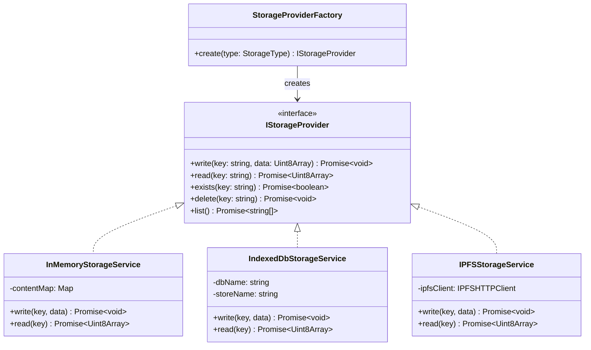
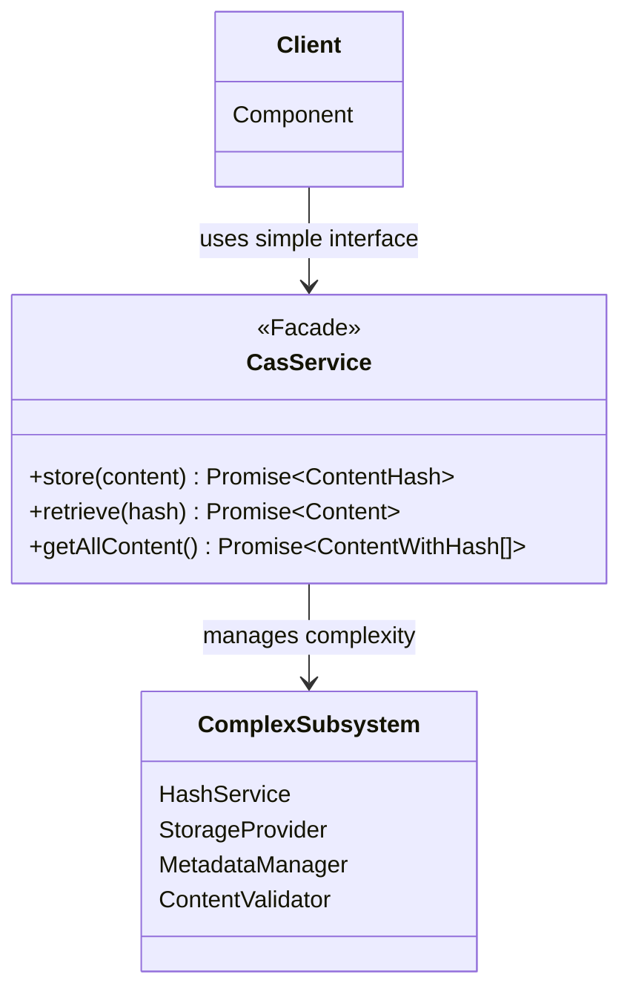
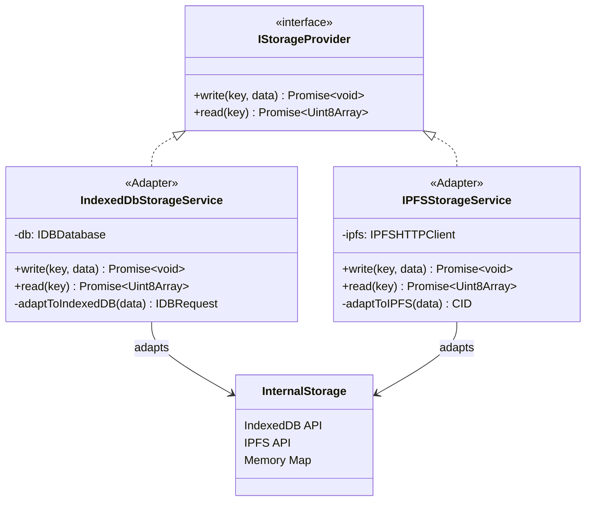
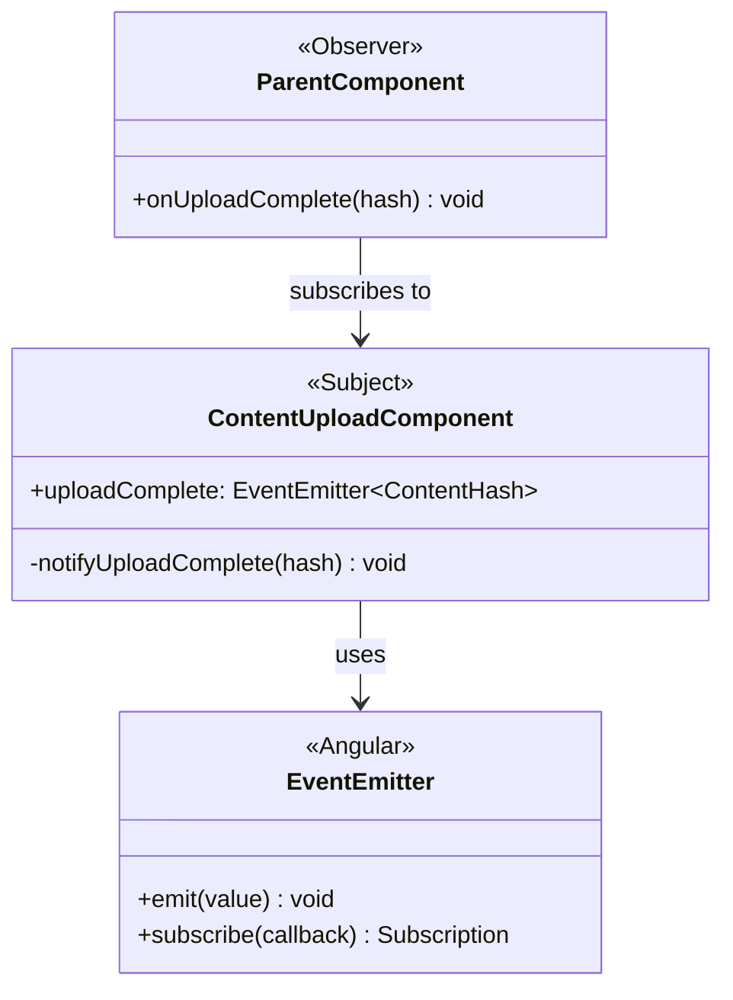
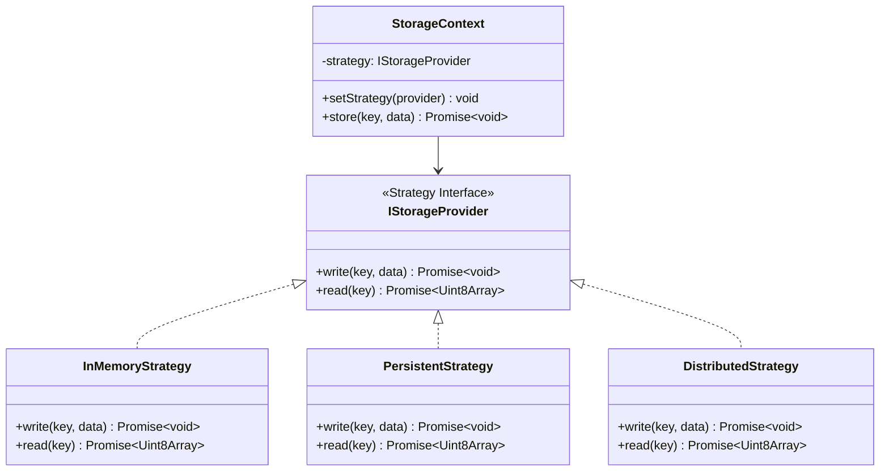
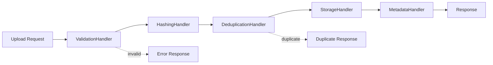
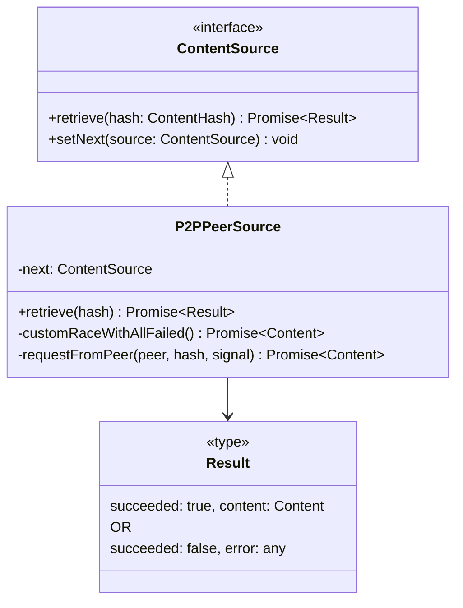
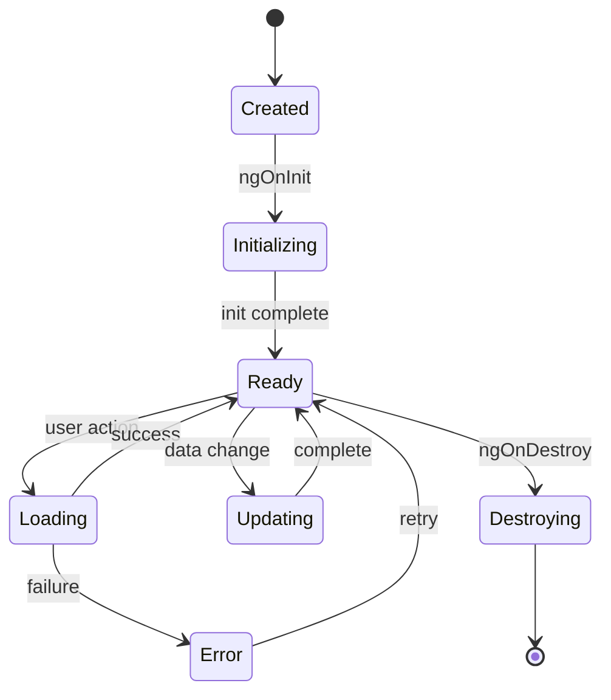
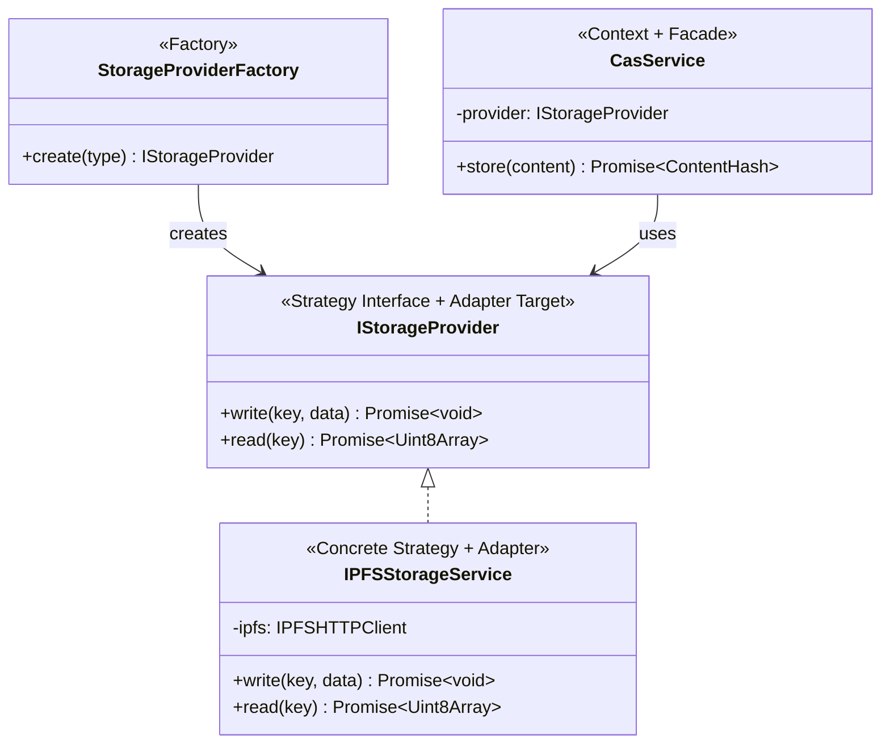

# Design Patterns in CAS/DISOT Architecture 🏗️

[⬅️ Architecture](./README.md) | [🏠 Documentation Home](../../)

## Overview

This document catalogs the Object-Oriented Design (OOD) patterns used throughout the CAS/DISOT application. Understanding these patterns helps developers maintain consistency and leverage proven solutions when extending the system.

## Creational Patterns

### Factory Pattern

The Factory pattern is used to create storage provider instances based on configuration:



**Benefits**:
- Decouples storage provider creation from usage
- Easy to add new storage types
- Configuration-driven instantiation

### Singleton Pattern

Angular's dependency injection ensures single instances of core services:

```mermaid
classDiagram
    class AngularDI {
        <<Angular Framework>>
        +provideIn: 'root'
    }
    
    class CasService {
        <<@Injectable({providedIn: 'root'})>>
        -storageProvider: IStorageProvider
        +store(content) Promise~ContentHash~
        +retrieve(hash) Promise~Content~
    }
    
    class DisotService {
        <<@Injectable({providedIn: 'root'})>>
        -entries: Map
        +createEntry(hash, type, key) DisotEntry
    }
    
    class HashService {
        <<@Injectable({providedIn: 'root'})>>
        +hash(data) Promise~string~
    }
    
    AngularDI --> CasService : manages
    AngularDI --> DisotService : manages
    AngularDI --> HashService : manages
```

## Structural Patterns

### Facade Pattern

Services act as facades to simplify complex subsystem interactions:



**Real Example**: `CasService.store()` internally:
1. Validates content
2. Generates hash
3. Checks for duplicates
4. Stores content
5. Stores metadata
6. Returns simple hash

### Adapter Pattern

Storage providers adapt different storage mechanisms to a common interface:



## Behavioral Patterns

### Observer Pattern

Component communication using Angular's EventEmitter:



### Strategy Pattern

Storage providers implement different strategies for the same interface:



### Chain of Responsibility Pattern

#### Content Processing Pipeline



#### P2P Content Discovery Chain

The P2P content discovery implements a sophisticated Chain of Responsibility with parallel execution:



**Key Implementation Detail**: The P2P source uses a custom race implementation instead of `Promise.race()`:

```typescript
// ❌ Wrong: Promise.race() rejects on first failure
const content = await Promise.race(peerPromises);

// ✅ Correct: Custom race that only fails when ALL fail
class P2PPeerSource implements ContentSource {
  private next?: ContentSource;
  
  async retrieve(hash: ContentHash): Promise<
    | { succeeded: true; content: Content }
    | { succeeded: false; error: any }
  > {
    const peers = await this.p2pClient.getConnectedPeers();
    
    if (peers.length === 0) {
      if (this.next) {
        return this.next.retrieve(hash);
      }
      return { succeeded: false, error: 'No connected peers' };
    }
    
    const abortController = new AbortController();
    
    // Custom race implementation
    return new Promise(async (resolve) => {
      let failedCount = 0;
      const totalPeers = peers.length;
      
      const checkAllFailed = () => {
        failedCount++;
        if (failedCount === totalPeers) {
          // All peers failed, continue chain or return error
          if (this.next) {
            resolve(this.next.retrieve(hash));
          } else {
            resolve({ succeeded: false, error: 'No peer has the content' });
          }
        }
      };
      
      // Start all peer requests in parallel
      peers.forEach(async (peer) => {
        try {
          const content = await this.requestFromPeer(
            peer, 
            hash, 
            abortController.signal
          );
          
          if (content && !abortController.signal.aborted) {
            // First success wins! Cancel all other requests
            abortController.abort();
            resolve({ succeeded: true, content });
          } else {
            // Peer doesn't have content
            checkAllFailed();
          }
        } catch (error) {
          if (error.name !== 'AbortError') {
            // Real failure (not cancellation)
            checkAllFailed();
          }
          // Ignore AbortError - it means another peer already succeeded
        }
      });
    });
  }
}
```

This ensures:
- ✅ Parallel queries to all peers for maximum performance
- ✅ Immediate return on first successful response
- ✅ Cancellation of ongoing requests to save bandwidth
- ✅ Chain continuation only when ALL peers fail

### State Pattern

Component lifecycle state management:



## Pattern Combinations

### Factory + Strategy + Adapter

The storage system combines multiple patterns:



## Best Practices

### When to Use These Patterns

1. **Factory Pattern**: When object creation logic is complex or configuration-driven
2. **Singleton Pattern**: For services that should have one instance app-wide
3. **Facade Pattern**: To simplify complex subsystem interactions
4. **Adapter Pattern**: When integrating third-party libraries or APIs
5. **Observer Pattern**: For loose coupling between components
6. **Strategy Pattern**: When algorithms/behaviors need to be interchangeable
7. **Chain of Responsibility**: For sequential processing with multiple handlers

### Anti-Patterns to Avoid

1. **God Object**: Keep services focused on single responsibilities
2. **Circular Dependencies**: Use interfaces and proper layering
3. **Overuse of Inheritance**: Favor composition over inheritance
4. **Tight Coupling**: Use dependency injection and interfaces

## Extending the Architecture

When adding new features, consider:

1. **Adding a New Storage Provider**:
   - Implement `IStorageProvider` interface
   - Update `StorageProviderFactory`
   - Follow existing adapter patterns

2. **Adding a New Entry Type**:
   - Extend the enum
   - Follow existing strategy patterns for handling

3. **Adding a New Service**:
   - Use `@Injectable({ providedIn: 'root' })`
   - Consider facade pattern for complex operations
   - Keep single responsibility

---

[⬅️ Architecture](./README.md) | [⬆️ Top](#design-patterns-in-casdisot-architecture-️) | [🏠 Documentation Home](../../)