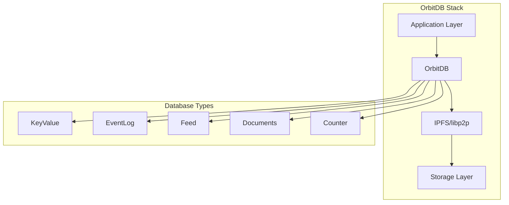

# OrbitDB Analysis for Browser Applications 📊

[⬅️ Distributed Databases](./README.md) | [🏠 Documentation Home](../../../)

## Executive Summary

OrbitDB is a serverless, distributed, peer-to-peer database built on IPFS. While it pioneered many concepts in distributed databases, **it has significant limitations for TypeScript/JavaScript browser applications** as of 2024.

### ⚠️ Key Limitations
- **Limited TypeScript Support** - Community types only, often outdated
- **Alpha Status** - Still marked as alpha after years of development
- **Browser Compatibility Issues** - Heavy dependencies on Node.js modules
- **Large Bundle Size** - ~2MB+ when including all dependencies
- **Performance Concerns** - Slow for large datasets
- **Maintenance Status** - Sporadic updates, unclear roadmap

## Technical Deep Dive

### Architecture Overview



### TypeScript Support Analysis

#### Current State (2024)
```typescript
// Type definitions are community maintained
npm install --save-dev @types/orbit-db

// Basic types exist but are incomplete
import OrbitDB from 'orbit-db'

// Many methods lack proper typing
const db = await orbitdb.keyvalue('my-db') // Type: any
const value = await db.get('key') // Type: any
```

#### Common TypeScript Issues
1. **Missing Generic Types**
   ```typescript
   // What we want
   const db = await orbitdb.keyvalue<UserProfile>('users')
   const user = await db.get('alice') // Type: UserProfile
   
   // What we get
   const db = await orbitdb.keyvalue('users')
   const user = await db.get('alice') // Type: any
   ```

2. **Incomplete Event Types**
   ```typescript
   db.events.on('replicated', (address) => {
     // address type is 'any', no autocomplete
   })
   ```

3. **No Type Safety for Schemas**
   ```typescript
   // Documents DB has no schema validation
   const doc = { name: 'Alice', age: '30' } // Should be number
   await db.put(doc) // No compile-time error
   ```

### Browser Compatibility Issues

#### 1. Bundle Size Problem
```javascript
// Webpack bundle analysis
orbit-db: 523KB
ipfs-core: 1.8MB
libp2p: 456KB
// Total: ~2.8MB before app code
```

#### 2. Node.js Dependencies
OrbitDB relies on many Node.js specific modules:
- `fs` - File system access
- `path` - Path manipulation
- `crypto` - Cryptographic functions
- `buffer` - Buffer implementation

Polyfills required:
```javascript
// webpack.config.js
resolve: {
  fallback: {
    "fs": false,
    "path": require.resolve("path-browserify"),
    "crypto": require.resolve("crypto-browserify"),
    "buffer": require.resolve("buffer/")
  }
}
```

#### 3. WebRTC Limitations
- Requires STUN/TURN servers for NAT traversal
- No direct browser-to-browser without signaling
- Falls back to IPFS gateways (centralization)

### Performance Analysis

#### Read Performance
```typescript
// Benchmark: Reading 10,000 entries
const results = []
const start = Date.now()

for (let i = 0; i < 10000; i++) {
  const value = await db.get(`key-${i}`)
  results.push(value)
}

const duration = Date.now() - start
// Average: 3-5 seconds (highly variable)
```

#### Write Performance
```typescript
// Benchmark: Writing 1,000 entries
const start = Date.now()

for (let i = 0; i < 1000; i++) {
  await db.put(`key-${i}`, { data: `value-${i}` })
}

const duration = Date.now() - start
// Average: 8-12 seconds (due to IPFS operations)
```

#### Replication Performance
- Initial sync can take minutes for large databases
- No incremental sync - downloads entire operation log
- Memory usage grows with database history

### Security Considerations

#### Access Control
```javascript
const db = await orbitdb.create('my-db', 'keyvalue', {
  accessController: {
    write: ['*'] // Anyone can write - security risk!
  }
})

// Better but still limited:
const db = await orbitdb.create('my-db', 'keyvalue', {
  accessController: {
    write: [orbitdb.identity.id]
  }
})
```

#### Encryption Status
- **No built-in encryption** for data at rest
- Must implement application-level encryption
- Key management is developer responsibility

### API Limitations

#### 1. No Query Language
```javascript
// Want: Complex queries
const results = await db.query({
  where: { age: { $gt: 18 }, city: 'New York' },
  orderBy: 'name',
  limit: 10
})

// Reality: Manual filtering
const all = await db.all()
const results = Object.values(all)
  .filter(doc => doc.age > 18 && doc.city === 'New York')
  .sort((a, b) => a.name.localeCompare(b.name))
  .slice(0, 10)
```

#### 2. No Transactions
```javascript
// Want: Atomic operations
await db.transaction(async (tx) => {
  await tx.put('balance-alice', currentBalance - 100)
  await tx.put('balance-bob', currentBalance + 100)
})

// Reality: Race conditions possible
await db.put('balance-alice', aliceBalance - 100)
// What if app crashes here?
await db.put('balance-bob', bobBalance + 100)
```

#### 3. Limited Indexing
- No secondary indexes
- Full table scans for queries
- No full-text search

### Production Readiness Assessment

#### Pros ✅
1. **Decentralized Architecture** - No single point of failure
2. **IPFS Integration** - Content addressing built-in
3. **Multiple DB Types** - KV, Feed, Docs, etc.
4. **Deterministic** - Same operations = same state

#### Cons ❌
1. **Alpha Status** - Not recommended for production
2. **Performance Issues** - Slow for large datasets
3. **Limited TypeScript** - Poor developer experience
4. **Large Bundle** - 2MB+ overhead
5. **No Built-in Encryption** - Security concerns
6. **Complex Setup** - IPFS configuration required
7. **Debugging Difficulty** - Distributed systems are hard

### Real-World Usage Examples

#### Basic Key-Value Store
```typescript
import OrbitDB from 'orbit-db'
import IPFS from 'ipfs-core'

// Setup (complex and slow)
const ipfs = await IPFS.create({
  repo: './ipfs',
  config: {
    Addresses: {
      Swarm: ['/dns4/ws-star.discovery.libp2p.io/tcp/443/wss/p2p-websocket-star']
    }
  }
})

const orbitdb = await OrbitDB.createInstance(ipfs)
const db = await orbitdb.keyvalue('user-settings')

// Usage
await db.put('theme', 'dark')
await db.put('language', 'en')

const theme = await db.get('theme') // 'dark'
```

#### Event Sourcing Pattern
```typescript
const eventLog = await orbitdb.eventlog('user-actions')

// Add events
await eventLog.add({
  type: 'USER_LOGIN',
  timestamp: Date.now(),
  userId: 'alice'
})

// Replay events
const events = eventLog.iterator({ limit: -1 })
  .collect()
  .map(e => e.payload.value)
```

### Migration Considerations

If currently using OrbitDB, consider:

1. **Data Export Strategy**
   ```typescript
   // Export all data
   const backup = {}
   const db = await orbitdb.keyvalue('my-db')
   const all = await db.all()
   backup['my-db'] = all
   
   // Save to file or alternative storage
   ```

2. **Gradual Migration**
   - Keep OrbitDB for existing data
   - Use new solution for new features
   - Sync between systems during transition

3. **Alternative Architecture**
   - Use Yjs for real-time sync
   - IPFS for content storage
   - IndexedDB for local persistence

## Verdict

### When to Use OrbitDB ✅
- Proof of concepts and experiments
- Strong IPFS integration requirement
- Don't need TypeScript support
- Small datasets (<1000 records)
- Can accept alpha software risks

### When to Avoid OrbitDB ❌
- Production applications
- TypeScript-first development
- Large datasets or high performance needs
- Complex querying requirements
- Need stable, well-maintained solution

### Recommended Alternatives

1. **[Yjs](./yjs-evaluation.md)** - Best for real-time collaboration
2. **[RxDB](./comparison-matrix.md#rxdb)** - Best for offline-first with SQL-like queries
3. **[Automerge](./comparison-matrix.md#automerge)** - Best for document-based CRDT
4. **[Gun.js](./comparison-matrix.md#gunjs)** - Simple real-time sync

---

[⬅️ Distributed Databases](./README.md) | [⬆️ Top](#orbitdb-analysis-for-browser-applications-) | [🏠 Documentation Home](../../../)