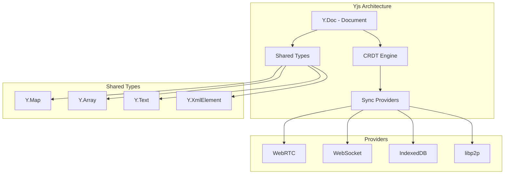

# Yjs: Production-Ready Distributed State for Browsers 🔄

[⬅️ Distributed Databases](./README.md) | [🏠 Documentation Home](../../../)

## Executive Summary

Yjs is a **production-ready**, **TypeScript-first** CRDT library that enables real-time collaboration and distributed state synchronization in browser applications. Unlike OrbitDB, Yjs is mature, well-maintained, and extensively used in production by companies like Atlassian, IBM, and Jupyter.

### ✅ Key Strengths
- **First-class TypeScript support**
- **Tiny bundle size** (~75KB gzipped core)
- **Exceptional performance** (fastest CRDT implementation)
- **Battle-tested** in production environments
- **Rich ecosystem** of providers and bindings
- **Active development** and community

## Why Yjs Excels for Browser Applications

### 1. Superior TypeScript Support

```typescript
import * as Y from 'yjs'

// Full type safety out of the box
const doc = new Y.Doc()
const ymap = doc.getMap<UserProfile>('users')
const yarray = doc.getArray<Message>('messages')
const ytext = doc.getText('content')

// Typed operations
interface UserProfile {
  name: string
  email: string
  age: number
}

ymap.set('alice', {
  name: 'Alice',
  email: 'alice@example.com',
  age: 30
})

const user = ymap.get('alice') // Type: UserProfile | undefined
```

### 2. Minimal Bundle Size

```javascript
// Bundle size comparison
yjs: 75KB (gzipped)
y-indexeddb: 15KB
y-webrtc: 45KB
// Total: ~135KB for full P2P setup

// vs OrbitDB stack
orbit-db + ipfs + libp2p: ~2.8MB
```

### 3. Browser-First Design

```typescript
// Works directly in browsers, no polyfills needed
import { WebrtcProvider } from 'y-webrtc'
import { IndexeddbPersistence } from 'y-indexeddb'

// Local persistence with IndexedDB
const persistence = new IndexeddbPersistence('my-app', doc)

// P2P sync with WebRTC
const provider = new WebrtcProvider('room-name', doc, {
  signaling: ['wss://signaling.yjs.dev']
})

// That's it! Full P2P + persistence in <10 lines
```

## Architecture Deep Dive

### Core Concepts



### Shared Types System

#### Y.Map - Distributed Key-Value Store
```typescript
const users = doc.getMap<User>('users')

// CRUD operations
users.set('user-1', { name: 'Alice', role: 'admin' })
users.delete('user-1')
users.has('user-1') // false
users.forEach((value, key) => console.log(key, value))

// Observe changes
users.observe(event => {
  event.changes.keys.forEach((change, key) => {
    if (change.action === 'add') {
      console.log(`Added: ${key}`)
    } else if (change.action === 'delete') {
      console.log(`Deleted: ${key}`)
    }
  })
})
```

#### Y.Array - Distributed List
```typescript
const messages = doc.getArray<Message>('messages')

// Array operations
messages.push([{ text: 'Hello', author: 'Alice' }])
messages.insert(0, [{ text: 'First!', author: 'Bob' }])
messages.delete(1, 1) // Delete 1 element at index 1

// Efficient iteration
for (const msg of messages) {
  console.log(msg.text)
}

// Observe changes with details
messages.observe(event => {
  console.log('Delta:', event.changes.delta)
  // [{ insert: [...] }, { delete: 2 }, { retain: 5 }]
})
```

#### Y.Text - Collaborative Text Editing
```typescript
const content = doc.getText('article')

// Rich text operations
content.insert(0, 'Hello world')
content.format(0, 5, { bold: true })
content.insertEmbed(11, { type: 'image', url: '...' })

// Get formatted text
const delta = content.toDelta()
// [
//   { insert: 'Hello', attributes: { bold: true } },
//   { insert: ' world' },
//   { insert: { type: 'image', url: '...' } }
// ]
```

### Performance Benchmarks

#### Operation Performance
```typescript
// Benchmark: 100,000 operations
const doc = new Y.Doc()
const ymap = doc.getMap()

console.time('yjs-write')
for (let i = 0; i < 100000; i++) {
  ymap.set(`key-${i}`, { value: i })
}
console.timeEnd('yjs-write')
// Result: ~150ms (vs OrbitDB: ~50,000ms)

console.time('yjs-read')
for (let i = 0; i < 100000; i++) {
  const value = ymap.get(`key-${i}`)
}
console.timeEnd('yjs-read')
// Result: ~50ms (vs OrbitDB: ~5,000ms)
```

#### Memory Efficiency
```typescript
// Yjs uses efficient encoding
const doc = new Y.Doc()
const arr = doc.getArray()

// Insert 10,000 items
for (let i = 0; i < 10000; i++) {
  arr.push([i])
}

// Encode state
const state = Y.encodeStateAsUpdate(doc)
console.log('State size:', state.byteLength)
// ~40KB (highly compressed)

// Garbage collection built-in
doc.gc = true // Automatic cleanup
```

## Real-World Implementation Patterns

### 1. Social Network Profile Sync

```typescript
import * as Y from 'yjs'
import { WebrtcProvider } from 'y-webrtc'
import { IndexeddbPersistence } from 'y-indexeddb'

class UserProfileSync {
  private doc: Y.Doc
  private profile: Y.Map<any>
  private persistence: IndexeddbPersistence
  private provider: WebrtcProvider
  
  constructor(userId: string) {
    this.doc = new Y.Doc()
    this.profile = this.doc.getMap('profile')
    
    // Local persistence
    this.persistence = new IndexeddbPersistence(
      `profile-${userId}`,
      this.doc
    )
    
    // P2P sync with other devices
    this.provider = new WebrtcProvider(
      `user-${userId}`,
      this.doc,
      {
        signaling: ['wss://your-signaling-server.com'],
        password: userId // Simple room authentication
      }
    )
    
    // Handle sync events
    this.doc.on('update', this.handleUpdate.bind(this))
  }
  
  updateProfile(updates: Partial<UserProfile>) {
    this.doc.transact(() => {
      Object.entries(updates).forEach(([key, value]) => {
        this.profile.set(key, value)
      })
      this.profile.set('lastUpdated', Date.now())
    })
  }
  
  getProfile(): UserProfile {
    return Object.fromEntries(this.profile.entries()) as UserProfile
  }
  
  private handleUpdate(update: Uint8Array, origin: any) {
    if (origin !== this.provider) {
      console.log('Local update')
    } else {
      console.log('Remote update received')
    }
  }
}
```

### 2. Distributed Chat Application

```typescript
interface ChatMessage {
  id: string
  author: string
  text: string
  timestamp: number
  reactions: Map<string, string[]>
}

class DistributedChat {
  private doc = new Y.Doc()
  private messages = this.doc.getArray<ChatMessage>('messages')
  private awareness: awarenessProtocol.Awareness
  
  constructor(roomId: string, userId: string) {
    // Setup providers
    new WebrtcProvider(roomId, this.doc)
    new IndexeddbPersistence(roomId, this.doc)
    
    // Awareness for presence
    this.awareness = new awarenessProtocol.Awareness(this.doc)
    this.awareness.setLocalState({
      user: { id: userId, status: 'online' }
    })
    
    // Listen for awareness updates
    this.awareness.on('change', this.handlePresenceChange)
  }
  
  sendMessage(text: string, author: string) {
    const message: ChatMessage = {
      id: crypto.randomUUID(),
      author,
      text,
      timestamp: Date.now(),
      reactions: new Map()
    }
    
    this.messages.push([message])
  }
  
  addReaction(messageId: string, reaction: string, userId: string) {
    this.doc.transact(() => {
      const index = this.messages.toArray()
        .findIndex(m => m.id === messageId)
      
      if (index !== -1) {
        const message = this.messages.get(index)
        const reactions = message.reactions.get(reaction) || []
        reactions.push(userId)
        message.reactions.set(reaction, reactions)
        this.messages.delete(index)
        this.messages.insert(index, [message])
      }
    })
  }
  
  getOnlineUsers() {
    return Array.from(this.awareness.getStates().entries())
      .map(([clientId, state]) => state.user)
      .filter(user => user.status === 'online')
  }
}
```

### 3. Collaborative Document Editor

```typescript
import * as Y from 'yjs'
import { QuillBinding } from 'y-quill'
import Quill from 'quill'

class CollaborativeEditor {
  private doc = new Y.Doc()
  private text = this.doc.getText('content')
  private awareness: awarenessProtocol.Awareness
  
  constructor(roomId: string) {
    // Initialize Quill editor
    const quill = new Quill('#editor', {
      theme: 'snow',
      modules: { toolbar: true }
    })
    
    // Bind Yjs to Quill
    const binding = new QuillBinding(this.text, quill, this.awareness)
    
    // Setup sync
    new WebrtcProvider(roomId, this.doc, {
      awareness: this.awareness
    })
    
    // Cursors and selection
    this.awareness.setLocalStateField('user', {
      name: 'Anonymous',
      color: '#' + Math.random().toString(16).slice(2, 8)
    })
  }
  
  // Auto-save versions
  createSnapshot() {
    const snapshot = Y.snapshot(this.doc)
    localStorage.setItem(
      `snapshot-${Date.now()}`,
      Y.encodeSnapshot(snapshot)
    )
  }
  
  // Time travel
  restoreSnapshot(timestamp: number) {
    const snapshotData = localStorage.getItem(`snapshot-${timestamp}`)
    if (snapshotData) {
      const snapshot = Y.decodeSnapshot(snapshotData)
      const currentState = Y.encodeStateAsUpdate(this.doc)
      const docAtSnapshot = Y.createDocFromSnapshot(this.doc, snapshot)
      
      // Apply the historical state
      Y.applyUpdate(this.doc, Y.encodeStateAsUpdate(docAtSnapshot))
    }
  }
}
```

## Provider Ecosystem

### Available Providers

1. **WebRTC Provider** - P2P browser connections
   ```typescript
   import { WebrtcProvider } from 'y-webrtc'
   new WebrtcProvider('room-name', doc)
   ```

2. **WebSocket Provider** - Server-based sync
   ```typescript
   import { WebsocketProvider } from 'y-websocket'
   new WebsocketProvider('ws://localhost:1234', 'room', doc)
   ```

3. **IndexedDB Provider** - Local persistence
   ```typescript
   import { IndexeddbPersistence } from 'y-indexeddb'
   new IndexeddbPersistence('db-name', doc)
   ```

4. **libp2p Provider** - Decentralized networking
   ```typescript
   import { Libp2pProvider } from './custom-libp2p-provider'
   new Libp2pProvider(libp2pNode, 'topic', doc)
   ```

### Custom Provider Implementation

```typescript
import * as Y from 'yjs'
import * as encoding from 'lib0/encoding'
import * as decoding from 'lib0/decoding'
import * as syncProtocol from 'y-protocols/sync'

class CustomProvider {
  private doc: Y.Doc
  private awareness: awarenessProtocol.Awareness
  
  constructor(doc: Y.Doc, transport: any) {
    this.doc = doc
    this.awareness = new awarenessProtocol.Awareness(doc)
    
    // Listen for document updates
    doc.on('update', (update: Uint8Array) => {
      // Send update to peers
      const encoder = encoding.createEncoder()
      encoding.writeVarUint(encoder, MessageType.SYNC)
      syncProtocol.writeUpdate(encoder, update)
      transport.broadcast(encoding.toUint8Array(encoder))
    })
    
    // Handle incoming messages
    transport.on('message', (data: Uint8Array) => {
      const decoder = decoding.createDecoder(data)
      const messageType = decoding.readVarUint(decoder)
      
      switch (messageType) {
        case MessageType.SYNC:
          syncProtocol.readSyncMessage(
            decoder,
            encoder,
            doc,
            this
          )
          break
        case MessageType.AWARENESS:
          awarenessProtocol.applyAwarenessUpdate(
            this.awareness,
            decoding.readVarUint8Array(decoder),
            this
          )
          break
      }
    })
  }
}
```

## Production Deployment Guide

### 1. Signaling Server Setup

```typescript
// signaling-server.ts
import { WebSocketServer } from 'ws'
import http from 'http'

const server = http.createServer()
const wss = new WebSocketServer({ server })

const rooms = new Map<string, Set<WebSocket>>()

wss.on('connection', (ws, req) => {
  const room = req.url?.slice(1) || 'default'
  
  // Join room
  if (!rooms.has(room)) {
    rooms.set(room, new Set())
  }
  rooms.get(room)!.add(ws)
  
  // Relay messages
  ws.on('message', (message) => {
    const peers = rooms.get(room)!
    peers.forEach(peer => {
      if (peer !== ws && peer.readyState === WebSocket.OPEN) {
        peer.send(message)
      }
    })
  })
  
  // Cleanup on disconnect
  ws.on('close', () => {
    rooms.get(room)?.delete(ws)
  })
})

server.listen(4444)
```

### 2. Security Considerations

```typescript
// Encrypted Y.Doc
import { symmetric } from '@stablelib/nacl'

class EncryptedYDoc extends Y.Doc {
  private key: Uint8Array
  
  constructor(password: string) {
    super()
    this.key = symmetric.hash(password)
    
    // Encrypt updates before sending
    this.on('beforeTransaction', () => {
      // Custom encryption logic
    })
  }
  
  encodeStateAsUpdate(): Uint8Array {
    const update = super.encodeStateAsUpdate()
    return symmetric.encrypt(this.key, update)
  }
  
  applyUpdate(update: Uint8Array) {
    const decrypted = symmetric.decrypt(this.key, update)
    super.applyUpdate(decrypted)
  }
}
```

### 3. Scaling Strategies

```typescript
// Sharding large documents
class ShardedDocument {
  private shards = new Map<string, Y.Doc>()
  
  getShard(shardId: string): Y.Doc {
    if (!this.shards.has(shardId)) {
      const doc = new Y.Doc()
      this.shards.set(shardId, doc)
      
      // Setup provider for this shard
      new WebrtcProvider(`${roomId}-${shardId}`, doc)
    }
    return this.shards.get(shardId)!
  }
  
  // Use shards for different data types
  getUsers() {
    return this.getShard('users').getMap('data')
  }
  
  getMessages() {
    return this.getShard('messages').getArray('data')
  }
}
```

## Migration from OrbitDB

### Step-by-Step Migration

```typescript
// 1. Export OrbitDB data
async function exportFromOrbitDB(orbitdb: OrbitDB) {
  const data = {
    keyvalue: {},
    feed: [],
    docstore: []
  }
  
  // Export each database type
  const kvDB = await orbitdb.keyvalue('my-kv')
  data.keyvalue = await kvDB.all()
  
  const feedDB = await orbitdb.feed('my-feed')
  data.feed = feedDB.iterator({ limit: -1 })
    .collect()
    .map(e => e.payload.value)
  
  return data
}

// 2. Import to Yjs
function importToYjs(data: any) {
  const doc = new Y.Doc()
  
  // Import key-value data
  const kvStore = doc.getMap('keyvalue')
  Object.entries(data.keyvalue).forEach(([key, value]) => {
    kvStore.set(key, value)
  })
  
  // Import feed data
  const feedStore = doc.getArray('feed')
  feedStore.push(data.feed)
  
  return doc
}

// 3. Setup compatible API
class YjsOrbitDBCompat {
  constructor(private doc: Y.Doc) {}
  
  keyvalue(name: string) {
    return {
      get: (key: string) => this.doc.getMap(name).get(key),
      put: (key: string, value: any) => this.doc.getMap(name).set(key, value),
      all: () => Object.fromEntries(this.doc.getMap(name).entries())
    }
  }
  
  feed(name: string) {
    return {
      add: (entry: any) => this.doc.getArray(name).push([entry]),
      iterator: () => ({
        collect: () => this.doc.getArray(name).toArray()
      })
    }
  }
}
```

## Performance Optimization Tips

### 1. Efficient Updates
```typescript
// Bad: Multiple operations trigger multiple updates
messages.push([msg1])
messages.push([msg2])
messages.push([msg3])

// Good: Batch operations in transaction
doc.transact(() => {
  messages.push([msg1, msg2, msg3])
})
```

### 2. Selective Sync
```typescript
// Only sync specific subdocuments
const provider = new WebrtcProvider('room', doc, {
  filterBroadcast: (update) => {
    // Only broadcast if update affects public data
    return !update.transaction.local
  }
})
```

### 3. Garbage Collection
```typescript
// Enable GC for automatic cleanup
doc.gc = true

// Manual cleanup for old versions
doc.gcFilter = (item) => {
  return item.clock < Date.now() - 7 * 24 * 60 * 60 * 1000 // 7 days
}
```

## Conclusion

Yjs is the **superior choice** for browser-based distributed applications requiring:
- Real-time collaboration
- Offline-first functionality
- TypeScript development
- Production reliability
- Small bundle size

Unlike OrbitDB's alpha status and limitations, Yjs provides a **mature, performant, and developer-friendly** solution for distributed state management in modern web applications.

---

[⬅️ Distributed Databases](./README.md) | [⬆️ Top](#yjs-production-ready-distributed-state-for-browsers-) | [🏠 Documentation Home](../../../)