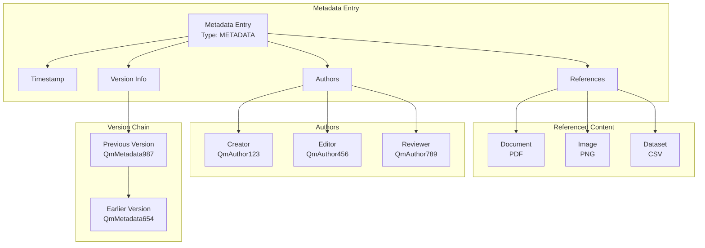

# Metadata Entry Architecture 📊

[⬅️ Architecture](../) | [🏠 Documentation Home](../../../) | [Design ➡️](./design.md)

## Overview

Metadata entries are specialized DISOT entries that establish relationships between content items, track authorship with roles, and maintain version history. They serve as the connective tissue in the content graph, enabling rich content organization and discovery.

### Simplified Architecture

Following KISS and Clean Architecture principles, metadata is stored directly within DISOT entries, eliminating the need for separate CAS storage. This approach:
- Creates only one record per metadata entry
- Provides direct access to metadata without additional retrieval steps
- Simplifies the codebase and improves performance



## Table of Contents

1. [Design Overview](./design.md) - Core structure and interfaces
2. [Examples](./examples.md) - Real-world usage examples
3. [Implementation Guide](./implementation.md) - How to implement metadata services
4. [API Reference](./api-reference.md) - Detailed API documentation

## Quick Start

### Creating a Metadata Entry

```typescript
import { createMetadataContent, AuthorRole } from '@app/core/domain/interfaces/metadata-entry';

const metadata = createMetadataContent({
  references: [
    {
      hash: 'QmDocumentHash123',
      mimeType: 'application/pdf',
      mimeTypeSource: 'detected',
      relationship: 'main-document'
    }
  ],
  authors: [
    {
      authorHash: 'QmAuthorHash456',
      role: AuthorRole.CREATOR
    }
  ],
  version: '1.0.0'
});
```

## Key Features

- **📎 Content References**: Link to multiple content items with MIME types
- **👥 Multi-Author Support**: Track creators, editors, contributors, and reviewers
- **🔄 Version Control**: Built-in versioning with change tracking
- **🔐 Cryptographic Signatures**: All metadata entries are signed DISOT entries
- **🌐 Decentralized**: No central authority required for metadata management

## Architecture Principles

1. **Content-Addressable**: All references use content hashes
2. **Immutable**: Metadata entries cannot be modified, only versioned
3. **Self-Describing**: MIME types and relationships included
4. **Cryptographically Secure**: Signed with author's private key
5. **Temporal**: Timestamps ensure chronological ordering

## Use Cases

- 📝 **Document Management**: Track document versions and contributors
- 🎨 **Digital Art**: Prove ownership and creation date
- 📦 **Software Releases**: Link binaries, source code, and documentation
- 📚 **Research Papers**: Track citations, datasets, and co-authors
- 🔗 **Content Collections**: Group related content items

---

[⬅️ Architecture](../) | [🏠 Documentation Home](../../../) | [Design ➡️](./design.md)