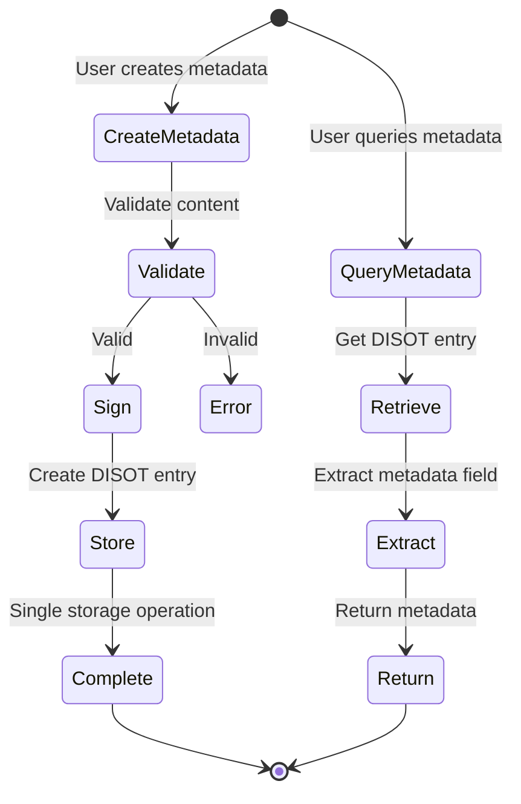

# Metadata API Reference 📖

[⬅️ Implementation](./implementation.md) | [🏠 Documentation Home](../../../) | [Overview ➡️](./)

## Table of Contents

1. [Interfaces](#interfaces)
2. [Enums](#enums)
3. [Type Guards](#type-guards)
4. [Helper Functions](#helper-functions)
5. [Service Methods](#service-methods)
6. [Error Types](#error-types)

## Data Flow Overview



## Interfaces

### MetadataContent

The main interface for metadata content.

```typescript
interface MetadataContent {
  timestamp: number;              // Unix timestamp of creation
  references: ContentReference[]; // Array of content references
  authors: AuthorReference[];     // Array of author references
  version: VersionInfo;           // Version information
}
```

**Properties:**
- `timestamp` - Unix timestamp when the metadata was created
- `references` - Array of content items referenced by this metadata
- `authors` - Array of authors with their roles
- `version` - Version control information

### ContentReference

Reference to content with MIME type information.

```typescript
interface ContentReference {
  hash: string;                                  // CAS hash of referenced content
  mimeType: string;                             // MIME type (e.g., 'text/plain')
  mimeTypeSource: 'detected' | 'manual';        // How MIME type was determined
  relationship?: string;                        // Optional relationship type
}
```

**Properties:**
- `hash` - Content-addressable storage hash of the referenced item
- `mimeType` - MIME type of the content (RFC 6838 format)
- `mimeTypeSource` - Whether MIME type was automatically detected or manually specified
- `relationship` - Optional semantic relationship (e.g., 'main', 'thumbnail', 'citation')

### AuthorReference

Reference to an author with their role.

```typescript
interface AuthorReference {
  authorHash: string;    // Hash reference to author entry
  role: AuthorRole;      // Author's role in this content
}
```

**Properties:**
- `authorHash` - Hash of the author's identity entry
- `role` - Role the author played in creating/modifying the content

### VersionInfo

Version control information.

```typescript
interface VersionInfo {
  version: string;            // Semantic version (e.g., '1.0.0')
  previousVersion?: string;   // Hash of previous metadata record
  changeDescription?: string; // What changed in this version
}
```

**Properties:**
- `version` - Semantic version string (MAJOR.MINOR.PATCH)
- `previousVersion` - Optional hash of the previous metadata record in the version chain
- `changeDescription` - Optional human-readable description of changes

## Enums

### AuthorRole

Possible roles for authors.

```typescript
enum AuthorRole {
  CREATOR = 'creator',         // Original creator
  EDITOR = 'editor',           // Made modifications
  CONTRIBUTOR = 'contributor', // Minor contributions
  REVIEWER = 'reviewer'        // Reviewed content
}
```

**Values:**
- `CREATOR` - Original author who created the content
- `EDITOR` - Made significant modifications to existing content
- `CONTRIBUTOR` - Made minor contributions or additions
- `REVIEWER` - Reviewed and approved the content

## Type Guards

### isMetadataContent

Type guard to check if an object is valid metadata content.

```typescript
function isMetadataContent(content: any): content is MetadataContent
```

**Parameters:**
- `content` - Any object to check

**Returns:**
- `boolean` - True if the object is valid MetadataContent

**Example:**
```typescript
const data = JSON.parse(jsonString);
if (isMetadataContent(data)) {
  // TypeScript now knows data is MetadataContent
  console.log(data.timestamp);
}
```

## Helper Functions

### createMetadataContent

Helper function to create metadata content with defaults.

```typescript
function createMetadataContent(params: {
  references: ContentReference[];
  authors: AuthorReference[];
  previousVersion?: string;
  changeDescription?: string;
  version?: string;
}): MetadataContent
```

**Parameters:**
- `params.references` - Required array of content references
- `params.authors` - Required array of author references
- `params.previousVersion` - Optional hash of previous version
- `params.changeDescription` - Optional change description
- `params.version` - Optional version string (defaults to '1.0.0')

**Returns:**
- `MetadataContent` - Complete metadata content object with current timestamp

**Example:**
```typescript
const metadata = createMetadataContent({
  references: [{
    hash: 'QmDocument123',
    mimeType: 'application/pdf',
    mimeTypeSource: 'detected'
  }],
  authors: [{
    authorHash: 'QmAuthor456',
    role: AuthorRole.CREATOR
  }]
});
```

## Service Methods

### MetadataService

The main service for managing metadata entries.

#### createMetadataEntry

Creates a new metadata entry.

```typescript
createMetadataEntry(
  content: MetadataContent,
  privateKey: string
): Promise<DisotEntry>
```

**Parameters:**
- `content` - The metadata content to store
- `privateKey` - Private key for signing the entry

**Returns:**
- `Promise<DisotEntry>` - The created DISOT entry

**Throws:**
- `MetadataError` - If content validation fails
- `StorageError` - If storage operation fails

#### updateMetadataEntry

Updates an existing metadata entry by creating a new version.

```typescript
updateMetadataEntry(
  previousId: string,
  updates: Partial<MetadataContent>,
  privateKey: string
): Promise<DisotEntry>
```

**Parameters:**
- `previousId` - ID of the metadata entry to update
- `updates` - Partial metadata content with updates
- `privateKey` - Private key for signing the new entry

**Returns:**
- `Promise<DisotEntry>` - The new metadata entry

**Note:** This creates a new entry with `previousVersion` set to the provided ID.

#### getMetadataContent

Retrieves metadata content from an entry.

```typescript
getMetadataContent(entryId: string): Promise<MetadataContent>
```

**Parameters:**
- `entryId` - ID of the metadata entry

**Returns:**
- `Promise<MetadataContent>` - The metadata content extracted directly from the entry

**Throws:**
- `NotFoundError` - If entry doesn't exist
- `TypeError` - If entry is not a metadata type

#### findByReference

Finds all metadata entries that reference a specific content hash.

```typescript
findByReference(contentHash: string): Observable<DisotEntry[]>
```

**Parameters:**
- `contentHash` - Hash of the content to search for

**Returns:**
- `Observable<DisotEntry[]>` - Observable of matching entries

#### findByAuthor

Finds all metadata entries by a specific author.

```typescript
findByAuthor(authorHash: string): Observable<DisotEntry[]>
```

**Parameters:**
- `authorHash` - Hash of the author to search for

**Returns:**
- `Observable<DisotEntry[]>` - Observable of matching entries

#### getVersionHistory

Gets the complete version history of a metadata entry.

```typescript
getVersionHistory(metadataId: string): Promise<DisotEntry[]>
```

**Parameters:**
- `metadataId` - ID of any entry in the version chain

**Returns:**
- `Promise<DisotEntry[]>` - Array of entries from newest to oldest

#### findByRelationship

Finds metadata entries containing specific relationship types.

```typescript
findByRelationship(relationship: string): Promise<DisotEntry[]>
```

**Parameters:**
- `relationship` - Relationship type to search for

**Returns:**
- `Promise<DisotEntry[]>` - Array of matching entries

#### findByMimeType

Finds metadata entries referencing content of a specific MIME type.

```typescript
findByMimeType(mimeType: string): Promise<DisotEntry[]>
```

**Parameters:**
- `mimeType` - MIME type to search for

**Returns:**
- `Promise<DisotEntry[]>` - Array of matching entries

#### getContentGraph

Builds a graph of content relationships.

```typescript
getContentGraph(
  startHash: string,
  depth: number = 2
): Promise<Map<string, Set<string>>>
```

**Parameters:**
- `startHash` - Starting point for graph traversal
- `depth` - Maximum depth to traverse (default: 2)

**Returns:**
- `Promise<Map<string, Set<string>>>` - Graph as adjacency list

## Error Types

### MetadataError

Base error class for metadata operations.

```typescript
class MetadataError extends Error {
  code: string;
  constructor(message: string, code: string);
}
```

**Error Codes:**
- `INVALID_CONTENT` - Content validation failed
- `STORAGE_ERROR` - Storage operation failed
- `NOT_FOUND` - Entry not found
- `TYPE_MISMATCH` - Entry is not metadata type
- `VERSION_CONFLICT` - Version conflict detected

### Usage Example

Complete example showing metadata creation and retrieval:

```typescript
import { MetadataService } from '@app/core/services/metadata/metadata.service';
import { createMetadataContent, AuthorRole } from '@app/core/domain/interfaces/metadata-entry';

// Create metadata
const metadata = createMetadataContent({
  references: [
    {
      hash: 'QmPaper123',
      mimeType: 'application/pdf',
      mimeTypeSource: 'detected',
      relationship: 'main'
    },
    {
      hash: 'QmDataset456',
      mimeType: 'text/csv',
      mimeTypeSource: 'manual',
      relationship: 'dataset'
    }
  ],
  authors: [
    {
      authorHash: 'QmJohnDoe',
      role: AuthorRole.CREATOR
    },
    {
      authorHash: 'QmJaneSmith',
      role: AuthorRole.CONTRIBUTOR
    }
  ],
  version: '1.0.0'
});

// Store metadata
try {
  const entry = await metadataService.createMetadataEntry(
    metadata,
    privateKey
  );
  console.log('Created entry:', entry.id);
  
  // Retrieve metadata
  const retrieved = await metadataService.getMetadataContent(entry.id);
  console.log('References:', retrieved.references);
  
  // Find related entries
  const byAuthor = await metadataService.findByAuthor('QmJohnDoe').toPromise();
  console.log('Entries by author:', byAuthor.length);
  
} catch (error) {
  if (error instanceof MetadataError) {
    console.error(`Metadata error (${error.code}):`, error.message);
  }
}
```

## Related Documentation

- [Design Overview](./design.md) - Architecture and design decisions
- [Examples](./examples.md) - Real-world usage examples
- [Implementation Guide](./implementation.md) - Step-by-step implementation

---

[⬅️ Implementation](./implementation.md) | [🏠 Documentation Home](../../../) | [Overview ➡️](./)