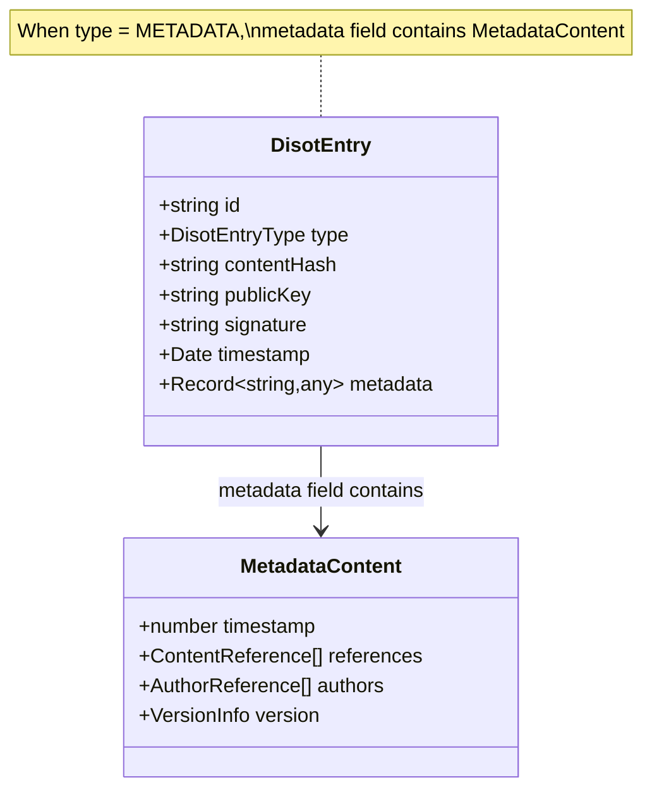
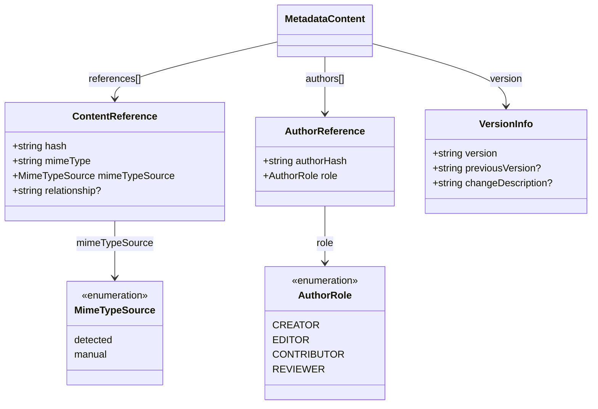
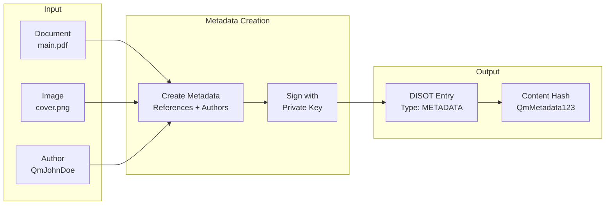
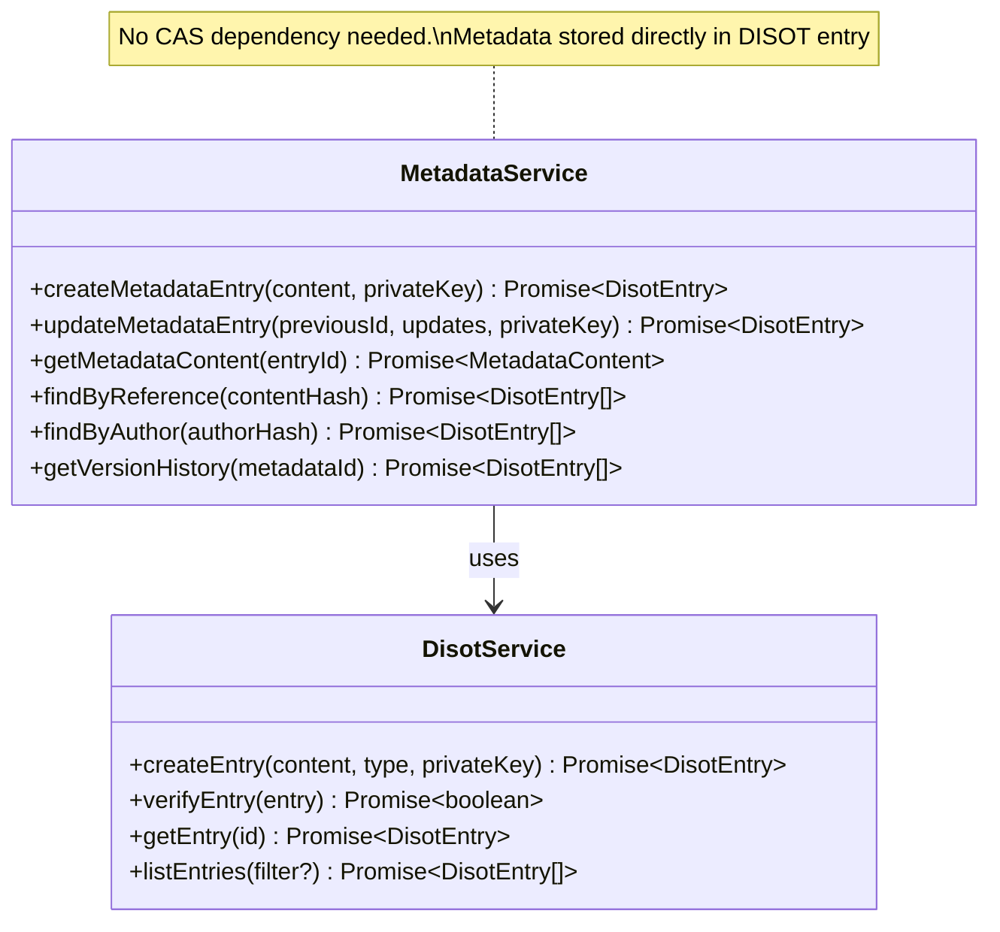
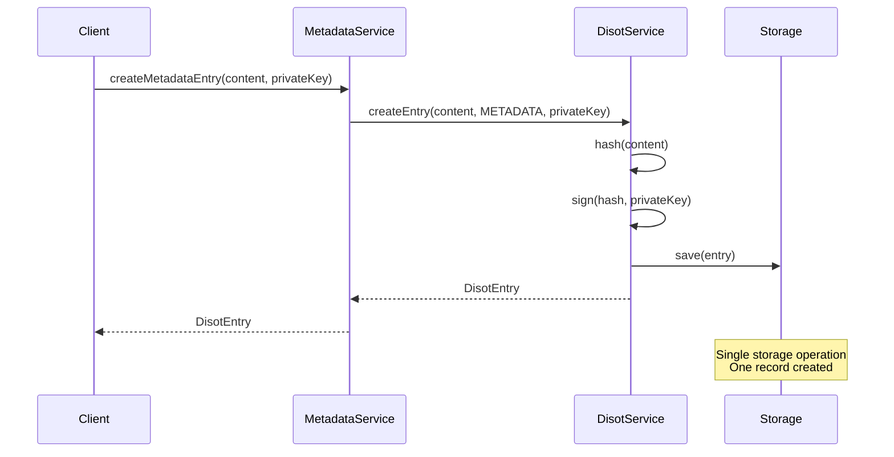

# Metadata Entry Design 🎨

[⬅️ Overview](./) | [🏠 Documentation Home](../../../) | [Examples ➡️](./examples.md)

## Table of Contents

1. [Core Structure](#core-structure)
2. [Supporting Interfaces](#supporting-interfaces)
3. [Integration](#integration-with-existing-system)
4. [Storage Considerations](#storage-considerations)
5. [Benefits](#benefits)
6. [Future Enhancements](#future-enhancements)

## Core Structure

### Simplified Architecture

Metadata entries are stored directly as DISOT entries with type 'METADATA'. The metadata content is stored in the entry's metadata field, eliminating the need for separate CAS storage.



## Supporting Interfaces



## Usage Examples



### Creating a Metadata Entry

```typescript
const metadataContent: MetadataContent = {
  timestamp: Date.now(),
  
  references: [
    {
      hash: 'QmX7gJ9L2K8xqV4Jb6N5eW3Rf8Hc9Dt2Pp1Qa3Zs4Yv5Bc6',
      mimeType: 'text/markdown',
      mimeTypeSource: 'detected',
      relationship: 'main-content'
    },
    {
      hash: 'QmA3bF7Hj9K2Lm4Np6Qr8St2Uv3Wx5Yz6Aa7Bb8Cc9Dd0',
      mimeType: 'image/png',
      mimeTypeSource: 'manual',
      relationship: 'thumbnail'
    }
  ],
  
  authors: [
    {
      authorHash: 'QmP9qR8sT7uV6wX5yZ4aB3cD2eF1gH0iJ9kL8mN7oP6qR5',
      role: AuthorRole.CREATOR
    },
    {
      authorHash: 'QmL5mN4oP3qR2sT1uV0wX9yZ8aB7cD6eF5gH4iJ3kL2mN1',
      role: AuthorRole.EDITOR
    }
  ],
  
  version: {
    version: '1.1.0',
    previousVersion: 'QmW4xY5zA6bC7dE8fG9hI0jK1lM2nO3pQ4rS5tU6vW7xY8',
    changeDescription: 'Added architecture diagrams and updated API documentation'
  }
};
```

### Metadata Entry for Blog Post

```typescript
const blogPostMetadata: MetadataContent = {
  timestamp: Date.now(),
  
  references: [
    {
      hash: 'QmBlogPostContent123',
      mimeType: 'text/markdown',
      mimeTypeSource: 'detected',
      relationship: 'content'
    },
    {
      hash: 'QmHeaderImage456',
      mimeType: 'image/jpeg',
      mimeTypeSource: 'detected',
      relationship: 'header-image'
    },
    {
      hash: 'QmCodeSnippet789',
      mimeType: 'text/x-typescript',
      mimeTypeSource: 'manual',
      relationship: 'code-example'
    }
  ],
  
  authors: [
    {
      authorHash: 'QmAuthorJohnDoe',
      role: AuthorRole.CREATOR
    }
  ],
  
  version: {
    version: '1.0.0'
  }
};
```

## Integration with Existing System

### Service Implementation



## Storage Considerations

Metadata entries are stored as regular DISOT entries with type 'METADATA'. The metadata content is stored directly in the entry's metadata field.



## Benefits

1. **Simplicity**: Single storage operation, single record
2. **Performance**: Direct access to metadata without CAS retrieval
3. **Atomicity**: Either the entry exists or it doesn't
4. **Relationship Tracking**: Explicitly defines relationships between content items
5. **Author Attribution**: Multiple authors with specific roles
6. **Version Control**: Built-in versioning with change tracking
7. **Content Discovery**: Enables graph traversal and content exploration
8. **Type Safety**: MIME type tracking for proper content handling

## Future Enhancements

1. **Hierarchical Organization**: Implement tree structures for file organization
2. **Access Control**: Add permission metadata for content access
3. **Content Collections**: Group related content into collections
4. **Search Indexes**: Build searchable indexes from metadata
5. **Relationship Types**: Expand relationship vocabulary (cites, responds-to, etc.)
6. **Author Profiles**: Implement full author identity system

## Security Considerations

- Path traversal prevention (to be implemented)
- Author verification through signature chain
- Content integrity through hash verification
- Metadata tampering prevention through signatures

## Related Documentation

- [Examples](./examples.md) - See real-world usage examples
- [Implementation Guide](./implementation.md) - Step-by-step implementation
- [API Reference](./api-reference.md) - Detailed API documentation
- [DISOT Service](../../services/disot-service.md) - Base service documentation

---

[⬅️ Overview](./) | [🏠 Documentation Home](../../../) | [Examples ➡️](./examples.md)