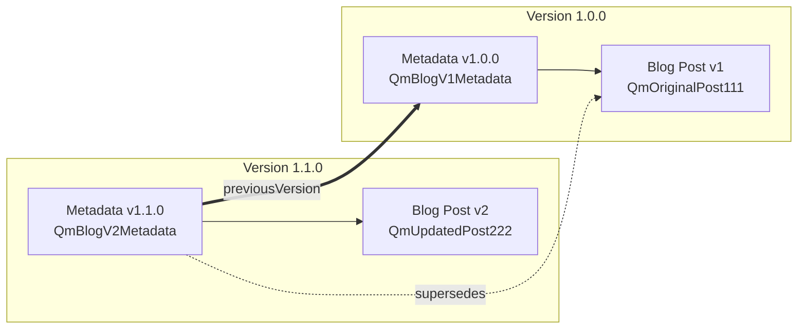
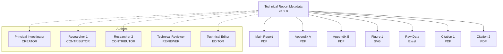

# Metadata Entry Examples 📚

[⬅️ Design](./design.md) | [🏠 Documentation Home](../../../) | [Implementation ➡️](./implementation.md)

## Table of Contents

1. [Research Paper with Multiple Authors](#example-1-research-paper-with-multiple-authors)
2. [Software Release with Dependencies](#example-2-software-release-with-dependencies)
3. [Digital Art Collection](#example-3-digital-art-collection)
4. [Content Update Chain](#example-4-content-update-chain)
5. [Complex Document with Attachments](#example-5-complex-document-with-attachments)

## Example 1: Research Paper with Multiple Authors

```typescript
const researchPaperMetadata: MetadataContent = {
  timestamp: 1704067200000, // 2024-01-01 00:00:00 UTC
  
  references: [
    {
      hash: 'Qmf8Hc9Dt2K8xqV4Jb6N5eW3RPp1Qa3Zs4Yv5Bc6X7gJ9L2',
      mimeType: 'application/pdf',
      mimeTypeSource: 'detected',
      relationship: 'main-document'
    },
    {
      hash: 'QmA3bF7Hj9K2Lm4Np6Qr8St2Uv3Wx5Yz6Aa7Bb8Cc9Dd0',
      mimeType: 'text/csv',
      mimeTypeSource: 'manual',
      relationship: 'dataset'
    },
    {
      hash: 'QmZ9yX8wV7uT6sR5qP4oN3mL2kJ1iH0gF9eD8cB7aA6zY5',
      mimeType: 'application/x-python',
      mimeTypeSource: 'detected',
      relationship: 'source-code'
    }
  ],
  
  authors: [
    {
      authorHash: 'QmLeadAuthor123',
      role: AuthorRole.CREATOR
    },
    {
      authorHash: 'QmCoAuthor456',
      role: AuthorRole.CONTRIBUTOR
    },
    {
      authorHash: 'QmDataAnalyst789',
      role: AuthorRole.CONTRIBUTOR
    },
    {
      authorHash: 'QmPeerReviewer101',
      role: AuthorRole.REVIEWER
    }
  ],
  
  version: {
    version: '2.1.0',
    previousVersion: 'QmPreviousVersion987',
    changeDescription: 'Added performance benchmarks for IPFS integration, updated conclusions'
  }
};
```

### Key Points
- Multiple authors with different roles
- References to main document, dataset, and source code
- Version tracking with previous version reference

## Example 2: Software Release with Dependencies

```typescript
const softwareReleaseMetadata: MetadataContent = {
  timestamp: 1704153600000, // 2024-01-02 00:00:00 UTC
  
  references: [
    {
      hash: 'QmBinaryExecutable123',
      mimeType: 'application/octet-stream',
      mimeTypeSource: 'manual',
      relationship: 'executable'
    },
    {
      hash: 'QmSourceCodeTarball456',
      mimeType: 'application/x-tar',
      mimeTypeSource: 'detected',
      relationship: 'source-archive'
    },
    {
      hash: 'QmReleaseNotes789',
      mimeType: 'text/markdown',
      mimeTypeSource: 'detected',
      relationship: 'release-notes'
    },
    {
      hash: 'QmLicenseFile101',
      mimeType: 'text/plain',
      mimeTypeSource: 'detected',
      relationship: 'license'
    }
  ],
  
  authors: [
    {
      authorHash: 'QmMainDeveloper111',
      role: AuthorRole.CREATOR
    },
    {
      authorHash: 'QmContributor222',
      role: AuthorRole.CONTRIBUTOR
    }
  ],
  
  version: {
    version: '3.0.0',
    previousVersion: 'QmVersion2_5_0',
    changeDescription: 'Major release: Added IPFS support, improved performance, breaking API changes'
  }
};
```

### Key Points
- References to binary, source code, release notes, and license
- Semantic versioning with major release indication
- Clear relationship types for each reference

## Example 3: Digital Art Collection

```typescript
const artCollectionMetadata: MetadataContent = {
  timestamp: 1704240000000, // 2024-01-03 00:00:00 UTC
  
  references: [
    {
      hash: 'QmHighResArtwork111',
      mimeType: 'image/png',
      mimeTypeSource: 'detected',
      relationship: 'high-resolution'
    },
    {
      hash: 'QmThumbnail222',
      mimeType: 'image/jpeg',
      mimeTypeSource: 'detected',
      relationship: 'thumbnail'
    },
    {
      hash: 'QmArtistStatement333',
      mimeType: 'text/plain',
      mimeTypeSource: 'manual',
      relationship: 'artist-statement'
    },
    {
      hash: 'QmProvenanceDoc444',
      mimeType: 'application/json',
      mimeTypeSource: 'manual',
      relationship: 'provenance'
    }
  ],
  
  authors: [
    {
      authorHash: 'QmArtist555',
      role: AuthorRole.CREATOR
    },
    {
      authorHash: 'QmCurator666',
      role: AuthorRole.EDITOR
    }
  ],
  
  version: {
    version: '1.0.0'
  }
};
```

### Key Points
- Multiple resolutions of the same artwork
- Provenance documentation in JSON format
- Artist as creator, curator as editor

## Example 4: Content Update Chain



```typescript
// Original blog post
const blogV1Metadata: MetadataContent = {
  timestamp: 1704326400000,
  references: [
    {
      hash: 'QmOriginalPost111',
      mimeType: 'text/markdown',
      mimeTypeSource: 'detected'
    }
  ],
  authors: [
    {
      authorHash: 'QmBlogger777',
      role: AuthorRole.CREATOR
    }
  ],
  version: {
    version: '1.0.0'
  }
};

// Updated with corrections
const blogV2Metadata: MetadataContent = {
  timestamp: 1704412800000,
  references: [
    {
      hash: 'QmUpdatedPost222',
      mimeType: 'text/markdown',
      mimeTypeSource: 'detected'
    },
    {
      hash: 'QmOriginalPost111',
      mimeType: 'text/markdown',
      mimeTypeSource: 'detected',
      relationship: 'supersedes'
    }
  ],
  authors: [
    {
      authorHash: 'QmBlogger777',
      role: AuthorRole.CREATOR
    },
    {
      authorHash: 'QmEditor888',
      role: AuthorRole.EDITOR
    }
  ],
  version: {
    version: '1.1.0',
    previousVersion: 'QmBlogV1Metadata',
    changeDescription: 'Fixed typos, added clarifications on hash functions'
  }
};
```

### Key Points
- Version chain showing content evolution
- Reference to superseded content
- New editor added in updated version

## Example 5: Complex Document with Attachments



```typescript
const technicalReportMetadata: MetadataContent = {
  timestamp: 1704499200000,
  
  references: [
    // Main document
    {
      hash: 'QmMainReport111',
      mimeType: 'application/pdf',
      mimeTypeSource: 'detected',
      relationship: 'main'
    },
    // Appendices
    {
      hash: 'QmAppendixA222',
      mimeType: 'application/pdf',
      mimeTypeSource: 'detected',
      relationship: 'appendix-a'
    },
    {
      hash: 'QmAppendixB333',
      mimeType: 'application/pdf',
      mimeTypeSource: 'detected',
      relationship: 'appendix-b'
    },
    // Supporting materials
    {
      hash: 'QmDataVisualization444',
      mimeType: 'image/svg+xml',
      mimeTypeSource: 'manual',
      relationship: 'figure-1'
    },
    {
      hash: 'QmSourceData555',
      mimeType: 'application/vnd.openxmlformats-officedocument.spreadsheetml.sheet',
      mimeTypeSource: 'detected',
      relationship: 'raw-data'
    },
    // References to cited works
    {
      hash: 'QmCitedPaper1_666',
      mimeType: 'application/pdf',
      mimeTypeSource: 'manual',
      relationship: 'citation'
    },
    {
      hash: 'QmCitedPaper2_777',
      mimeType: 'application/pdf',
      mimeTypeSource: 'manual',
      relationship: 'citation'
    }
  ],
  
  authors: [
    {
      authorHash: 'QmPrincipalInvestigator888',
      role: AuthorRole.CREATOR
    },
    {
      authorHash: 'QmResearcher1_999',
      role: AuthorRole.CONTRIBUTOR
    },
    {
      authorHash: 'QmResearcher2_000',
      role: AuthorRole.CONTRIBUTOR
    },
    {
      authorHash: 'QmTechnicalReviewer111',
      role: AuthorRole.REVIEWER
    },
    {
      authorHash: 'QmTechnicalEditor222',
      role: AuthorRole.EDITOR
    }
  ],
  
  version: {
    version: '1.2.0',
    previousVersion: 'QmDraftVersion333',
    changeDescription: 'Incorporated reviewer feedback, added security recommendations section'
  }
};
```

### Key Points
- Complex document structure with appendices
- Supporting materials with specific relationships
- Citations to external works
- Full authorship team with different roles

## Common Patterns

### 1. Relationship Types
- `main`, `main-document`, `content` - Primary content
- `thumbnail`, `preview` - Preview versions
- `appendix-*`, `supplement-*` - Additional materials
- `citation`, `reference` - External references
- `supersedes`, `replaces` - Version relationships
- `source-code`, `dataset` - Supporting materials

### 2. MIME Type Sources
- `detected` - Automatically determined from content
- `manual` - Explicitly specified by creator

### 3. Version Management
- Use semantic versioning (MAJOR.MINOR.PATCH)
- Always reference previous version hash when updating
- Include meaningful change descriptions

### 4. Author Roles
- `CREATOR` - Original author(s)
- `EDITOR` - Made significant changes
- `CONTRIBUTOR` - Added content or fixes
- `REVIEWER` - Reviewed and approved

## Related Documentation

- [Design Overview](./design.md) - Core structure and interfaces
- [Implementation Guide](./implementation.md) - How to implement
- [API Reference](./api-reference.md) - Detailed API documentation

---

[⬅️ Design](./design.md) | [🏠 Documentation Home](../../../) | [Implementation ➡️](./implementation.md)