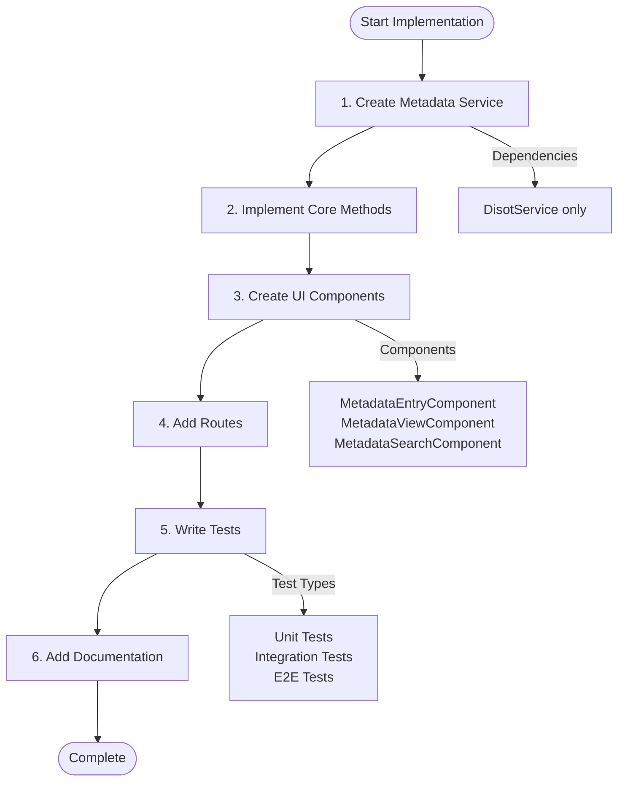
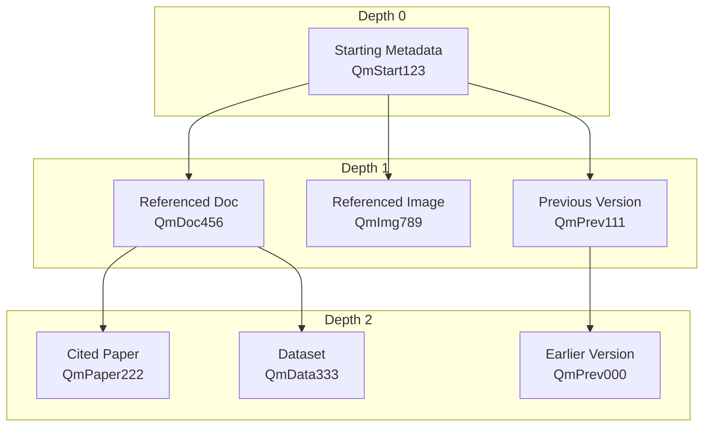

# Metadata Implementation Guide 🛠️

[⬅️ Examples](./examples.md) | [🏠 Documentation Home](../../../) | [API Reference ➡️](./api-reference.md)

## Table of Contents

1. [Prerequisites](#prerequisites)
2. [Step-by-Step Implementation](#step-by-step-implementation)
3. [Service Implementation](#service-implementation)
4. [Component Implementation](#component-implementation)
5. [Testing Strategy](#testing-strategy)
6. [Best Practices](#best-practices)

## Prerequisites

Before implementing metadata functionality, ensure you have:

1. ✅ Understanding of [DISOT entries](../../services/disot-service.md)
2. ✅ Familiarity with [CAS service](../../services/cas-service.md)
3. ✅ Knowledge of Angular services and dependency injection
4. ✅ TypeScript interfaces from `src/app/core/domain/interfaces/metadata-entry.ts`

## Step-by-Step Implementation



### Step 1: Create the Metadata Service

```typescript
// src/app/core/services/metadata/metadata.service.ts
import { Injectable } from '@angular/core';
import { Observable, from, map } from 'rxjs';
import { DisotService } from '../disot.service';
import { 
  MetadataContent, 
  createMetadataContent,
  isMetadataContent 
} from '../../domain/interfaces/metadata-entry';
import { DisotEntry, DisotEntryType } from '../../domain/interfaces/disot.interface';

@Injectable({
  providedIn: 'root'
})
export class MetadataService {
  constructor(
    private disotService: DisotService
  ) {}

  async createMetadataEntry(
    content: MetadataContent,
    privateKey: string
  ): Promise<DisotEntry> {
    // Create DISOT entry with metadata content directly
    const entry = await this.disotService.createEntry(
      content,  // Pass content directly, not a hash
      DisotEntryType.METADATA,
      privateKey
    );
    
    return entry;
  }

  async updateMetadataEntry(
    previousId: string,
    updates: Partial<MetadataContent>,
    privateKey: string
  ): Promise<DisotEntry> {
    // Retrieve previous metadata
    const previousContent = await this.getMetadataContent(previousId);
    
    // Merge updates
    const newContent: MetadataContent = {
      ...previousContent,
      ...updates,
      timestamp: Date.now(),
      version: {
        ...previousContent.version,
        ...updates.version,
        previousVersion: previousId
      }
    };
    
    return this.createMetadataEntry(newContent, privateKey);
  }

  async getMetadataContent(entryId: string): Promise<MetadataContent> {
    const entry = await this.disotService.getEntry(entryId);
    
    if (entry.type !== DisotEntryType.METADATA) {
      throw new Error('Entry is not a metadata entry');
    }
    
    // Direct access to metadata - no CAS retrieval needed
    const metadata = entry.metadata as MetadataContent;
    
    if (!isMetadataContent(metadata)) {
      throw new Error('Invalid metadata content');
    }
    
    return metadata;
  }

  findByReference(contentHash: string): Observable<DisotEntry[]> {
    return from(this.disotService.listEntries({ 
      type: DisotEntryType.METADATA 
    })).pipe(
      map(entries => entries.filter(async entry => {
        try {
          const metadata = await this.getMetadataContent(entry.id);
          return metadata.references.some(ref => ref.hash === contentHash);
        } catch {
          return false;
        }
      }))
    );
  }

  findByAuthor(authorHash: string): Observable<DisotEntry[]> {
    return from(this.disotService.listEntries({ 
      type: DisotEntryType.METADATA 
    })).pipe(
      map(entries => entries.filter(async entry => {
        try {
          const metadata = await this.getMetadataContent(entry.id);
          return metadata.authors.some(author => author.authorHash === authorHash);
        } catch {
          return false;
        }
      }))
    );
  }

  async getVersionHistory(metadataId: string): Promise<DisotEntry[]> {
    const history: DisotEntry[] = [];
    let currentId = metadataId;
    
    while (currentId) {
      try {
        const entry = await this.disotService.getEntry(currentId);
        history.push(entry);
        
        const metadata = await this.getMetadataContent(currentId);
        currentId = metadata.version.previousVersion || '';
      } catch {
        break;
      }
    }
    
    return history;
  }
}
```

### Step 2: Create Metadata Components

#### Metadata Entry Component

```typescript
// src/app/features/metadata/metadata-entry/metadata-entry.component.ts
import { Component, OnInit } from '@angular/core';
import { FormBuilder, FormGroup, FormArray, Validators } from '@angular/forms';
import { MetadataService } from '../../../core/services/metadata/metadata.service';
import { AuthorRole } from '../../../core/domain/interfaces/metadata-entry';

@Component({
  selector: 'app-metadata-entry',
  templateUrl: './metadata-entry.component.html',
  styleUrls: ['./metadata-entry.component.scss']
})
export class MetadataEntryComponent implements OnInit {
  metadataForm: FormGroup;
  authorRoles = Object.values(AuthorRole);
  
  constructor(
    private fb: FormBuilder,
    private metadataService: MetadataService
  ) {
    this.metadataForm = this.createForm();
  }

  ngOnInit(): void {
    this.addReference();
    this.addAuthor();
  }

  private createForm(): FormGroup {
    return this.fb.group({
      references: this.fb.array([]),
      authors: this.fb.array([]),
      version: this.fb.group({
        version: ['1.0.0', Validators.required],
        previousVersion: [''],
        changeDescription: ['']
      })
    });
  }

  get references(): FormArray {
    return this.metadataForm.get('references') as FormArray;
  }

  get authors(): FormArray {
    return this.metadataForm.get('authors') as FormArray;
  }

  addReference(): void {
    const referenceGroup = this.fb.group({
      hash: ['', Validators.required],
      mimeType: ['', Validators.required],
      mimeTypeSource: ['detected', Validators.required],
      relationship: ['']
    });
    this.references.push(referenceGroup);
  }

  addAuthor(): void {
    const authorGroup = this.fb.group({
      authorHash: ['', Validators.required],
      role: [AuthorRole.CREATOR, Validators.required]
    });
    this.authors.push(authorGroup);
  }

  removeReference(index: number): void {
    this.references.removeAt(index);
  }

  removeAuthor(index: number): void {
    this.authors.removeAt(index);
  }

  async onSubmit(): Promise<void> {
    if (this.metadataForm.valid) {
      const formValue = this.metadataForm.value;
      const privateKey = await this.getPrivateKey(); // Implement key retrieval
      
      try {
        const entry = await this.metadataService.createMetadataEntry(
          {
            timestamp: Date.now(),
            ...formValue
          },
          privateKey
        );
        
        console.log('Metadata entry created:', entry);
        // Handle success (navigation, notification, etc.)
      } catch (error) {
        console.error('Error creating metadata entry:', error);
        // Handle error
      }
    }
  }

  private async getPrivateKey(): Promise<string> {
    // Implement private key retrieval
    // This could be from a key management service or user input
    return 'user-private-key';
  }
}
```

#### Metadata View Component

```typescript
// src/app/features/metadata/metadata-view/metadata-view.component.ts
import { Component, OnInit } from '@angular/core';
import { ActivatedRoute } from '@angular/router';
import { MetadataService } from '../../../core/services/metadata/metadata.service';
import { MetadataContent } from '../../../core/domain/interfaces/metadata-entry';
import { DisotEntry } from '../../../core/domain/interfaces/disot.interface';

@Component({
  selector: 'app-metadata-view',
  templateUrl: './metadata-view.component.html',
  styleUrls: ['./metadata-view.component.scss']
})
export class MetadataViewComponent implements OnInit {
  entry?: DisotEntry;
  metadata?: MetadataContent;
  versionHistory: DisotEntry[] = [];
  loading = true;
  error?: string;

  constructor(
    private route: ActivatedRoute,
    private metadataService: MetadataService
  ) {}

  async ngOnInit(): Promise<void> {
    const entryId = this.route.snapshot.paramMap.get('id');
    
    if (entryId) {
      try {
        await this.loadMetadata(entryId);
        await this.loadVersionHistory(entryId);
      } catch (error) {
        this.error = 'Failed to load metadata';
        console.error(error);
      } finally {
        this.loading = false;
      }
    }
  }

  private async loadMetadata(entryId: string): Promise<void> {
    this.metadata = await this.metadataService.getMetadataContent(entryId);
  }

  private async loadVersionHistory(entryId: string): Promise<void> {
    this.versionHistory = await this.metadataService.getVersionHistory(entryId);
  }

  formatTimestamp(timestamp: number): string {
    return new Date(timestamp).toLocaleString();
  }

  getRoleBadgeClass(role: string): string {
    const roleClasses = {
      creator: 'badge-primary',
      editor: 'badge-secondary',
      contributor: 'badge-info',
      reviewer: 'badge-success'
    };
    return roleClasses[role] || 'badge-default';
  }
}
```

### Step 3: Add Metadata Routes

```typescript
// src/app/app-routing.module.ts
const routes: Routes = [
  // ... existing routes
  {
    path: 'metadata',
    children: [
      {
        path: 'create',
        component: MetadataEntryComponent
      },
      {
        path: 'view/:id',
        component: MetadataViewComponent
      },
      {
        path: 'search',
        component: MetadataSearchComponent
      }
    ]
  }
];
```

## Service Implementation

### Advanced Query Methods

```typescript
// Additional methods for MetadataService
export class MetadataService {
  // ... existing methods

  async findByRelationship(
    relationship: string
  ): Promise<DisotEntry[]> {
    const entries = await this.disotService.listEntries({ 
      type: DisotEntryType.METADATA 
    });
    
    const filtered = [];
    for (const entry of entries) {
      try {
        const metadata = await this.getMetadataContent(entry.id);
        const hasRelationship = metadata.references.some(
          ref => ref.relationship === relationship
        );
        if (hasRelationship) {
          filtered.push(entry);
        }
      } catch {
        // Skip invalid entries
      }
    }
    
    return filtered;
  }

  async findByMimeType(mimeType: string): Promise<DisotEntry[]> {
    const entries = await this.disotService.listEntries({ 
      type: DisotEntryType.METADATA 
    });
    
    const filtered = [];
    for (const entry of entries) {
      try {
        const metadata = await this.getMetadataContent(entry.id);
        const hasMimeType = metadata.references.some(
          ref => ref.mimeType === mimeType
        );
        if (hasMimeType) {
          filtered.push(entry);
        }
      } catch {
        // Skip invalid entries
      }
    }
    
    return filtered;
  }

  async getContentGraph(
    startHash: string,
    depth: number = 2
  ): Promise<Map<string, Set<string>>> {
    const graph = new Map<string, Set<string>>();
    const visited = new Set<string>();
    
    await this.buildGraph(startHash, graph, visited, depth);
    
    return graph;
  }

  private async buildGraph(
    hash: string,
    graph: Map<string, Set<string>>,
    visited: Set<string>,
    depth: number
  ): Promise<void> {
    if (depth <= 0 || visited.has(hash)) {
      return;
    }
    
    visited.add(hash);
    
    try {
      const metadata = await this.getMetadataContent(hash);
      const connections = new Set<string>();
      
      // Add all referenced content
      for (const ref of metadata.references) {
        connections.add(ref.hash);
      }
      
      // Add previous version if exists
      if (metadata.version.previousVersion) {
        connections.add(metadata.version.previousVersion);
      }
      
      graph.set(hash, connections);
      
      // Recursively build graph for connections
      for (const connection of connections) {
        await this.buildGraph(connection, graph, visited, depth - 1);
      }
    } catch {
      // Skip if not a metadata entry
    }
  }
}
```

### Content Graph Visualization



## Testing Strategy

### Unit Tests

```typescript
// src/app/core/services/metadata/metadata.service.spec.ts
describe('MetadataService', () => {
  let service: MetadataService;
  let disotService: jasmine.SpyObj<DisotService>;

  beforeEach(() => {
    const disotSpy = jasmine.createSpyObj('DisotService', 
      ['createEntry', 'getEntry', 'listEntries']);

    TestBed.configureTestingModule({
      providers: [
        MetadataService,
        { provide: DisotService, useValue: disotSpy }
      ]
    });

    service = TestBed.inject(MetadataService);
    disotService = TestBed.inject(DisotService) as jasmine.SpyObj<DisotService>;
  });

  it('should create metadata entry', async () => {
    const metadata: MetadataContent = {
      timestamp: Date.now(),
      references: [{
        hash: 'QmTest123',
        mimeType: 'text/plain',
        mimeTypeSource: 'detected'
      }],
      authors: [{
        authorHash: 'QmAuthor456',
        role: AuthorRole.CREATOR
      }],
      version: { version: '1.0.0' }
    };

    const entry: DisotEntry = {
      id: 'entry-123',
      contentHash: 'QmHash789',
      type: DisotEntryType.METADATA,
      metadata: metadata,
      // ... other fields
    };

    disotService.createEntry.and.returnValue(Promise.resolve(entry));

    const result = await service.createMetadataEntry(metadata, 'private-key');

    expect(disotService.createEntry).toHaveBeenCalledWith(
      metadata,  // Content passed directly
      DisotEntryType.METADATA,
      'private-key'
    );
    expect(result).toEqual(entry);
  });

  // Add more tests for other methods
});
```

## Best Practices

### 1. Validation

Always validate metadata before creation:

```typescript
function validateMetadataContent(content: MetadataContent): void {
  if (!content.references || content.references.length === 0) {
    throw new Error('At least one reference is required');
  }
  
  if (!content.authors || content.authors.length === 0) {
    throw new Error('At least one author is required');
  }
  
  if (!content.version || !content.version.version) {
    throw new Error('Version is required');
  }
  
  // Validate semantic version format
  const versionRegex = /^\d+\.\d+\.\d+$/;
  if (!versionRegex.test(content.version.version)) {
    throw new Error('Version must be in semantic version format (X.Y.Z)');
  }
}
```

### 2. Error Handling

Implement comprehensive error handling:

```typescript
class MetadataError extends Error {
  constructor(message: string, public code: string) {
    super(message);
    this.name = 'MetadataError';
  }
}

// Usage
try {
  await metadataService.createMetadataEntry(content, privateKey);
} catch (error) {
  if (error instanceof MetadataError) {
    switch (error.code) {
      case 'INVALID_CONTENT':
        // Handle invalid content
        break;
      case 'STORAGE_ERROR':
        // Handle storage error
        break;
      default:
        // Handle other errors
    }
  }
}
```

### 3. Performance Optimization

Cache frequently accessed metadata:

```typescript
export class MetadataService {
  private metadataCache = new Map<string, MetadataContent>();
  
  async getMetadataContent(entryHash: string): Promise<MetadataContent> {
    // Check cache first
    if (this.metadataCache.has(entryHash)) {
      return this.metadataCache.get(entryHash)!;
    }
    
    // Load from storage
    const metadata = await this.loadMetadataContent(entryHash);
    
    // Cache for future use
    this.metadataCache.set(entryHash, metadata);
    
    return metadata;
  }
}
```

### 4. Batch Operations

Implement batch operations for efficiency:

```typescript
async createBatchMetadataEntries(
  entries: Array<{ content: MetadataContent; privateKey: string }>
): Promise<DisotEntry[]> {
  const promises = entries.map(({ content, privateKey }) =>
    this.createMetadataEntry(content, privateKey)
  );
  
  return Promise.all(promises);
}
```

## Related Documentation

- [Design Overview](./design.md) - Core structure and interfaces
- [Examples](./examples.md) - Real-world usage examples
- [API Reference](./api-reference.md) - Detailed API documentation
- [Testing Guide](../../testing/testing-strategy.md) - General testing approaches

---

[⬅️ Examples](./examples.md) | [🏠 Documentation Home](../../../) | [API Reference ➡️](./api-reference.md)