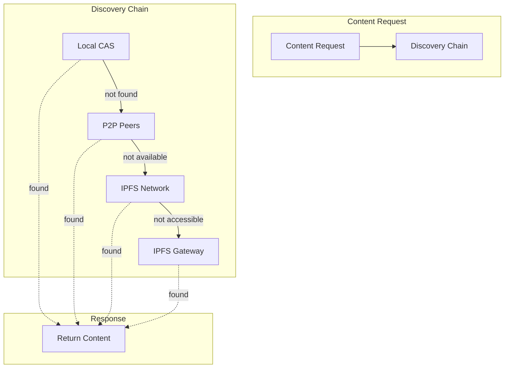
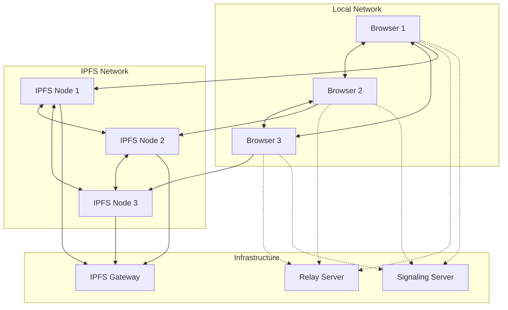

# IPFS-libp2p Hybrid Integration 🔄

[⬅️ Features](./README.md) | [🏠 Documentation Home](../../)

## Overview

The IPFS-libp2p hybrid integration combines the strengths of both protocols to create a robust, efficient, and resilient content distribution system. This integration enables seamless content discovery across multiple transport layers with automatic fallback mechanisms.

## Implementation Status: 📄 Designed & Partially Implemented

## Hybrid Architecture



## Key Integration Features

### 1. Unified Content Addressing

Both IPFS and our CAS system use content-based addressing:
- **Same Hash Algorithm**: SHA-256 for both systems
- **Compatible Identifiers**: CAS hashes can map to IPFS CIDs
- **Seamless Interoperability**: Content stored in one can be retrieved from the other

```typescript
// Content stored in CAS
const casHash = await casService.store(content);

// Same content accessible via IPFS
const ipfsCid = await ipfsService.cidFromHash(casHash);
const content = await ipfsService.cat(ipfsCid);
```

### 2. Hybrid Content Discovery

#### Smart Routing Decision Tree
```typescript
class HybridContentRouter {
  async route(request: P2PContentRequest): Promise<ContentSource> {
    // Analyze request context
    const context = this.analyzeContext(request);
    
    if (context.isOffline) {
      // Only local and direct peers
      return this.configureOfflineChain();
    }
    
    if (context.isPrivate) {
      // No public gateways
      return this.configurePrivateChain();
    }
    
    if (context.isUrgent) {
      // Parallel all sources
      return this.configureParallelChain();
    }
    
    // Default chain
    return this.configureDefaultChain();
  }
}
```

### 3. Performance Optimizations

#### Predictive Caching
```typescript
interface CacheStrategy {
  // Pin content from trusted peers automatically
  autoPinFromTrustedPeers: boolean;
  
  // Cache frequently accessed content
  lruCacheSize: number;
  
  // Prefetch related content
  prefetchRelated: boolean;
  
  // Geographic distribution
  replicateToNearbyPeers: boolean;
}
```

#### Bandwidth Management
- Chunk-level deduplication across protocols
- Parallel chunk retrieval from multiple sources
- Adaptive chunk sizing based on connection quality

### 4. Redundancy & Failover

#### Multi-Layer Redundancy
1. **Local Storage**: Immediate access
2. **Peer Network**: Low latency, high trust
3. **IPFS Network**: Global availability
4. **Gateway Fallback**: Always accessible

#### Automatic Failover
```typescript
class RedundantContentSource {
  private readonly sources: ContentSource[] = [
    new LocalCASSource(),
    new P2PPeerSource(),
    new IPFSNetworkSource(),
    new IPFSGatewaySource()
  ];
  
  async retrieve(hash: ContentHash): Promise<Content> {
    for (const source of this.sources) {
      try {
        const result = await source.retrieve(hash);
        if (result.succeeded) {
          // Optionally replicate to faster sources
          this.replicateToFasterSources(result.content, source);
          return result.content;
        }
      } catch (error) {
        continue; // Try next source
      }
    }
    throw new Error('Content not found in any source');
  }
}
```

### 5. Privacy-Aware Distribution

#### Content Classification
```typescript
enum ContentPrivacy {
  PUBLIC = 'public',        // Can use any source
  PRIVATE = 'private',      // P2P only, no public gateways
  RESTRICTED = 'restricted' // Specific peers only
}

class PrivacyAwareRouter {
  route(content: Content, privacy: ContentPrivacy): ContentSource[] {
    switch (privacy) {
      case ContentPrivacy.PUBLIC:
        return [p2p, ipfs, gateway];
      case ContentPrivacy.PRIVATE:
        return [p2p, privateIPFS];
      case ContentPrivacy.RESTRICTED:
        return [trustedPeers];
    }
  }
}
```

### 6. Hybrid Protocol Benefits

#### From IPFS
- Content addressing and integrity
- Global DHT for discovery
- Bitswap protocol for efficient transfer
- IPLD for structured data
- Existing infrastructure and gateways

#### From libp2p
- Direct peer connections
- Custom protocols
- Real-time communication
- WebRTC support
- Fine-grained access control

### 7. Implementation Examples

#### Content Publishing
```typescript
class HybridPublisher {
  async publish(content: Content, options: PublishOptions) {
    // Store locally first
    const hash = await this.casService.store(content);
    
    // Determine distribution strategy
    if (options.privacy === 'public') {
      // Pin to IPFS for global access
      await this.ipfsService.pin(hash);
      
      // Announce via pubsub
      await this.p2pService.announce({
        type: 'content-published',
        hash,
        metadata: options.metadata
      });
    } else {
      // Share only with trusted peers
      await this.p2pService.shareToPeers(
        hash, 
        options.trustedPeers
      );
    }
    
    return hash;
  }
}
```

#### Content Discovery
```typescript
class HybridDiscovery {
  async discover(query: ContentQuery): Promise<ContentResult[]> {
    // Search across all sources in parallel
    const results = await Promise.allSettled([
      this.searchLocal(query),
      this.searchPeers(query),
      this.searchIPFS(query)
    ]);
    
    // Merge and deduplicate results
    return this.mergeResults(results);
  }
  
  private mergeResults(results: PromiseSettledResult[]): ContentResult[] {
    const merged = new Map<string, ContentResult>();
    
    for (const result of results) {
      if (result.status === 'fulfilled') {
        for (const item of result.value) {
          // Prefer closer sources
          if (!merged.has(item.hash) || 
              item.distance < merged.get(item.hash).distance) {
            merged.set(item.hash, item);
          }
        }
      }
    }
    
    return Array.from(merged.values());
  }
}
```

### 8. Network Topology



## Configuration

### Hybrid System Configuration
```typescript
interface HybridConfig {
  // Source priorities
  sourcePriorities: {
    local: number;      // 1 (highest)
    peer: number;       // 2
    ipfs: number;       // 3
    gateway: number;    // 4 (lowest)
  };
  
  // Routing strategies
  routing: {
    strategy: 'performance' | 'privacy' | 'reliability';
    parallelQueries: boolean;
    timeoutMs: number;
  };
  
  // Replication policies
  replication: {
    autoReplicate: boolean;
    replicationFactor: number;
    preferredLocations: string[];
  };
  
  // Network conditions
  adaptiveRouting: {
    enabled: boolean;
    checkIntervalMs: number;
    bandwidthThreshold: number;
  };
}
```

## Best Practices

### 1. **Content Strategy**
- Public content → IPFS with gateway fallback
- Private content → P2P only with encryption
- Large files → IPFS with chunking
- Real-time data → Direct P2P streams

### 2. **Performance Tuning**
- Use local cache aggressively
- Parallelize peer queries
- Implement smart prefetching
- Monitor network conditions

### 3. **Reliability**
- Always have multiple sources
- Implement retry logic
- Use exponential backoff
- Track source reliability

### 4. **Security**
- Verify content hashes always
- Use encryption for private content
- Implement access control lists
- Audit peer connections

## Future Enhancements

### Short Term
- [ ] Implement basic hybrid routing
- [ ] Add IPFS pinning policies
- [ ] Create unified discovery API
- [ ] Build performance metrics

### Medium Term
- [ ] Advanced caching strategies
- [ ] Predictive content placement
- [ ] Bandwidth optimization
- [ ] Trust-based routing

### Long Term
- [ ] Economic incentives
- [ ] Machine learning for routing
- [ ] Global content index
- [ ] Decentralized governance

---

[⬅️ Features](./README.md) | [⬆️ Top](#ipfs-libp2p-hybrid-integration-) | [🏠 Documentation Home](../../)