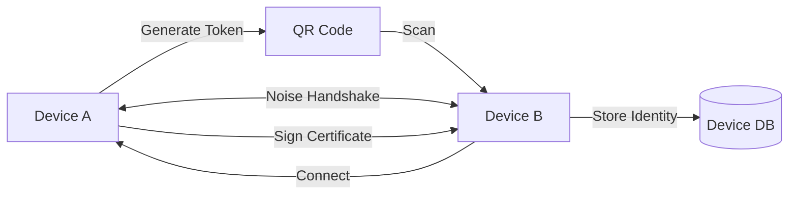
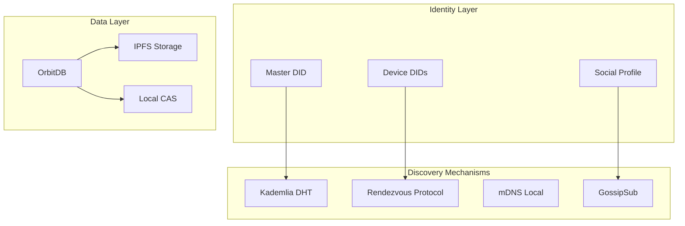

# Social Networking Features 👥

[⬅️ Features](./README.md) | [🏠 Documentation Home](../../)

## Overview

This document details the social networking capabilities of CAS/DISOT, including peer discovery, device synchronization, friend connections, and distributed social features using libp2p, IPFS, and OrbitDB.

## Core Social Features

### 1. Multi-Device Synchronization 📱

Synchronize all data across user's devices automatically:

```typescript
interface DeviceSync {
  // Device registry
  devices: Device[];
  
  // Sync configuration
  syncConfig: {
    autoSync: boolean;
    syncInterval: number;
    conflictResolution: 'latest-write' | 'manual' | 'merge';
  };
  
  // Sync methods
  syncWithDevice(deviceId: string): Promise<void>;
  syncAll(): Promise<void>;
  resolveConflicts(): Promise<void>;
}
```

#### Implementation Stack
- **OrbitDB**: Distributed databases for state synchronization
- **libp2p Streams**: Direct device-to-device data transfer
- **IPFS**: Content storage and deduplication

### 2. Device Pairing & Handshake 🤝

Secure device pairing using QR codes and cryptographic handshakes:



#### Security Features
- **Ephemeral Keys**: Temporary keys for pairing session
- **Noise Protocol**: Secure handshake with forward secrecy
- **Device Certificates**: Signed by master identity
- **Time-limited Tokens**: 5-minute expiration

### 3. Friend Discovery 🔍

Multiple mechanisms for finding friends:

#### A. Username-based Discovery
```typescript
// Register username globally
await discovery.registerUsername('@alice', {
  did: masterDID,
  profile: publicProfile,
  discoverable: true
});

// Find by username
const friend = await discovery.findByUsername('@bob');
```

#### B. DID-based Discovery
```typescript
// Direct lookup by DID
const user = await discovery.findByDID('did:key:z6Mk...');
```

#### C. Social Graph Discovery
```typescript
// Find friends of friends
const suggestions = await discovery.discoverFriendsOfFriends({
  depth: 2,
  limit: 50
});
```

### 4. Data Migration 📦

Complete data transfer between devices:

```typescript
class DataMigration {
  async exportAll(): Promise<MigrationBundle> {
    return {
      identity: await this.exportIdentity(),
      content: await this.exportContent(),
      social: await this.exportSocialGraph(),
      settings: await this.exportSettings()
    };
  }
  
  async importBundle(bundle: MigrationBundle): Promise<void> {
    // Verify bundle integrity
    await this.verifyBundle(bundle);
    
    // Import in order
    await this.importIdentity(bundle.identity);
    await this.importContent(bundle.content);
    await this.importSocialGraph(bundle.social);
    await this.importSettings(bundle.settings);
  }
}
```

## Technical Architecture

### Discovery Layer



### Key Components

#### 1. Identity Management
```typescript
interface IdentityManager {
  // Master identity (user-level)
  masterIdentity: {
    did: string;
    keyPair: Ed25519KeyPair;
    created: Date;
  };
  
  // Device identities
  deviceIdentities: Map<string, DeviceIdentity>;
  
  // Methods
  createMasterIdentity(): Promise<MasterIdentity>;
  addDevice(name: string): Promise<DeviceIdentity>;
  removeDevice(deviceId: string): Promise<void>;
  rotateKeys(): Promise<void>;
}
```

#### 2. Discovery Service
```typescript
interface DiscoveryService {
  // DHT operations
  dht: {
    put(key: string, value: any): Promise<void>;
    get(key: string): Promise<any>;
    findProviders(key: string): Promise<Peer[]>;
  };
  
  // Rendezvous operations
  rendezvous: {
    register(namespace: string, ttl?: number): Promise<void>;
    discover(namespace: string): Promise<Peer[]>;
    unregister(namespace: string): Promise<void>;
  };
  
  // PubSub operations
  pubsub: {
    subscribe(topic: string): Promise<void>;
    publish(topic: string, data: any): Promise<void>;
    unsubscribe(topic: string): Promise<void>;
  };
}
```

#### 3. Sync Engine
```typescript
interface SyncEngine {
  // OrbitDB instances
  databases: {
    profile: KeyValueDB;      // User profile
    content: FeedDB;          // Content feed
    social: DocumentDB;       // Social graph
    messages: DocumentDB;     // Private messages
  };
  
  // Sync operations
  syncDatabase(db: OrbitDB, peer: Peer): Promise<void>;
  handleConflict(local: Entry, remote: Entry): Promise<Entry>;
  subscribeToUpdates(db: OrbitDB): void;
}
```

### Data Schemas

#### User Profile
```typescript
interface UserProfile {
  // Identity
  did: string;
  username: string;
  
  // Profile data
  displayName: string;
  bio?: string;
  avatar?: CID;
  
  // Metadata
  created: Date;
  updated: Date;
  
  // Privacy
  visibility: 'public' | 'friends' | 'private';
  discoverable: boolean;
}
```

#### Social Connection
```typescript
interface SocialConnection {
  // Identity
  userDID: string;
  friendDID: string;
  
  // Relationship
  type: 'friend' | 'follow' | 'block';
  trustLevel: number; // 0-100
  
  // Metadata
  connectedAt: Date;
  tags?: string[];
  notes?: string;
}
```

## Privacy & Security

### Access Control Levels

1. **Public**: Discoverable by anyone
2. **Friends**: Only visible to connections
3. **Private**: Only synchronized between own devices

### Encryption

```typescript
interface EncryptionManager {
  // Content encryption
  encryptForDevices(content: any, deviceDIDs: string[]): Promise<Encrypted>;
  encryptForFriends(content: any, friendDIDs: string[]): Promise<Encrypted>;
  
  // Message encryption
  encryptMessage(message: string, recipientDID: string): Promise<Encrypted>;
  
  // Group encryption
  createGroupKey(memberDIDs: string[]): Promise<GroupKey>;
  encryptForGroup(content: any, groupKey: GroupKey): Promise<Encrypted>;
}
```

## Implementation Examples

### Device Pairing Flow

```typescript
// Device A (existing)
const pairing = new DevicePairing(identity);
const token = await pairing.initiatePairing();
const qrData = {
  token,
  addresses: libp2p.getMultiaddrs(),
  expires: token.expires
};
showQRCode(qrData);

// Device B (new)
const scannedData = await scanQRCode();
const pairing = new DevicePairing();
await pairing.completePairing(scannedData);

// Now Device B is paired and can sync
const sync = new SyncEngine(identity);
await sync.syncAll();
```

### Friend Connection Flow

```typescript
// Find friend
const discovery = new DiscoveryService(libp2p);
const friend = await discovery.findByUsername('@charlie');

// Send friend request
const request = {
  from: myIdentity.did,
  to: friend.did,
  message: 'Hey, it\'s Alice!',
  timestamp: Date.now()
};

await messaging.sendFriendRequest(request);

// Friend accepts
await social.addConnection({
  friendDID: request.from,
  type: 'friend',
  trustLevel: 75
});
```

### Content Synchronization

```typescript
// Publish content update
const content = {
  type: 'post',
  text: 'Hello decentralized world!',
  media: [cidOfImage],
  timestamp: Date.now()
};

// Add to local feed
await databases.content.add(content);

// Broadcast to devices and friends
await pubsub.publish(`/sync/${myDID}`, {
  type: 'new-content',
  entry: content
});
```

## Performance Considerations

### Optimization Strategies

1. **Selective Sync**: Only sync necessary data
2. **Bloom Filters**: Efficient content availability checks
3. **Caching**: Local caches for frequently accessed data
4. **Batch Operations**: Group multiple updates
5. **Delta Sync**: Only transfer changes

### Scalability

- **DHT**: Scales logarithmically with network size
- **PubSub**: Efficient message propagation
- **OrbitDB**: Eventually consistent, conflict-free

## Future Enhancements

### Short Term
- [ ] Contact import/export
- [ ] Group messaging
- [ ] Read receipts
- [ ] Typing indicators

### Medium Term
- [ ] Voice/video calls over WebRTC
- [ ] Collaborative documents
- [ ] Shared calendars
- [ ] Location sharing

### Long Term
- [ ] Federated communities
- [ ] Reputation system
- [ ] Content monetization
- [ ] DAO governance

---

[⬅️ Features](./README.md) | [⬆️ Top](#social-networking-features-) | [🏠 Documentation Home](../../)