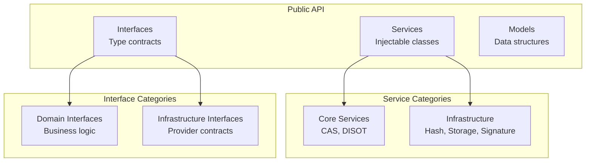
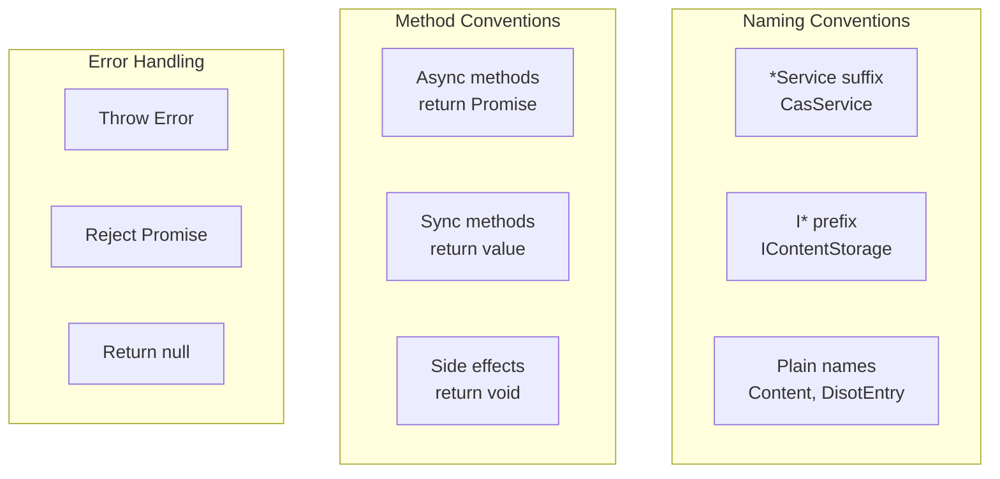
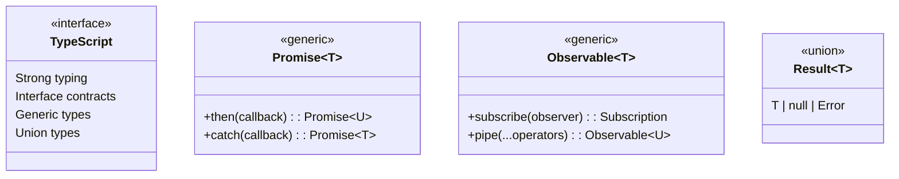

# API Reference

[⬅️ Security](../03-developer-guide/architecture/security.md) | [🏠 Documentation Home](../) | [Services ➡️](./services/)

## Table of Contents

1. [Services API](./services/)
   - [CAS Service API](./services/cas-service.md)
   - [DISOT Service API](./services/cas-service.md#disot-service)
   - [Hash Service API](./services/cas-service.md#hash-service)
   - [Signature Service API](./services/cas-service.md#signature-service)
   - [Storage Service API](./services/cas-service.md#storage-service)

2. [Interfaces API](./interfaces/domain-interfaces.md)
   - [Content Interfaces](./interfaces/domain-interfaces.md#content-interfaces)
   - [DISOT Interfaces](./interfaces/domain-interfaces.md#disot-interfaces)
   - [Crypto Interfaces](./interfaces/domain-interfaces.md#crypto-interfaces)
   - [Storage Interfaces](./interfaces/domain-interfaces.md#storage-interfaces)

3. [Models API](./models/content-models.md)
   - [Content Models](./models/content-models.md#content-models)
   - [DISOT Models](./models/content-models.md#disot-models)
   - [Crypto Models](./models/content-models.md#crypto-models)

## Overview

This API reference provides detailed documentation for all services, interfaces, and models in the CAS/DISOT application.

### API Structure

### API Conventions

### Type System

---

[⬅️ Security](../03-developer-guide/architecture/security.md) | [⬆️ Top](#api-reference) | [🏠 Documentation Home](../) | [Services ➡️](./services/)