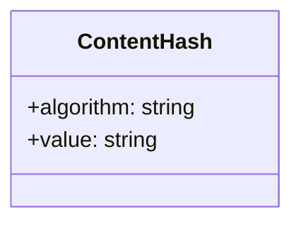
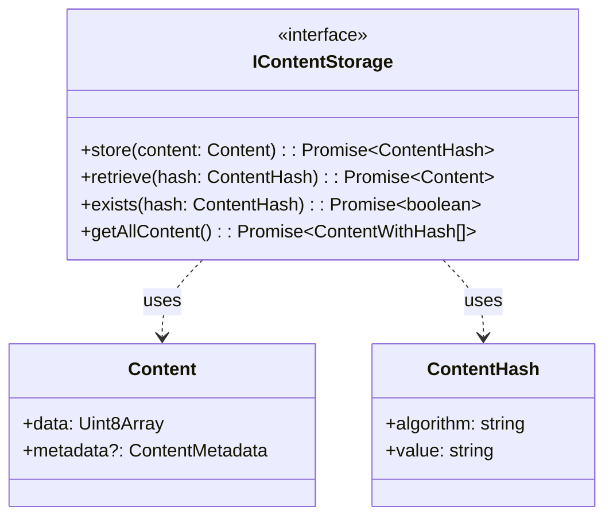
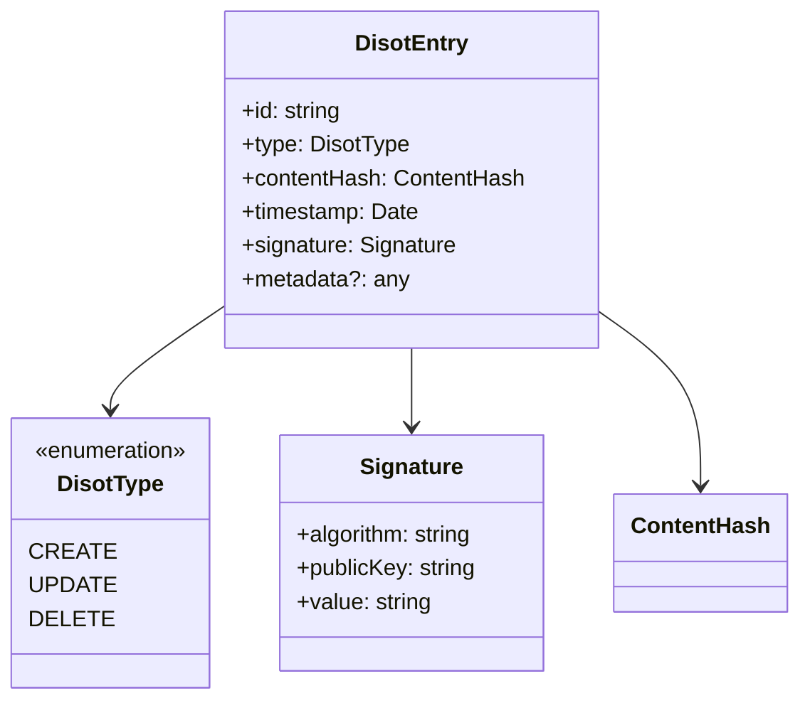
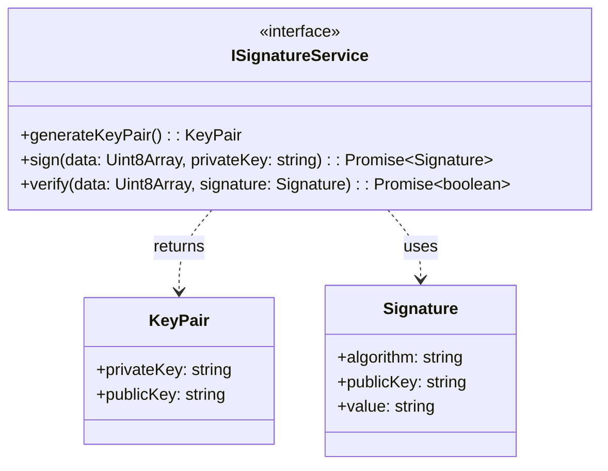
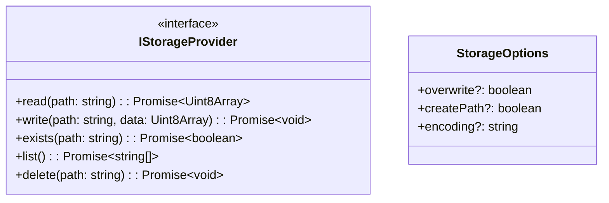
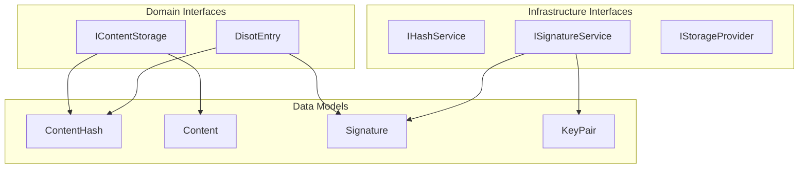

# Interfaces API Reference

[⬅️ Services API](../services/cas-service.md) | [🏠 Home](../../README.md) | [Models API ➡️](../models/content-models.md)

## Table of Contents

1. [Content Interfaces](#content-interfaces)
2. [DISOT Interfaces](#disot-interfaces)
3. [Crypto Interfaces](#crypto-interfaces)
4. [Storage Interfaces](#storage-interfaces)

## Content Interfaces

### ContentHash

Represents a cryptographic hash of content.

```typescript
interface ContentHash {
  algorithm: string;  // Hash algorithm (e.g., 'sha256')
  value: string;      // Hex-encoded hash value
}
```



### Content

Represents content with metadata.

```typescript
interface Content {
  data: Uint8Array;           // Raw content data
  metadata?: ContentMetadata; // Optional metadata
}
```

### ContentMetadata

Metadata associated with content.

```typescript
interface ContentMetadata {
  name?: string;    // File name
  type?: string;    // MIME type
  size?: number;    // Size in bytes
  created?: Date;   // Creation date
  [key: string]: any; // Additional properties
}
```

### ContentWithHash

Content bundled with its hash.

```typescript
interface ContentWithHash {
  content: Content;
  hash: ContentHash;
}
```

### IContentStorage

Interface for content storage operations.

```typescript
interface IContentStorage {
  store(content: Content): Promise<ContentHash>;
  retrieve(hash: ContentHash): Promise<Content>;
  exists(hash: ContentHash): Promise<boolean>;
  getAllContent(): Promise<ContentWithHash[]>;
}
```



## DISOT Interfaces

### DisotEntry

Represents a DISOT entry with signature.

```typescript
interface DisotEntry {
  id: string;                // Unique entry ID
  type: DisotType;          // Entry type
  contentHash: ContentHash;  // Reference to content
  timestamp: Date;          // Creation timestamp
  signature: Signature;     // Digital signature
  metadata?: any;           // Optional metadata
}
```

### DisotType

Enumeration of DISOT entry types.

```typescript
enum DisotType {
  CREATE = 'CREATE',
  UPDATE = 'UPDATE', 
  DELETE = 'DELETE'
}
```

### DisotMetadata

Metadata for DISOT entries.

```typescript
interface DisotMetadata {
  version?: string;
  author?: string;
  description?: string;
  tags?: string[];
  [key: string]: any;
}
```



## Crypto Interfaces

### IHashService

Interface for hashing operations.

```typescript
interface IHashService {
  hash(data: Uint8Array): Promise<string>;
}
```

### ISignatureService

Interface for digital signature operations.

```typescript
interface ISignatureService {
  generateKeyPair(): KeyPair;
  sign(data: Uint8Array, privateKey: string): Promise<Signature>;
  verify(data: Uint8Array, signature: Signature): Promise<boolean>;
}
```

### KeyPair

Represents a cryptographic key pair.

```typescript
interface KeyPair {
  privateKey: string;  // Private key (hex)
  publicKey: string;   // Public key (hex)
}
```

### Signature

Represents a digital signature.

```typescript
interface Signature {
  algorithm: string;   // Signature algorithm
  publicKey: string;   // Public key (hex)
  value: string;       // Signature value (hex)
}
```



## Storage Interfaces

### IStorageProvider

Interface for storage operations.

```typescript
interface IStorageProvider {
  read(path: string): Promise<Uint8Array>;
  write(path: string, data: Uint8Array): Promise<void>;
  exists(path: string): Promise<boolean>;
  list(): Promise<string[]>;
  delete(path: string): Promise<void>;
}
```

### StorageOptions

Options for storage operations.

```typescript
interface StorageOptions {
  overwrite?: boolean;  // Overwrite existing
  createPath?: boolean; // Create path if missing
  encoding?: string;    // Data encoding
}
```



### Interface Relationships



---

[⬅️ Services API](../services/cas-service.md) | [⬆️ Top](#interfaces-api-reference) | [🏠 Home](../../README.md) | [Models API ➡️](../models/content-models.md)