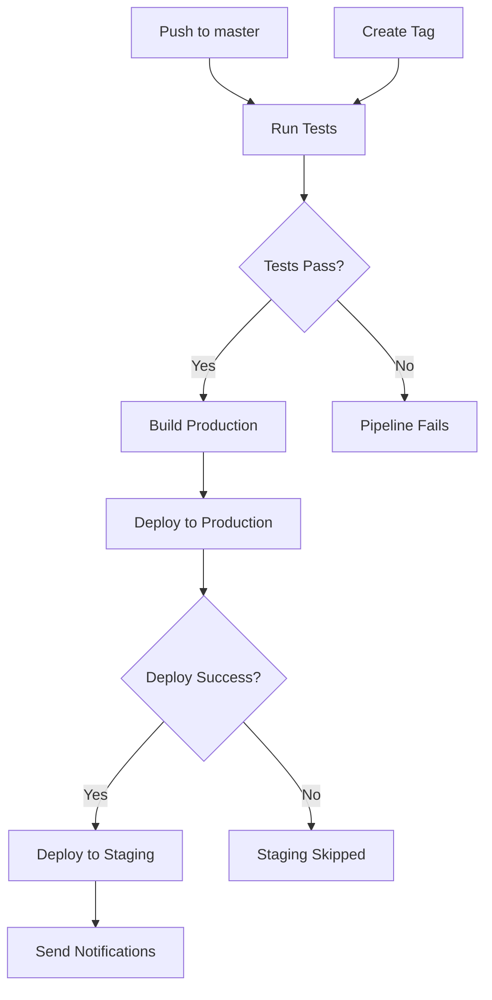

[← Back to Deployment Guide](./README.md)

---

# CI/CD Pipeline Documentation

> **Document Version**: 1.0  
> **Last Updated**: January 2025  
> **Scope**: GitHub Actions CI/CD Pipeline  
> **File**: `.github/workflows/ci-cd.yml`

## Overview

The CAS/DISOT application uses GitHub Actions for continuous integration and deployment. The pipeline automatically tests, builds, and deploys the application to both staging and production environments.

## Pipeline Stages

### 1. Test Suite
- Runs on all pushes and pull requests
- Tests against Node.js v20.x and v22.x
- Generates code coverage reports
- Runs linting (if configured)

### 2. Build Stage
- Triggered on pushes to `master` or version tags
- Builds for both staging and production environments
- Includes coverage reports in build artifacts
- Creates 404.html for SPA routing support

### 3. Deployment

#### Production Deployment
- **Trigger**: Push to `master` or version tags (v*)
- **URL**: https://o2alexanderfedin.github.io/angular-cas-disot/
- **Base href**: `/angular-cas-disot/`
- **Branch**: Deploys to `gh-pages`

#### Staging Deployment
- **Trigger**: After production deployment succeeds
- **URL**: https://o2alexanderfedin.github.io/angular-cas-disot/staging/
- **Base href**: `/angular-cas-disot/staging/`
- **Branch**: Deploys to `gh-pages` in `staging/` directory
- **Sequential**: Waits for production to complete (prevents conflicts)

## Key Features

### Sequential Deployment Strategy
```yaml
deploy-staging:
  needs: [test, build, deploy-production]
  if: needs.deploy-production.result == 'success'
```
This prevents Git conflicts when both deployments try to push to `gh-pages` simultaneously.

### Coverage Integration
- Coverage reports are generated during build
- Reports are included in deployment at `/coverage/`
- Automatic redirect from `/coverage/` to `/coverage/cas-app/`

### Environment Configuration
```yaml
strategy:
  matrix:
    environment: 
      - name: 'staging'
        base_href: '/angular-cas-disot/staging/'
      - name: 'production' 
        base_href: '/angular-cas-disot/'
```

### Build Artifacts
- Artifacts retained for 30 days
- Named with environment and commit SHA
- Includes full Angular build output and coverage

## Deployment Flow



## Environment Variables

### Required Secrets
- `GITHUB_TOKEN`: Automatically provided by GitHub Actions

### Environment URLs
- Production: `https://o2alexanderfedin.github.io/angular-cas-disot`
- Staging: `https://o2alexanderfedin.github.io/angular-cas-disot/staging`

## Monitoring Deployments

### GitHub Actions UI
1. Go to repository → Actions tab
2. View workflow runs and their status
3. Check deployment environments under Settings → Environments

### Deployment Status
- ✅ Green check: Deployment successful
- ❌ Red X: Deployment failed
- 🟡 Yellow circle: In progress

## Troubleshooting

### Common Issues

#### 1. Staging 404 Errors
**Problem**: Assets not loading in staging
**Solution**: Ensure base-href matches deployment path

#### 2. Git Push Conflicts
**Problem**: "rejected - fetch first" errors
**Solution**: Sequential deployment strategy (implemented)

#### 3. Coverage Not Showing
**Problem**: Coverage link returns 404
**Solution**: Check that coverage generation runs before build

### Manual Deployment

If automated deployment fails:
```bash
# Build locally
npm run build:production

# Deploy using gh-pages
npx gh-pages -d dist/cas-app/browser
```

## Best Practices

1. **Always test locally** before pushing to master
2. **Use pull requests** for code review
3. **Tag releases** for production deployments
4. **Monitor deployments** after pushing
5. **Check both environments** after deployment

## Related Documentation

- [Build Process](./build-process.md)
- [Configuration](./configuration.md)
- [GitHub Actions Docs](https://docs.github.com/en/actions)

---

[← Back to Deployment Guide](./README.md) | [Top of Page](#cicd-pipeline-documentation)