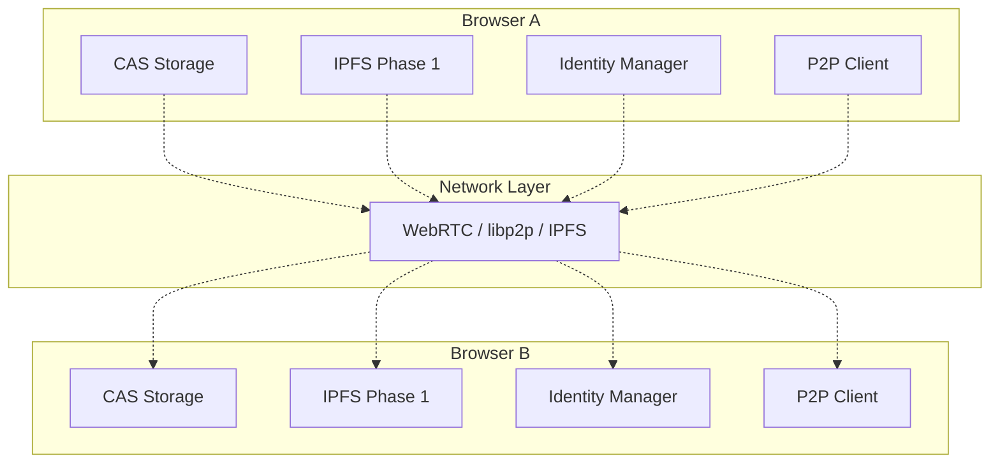

# Phase 3: P2P Network 🌐

[⬅️ Roadmap](../../) | [🏠 Documentation Home](../../../) | [IPFS-P2P Integration ➡️](./ipfs-p2p-integration.md)

## Overview

Phase 3 introduces true peer-to-peer capabilities to the CAS/DISOT system, enabling direct browser-to-browser communication without centralized servers. This phase builds upon the distributed storage of Phase 1 (IPFS) and integrates with the Decentralized Identity system.

## Core Objectives

1. **Direct Peer Communication**
   - Browser-to-browser content exchange
   - No dependency on central servers
   - Offline-first capabilities

2. **Decentralized Identity Integration**
   - P2P identity verification
   - Trust network propagation
   - Credential exchange between peers

3. **Content Synchronization**
   - Automatic content sharing between trusted peers
   - Selective sync based on trust levels
   - Conflict resolution for concurrent updates

## Key Technologies

### WebRTC
- Direct peer connections
- NAT traversal with STUN/TURN
- Data channels for content transfer

### libp2p
- Peer discovery mechanisms
- DHT for peer routing
- Protocol multiplexing

### Existing Foundation
- **IPFS Integration** (Phase 1) - Content addressing and distributed storage
- **Decentralized Identity** - DID-based authentication and trust

## Architecture Components

## Implementation Priorities

### 1. Peer Discovery & Connection
- Local network peer discovery (mDNS)
- DHT-based peer discovery
- Bootstrap nodes for initial connections

### 2. Identity-Based Communication
- Mutual DID authentication
- Encrypted peer channels
- Trust-based access control

### 3. IPFS-Enhanced Content Exchange Protocol
- Hybrid P2P/IPFS content discovery
- Smart routing based on availability
- Leverage IPFS for redundancy and fallback
- [Detailed IPFS Integration](./ipfs-p2p-integration.md)

### 4. Offline Resilience
- Local peer caching
- Opportunistic synchronization
- Conflict-free replicated data types (CRDTs)

## Benefits

### Core P2P Benefits
- **True Decentralization**: No single point of failure
- **Enhanced Privacy**: Direct peer communication
- **Offline Capability**: Work without internet connection
- **Reduced Costs**: No server infrastructure needed
- **Censorship Resistance**: Content persists across peer network

### IPFS Integration Benefits
- **Content Redundancy**: Multiple retrieval paths (P2P, IPFS, Gateway)
- **Global Availability**: Leverage worldwide IPFS network when needed
- **Bandwidth Efficiency**: IPFS chunking and deduplication
- **Proven Infrastructure**: Build on battle-tested IPFS protocols
- **Graceful Degradation**: Fallback options ensure content availability

## Integration Points

### With Phase 1 (IPFS) - Deep Integration
- **Content Discovery**: Unified hash-based addressing across P2P and IPFS
- **Hybrid Routing**: Smart selection between P2P and IPFS based on:
  - Content availability
  - Network conditions  
  - Trust levels
  - Privacy requirements
- **Redundancy**: Automatic IPFS pinning for important content
- **Bandwidth Optimization**: Use IPFS chunking for parallel transfers
- **Private Networks**: Swarm keys for trusted peer groups
- See: [IPFS-P2P Integration Guide](./ipfs-p2p-integration.md)

### With Decentralized Identity
- DIDs as peer identifiers
- Trust scores for peer selection
- Verifiable credentials for access control

## Challenges & Solutions

| Challenge | Solution |
|-----------|----------|
| NAT Traversal | WebRTC with STUN/TURN servers |
| Peer Discovery | Multiple mechanisms (local, DHT, bootstrap) |
| Trust Bootstrap | Web of Trust with identity verification |
| Bandwidth Limits | Selective sync based on trust/priority |
| Browser Constraints | Progressive enhancement, fallback options |

## Success Criteria

- [ ] Direct peer-to-peer content transfer working
- [ ] Identity-based authentication between peers
- [ ] Offline content synchronization
- [ ] Trust network propagation
- [ ] Performance comparable to centralized solution

## Next Steps

1. Evaluate WebRTC vs libp2p for browser compatibility
2. Design P2P protocol specification
3. Implement proof-of-concept with two browsers
4. Integrate with existing CAS/DISOT infrastructure
5. Add identity-based access control

---

[⬅️ Roadmap](../../) | [⬆️ Top](#phase-3-p2p-network-) | [🏠 Documentation Home](../../../) | [IPFS-P2P Integration ➡️](./ipfs-p2p-integration.md)