# IPFS-Enhanced P2P Content Exchange Protocol 🔄

[⬅️ Phase 3 Overview](./README.md) | [🏠 Documentation Home](../../../)

## Overview

This document describes how Phase 3's P2P content exchange protocol leverages the existing IPFS integration from Phase 1 to create a hybrid approach that combines the best of both distributed storage and direct peer communication.

## IPFS as P2P Infrastructure

### 1. Content Addressing Foundation

Since all content in our CAS system already uses SHA-256 hashes, and IPFS uses the same content-addressing principle:

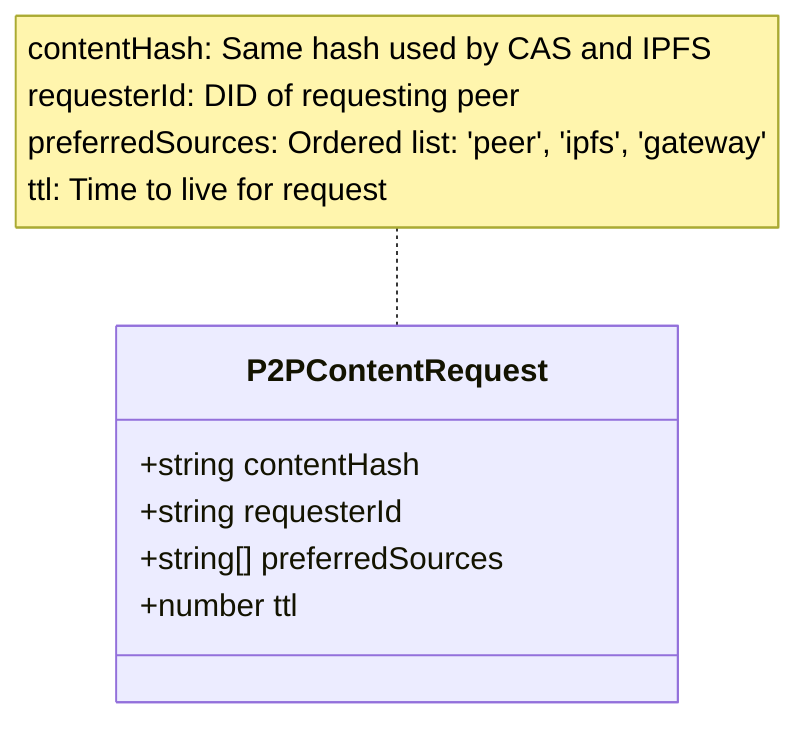

### 2. Hybrid Content Discovery

The content discovery mechanism implements a **Chain of Responsibility** pattern, where each content source gets a chance to fulfill the request before passing it to the next handler:

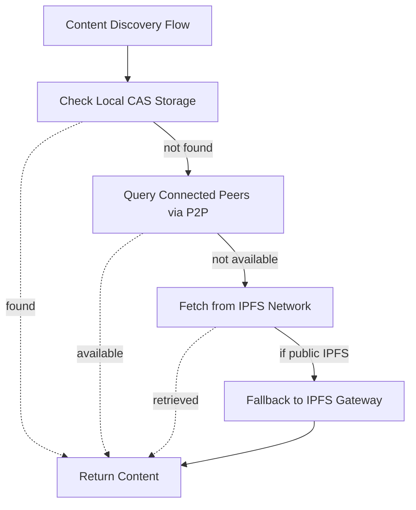

#### Design Pattern: Chain of Responsibility

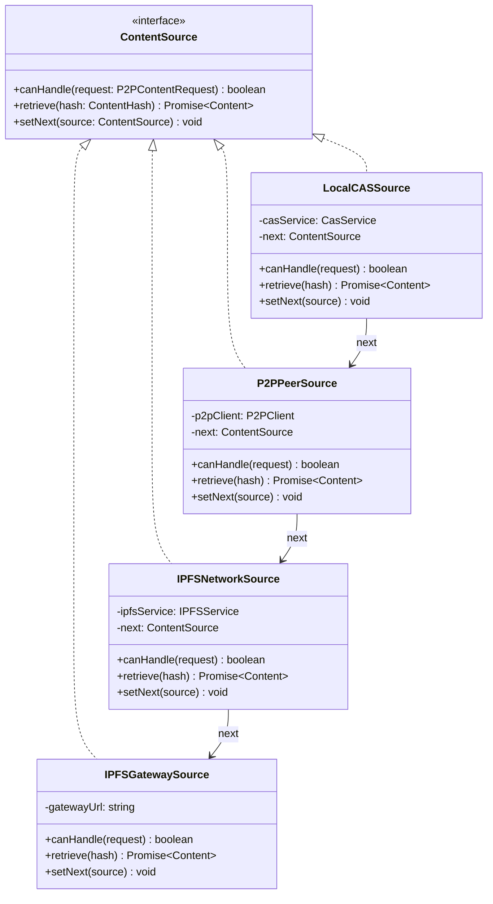

This pattern provides:
- **Loose coupling** between content sources
- **Easy extensibility** - new sources can be added without modifying existing code
- **Configurable priority** - chain order can be adjusted based on preferences
- **Graceful degradation** - automatic fallback through the chain

## Implementation Strategy

### 1. IPFS-Aware P2P Protocol

#### Implementation with Chain of Responsibility

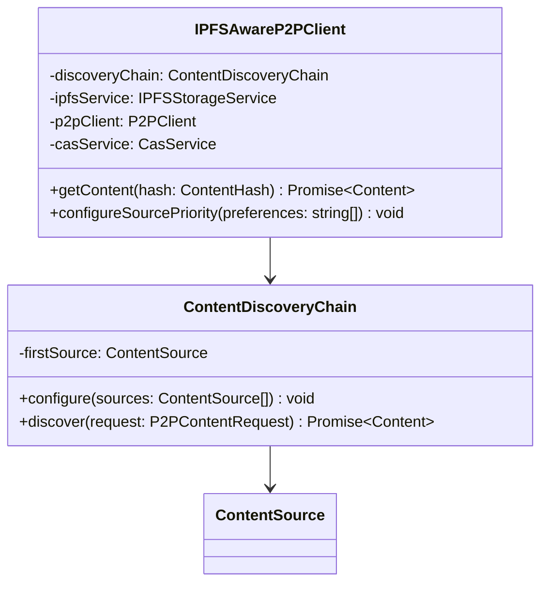

#### Content Retrieval Flow

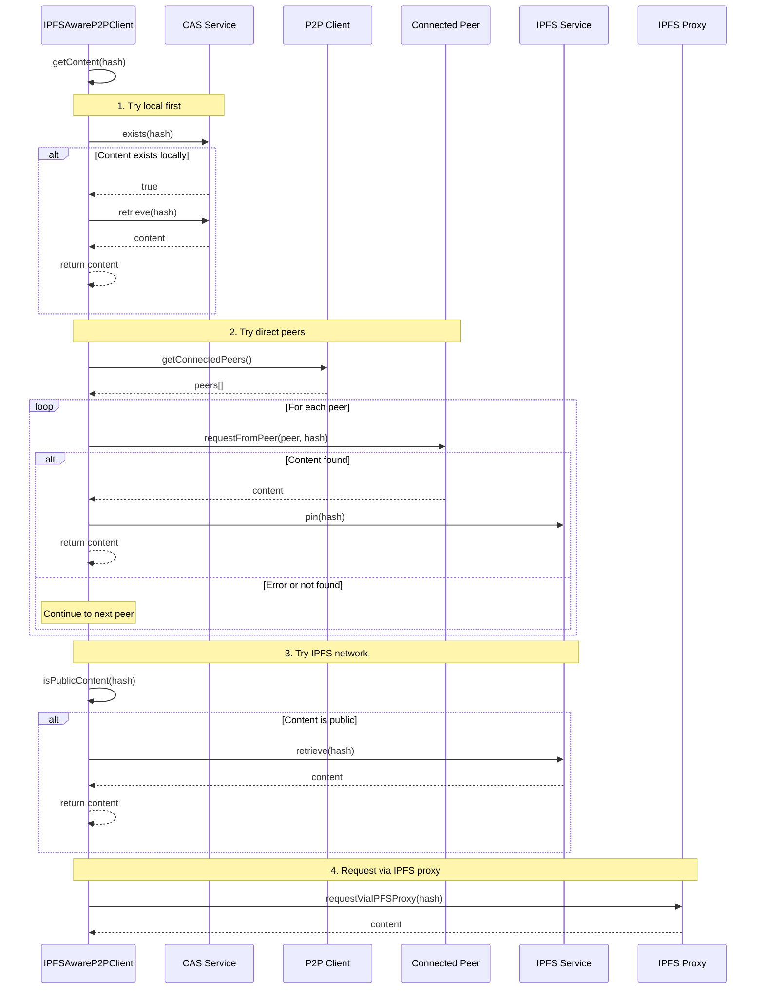

### 2. Peer IPFS Status Exchange

Peers share their IPFS capabilities and content availability:

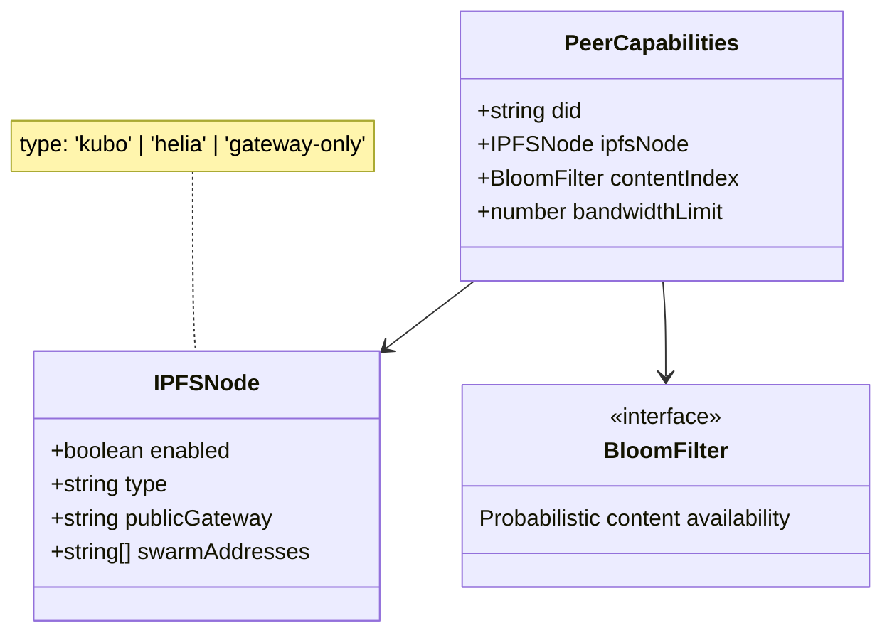

### 3. Smart Content Routing

#### Design Pattern: Strategy Pattern

The `preferredSources` field in `P2PContentRequest` enables dynamic strategy selection:

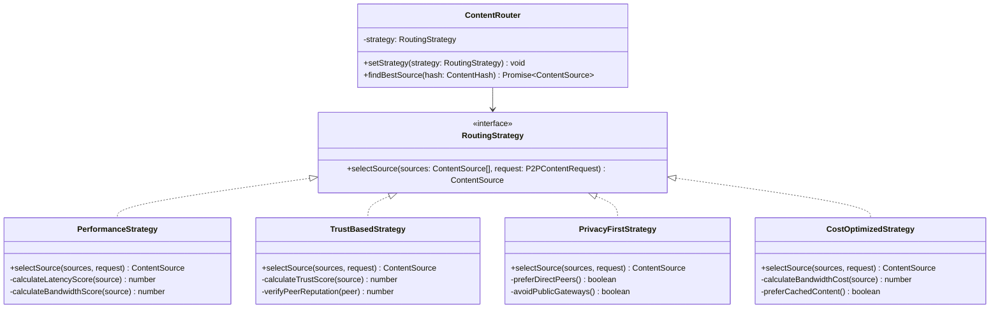

#### Routing Decision Flow

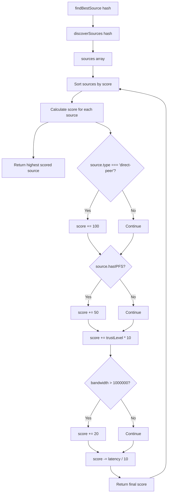

## IPFS-Specific Enhancements

### 1. Content Pinning Strategy

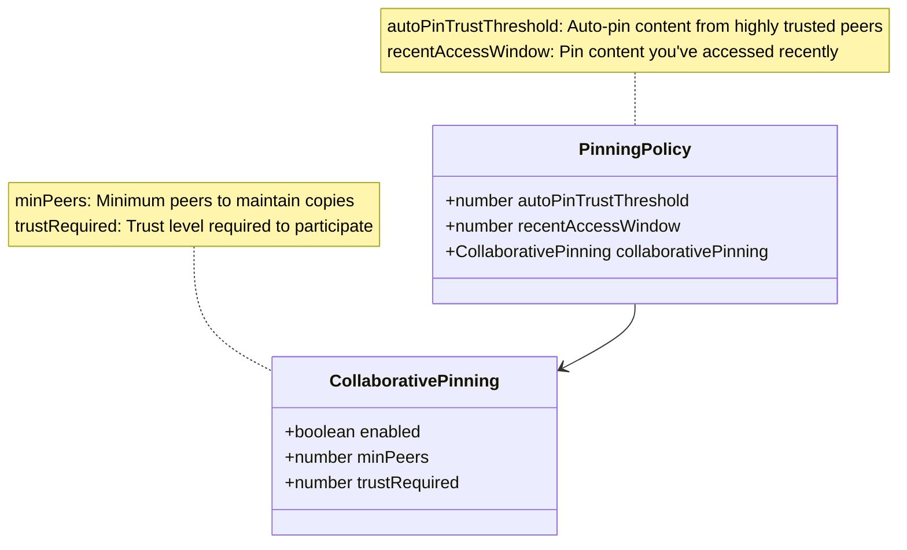

### 2. IPFS Swarm Key Integration

For private content networks:

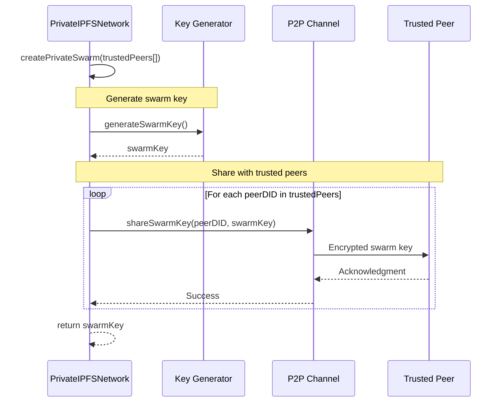

### 3. IPFS Pubsub for Real-time Updates

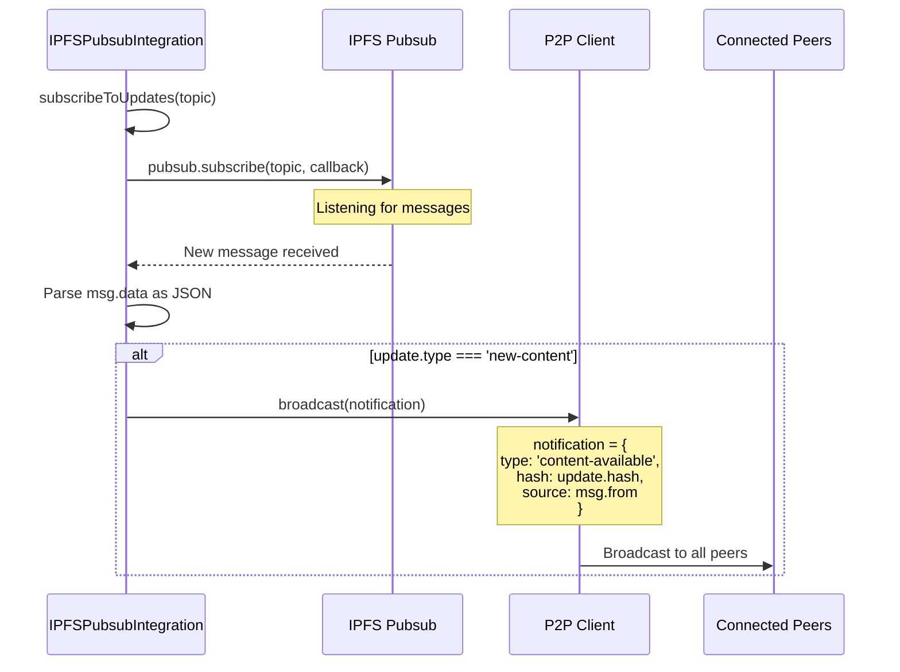

## Advantages of IPFS Integration

### 1. Redundancy and Availability
- If P2P peers are offline, content remains available via IPFS
- Public content automatically distributed across IPFS network
- No single point of failure

### 2. Bandwidth Optimization
- IPFS chunking allows parallel downloads from multiple sources
- Peers can fetch different chunks and share via P2P
- Deduplication at the protocol level

### 3. Content Integrity
- IPFS's merkle DAG ensures content integrity
- Same hash verification used by both CAS and IPFS
- Automatic corruption detection

### 4. Network Effect
- Leverage existing IPFS infrastructure
- Compatible with IPFS ecosystem tools
- Public gateways as fallback

## Implementation Phases

### Phase 3.1: Basic Integration
- [ ] P2P protocol aware of peer IPFS capabilities
- [ ] Fallback to IPFS when peers unavailable
- [ ] Share IPFS CIDs in P2P messages

### Phase 3.2: Advanced Features
- [ ] Collaborative pinning strategies
- [ ] Private IPFS swarms for groups
- [ ] IPFS pubsub integration
- [ ] Bandwidth-aware routing

### Phase 3.3: Optimization
- [ ] Predictive content caching
- [ ] Swarm intelligence for content distribution
- [ ] Economic incentives for pinning

## Example: Content Request Flow

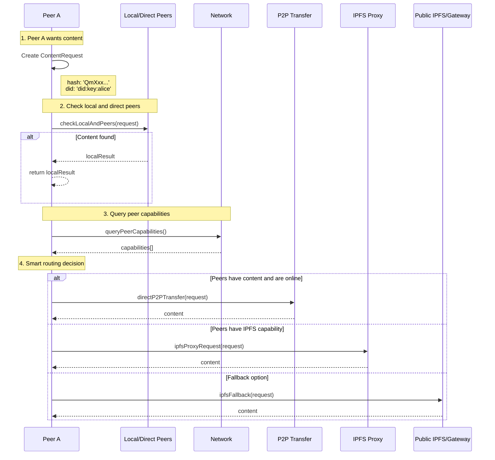

## Configuration

```mermaid
classDiagram
    class P2PIPFSConfig {
        +string[] preferP2P
        +string[] preferIPFS
        +number p2pBandwidthLimit
        +number ipfsBandwidthLimit
        +string cacheStrategy
    }
    
    note for P2PIPFSConfig "preferP2P: ['private', 'recent', 'small']<br/>preferIPFS: ['public', 'large', 'archived']<br/>cacheStrategy: 'lru' | 'trust-based' | 'predictive'"

## Design Patterns Summary

The IPFS-P2P integration leverages several object-oriented design patterns:

### 1. Chain of Responsibility
- **Purpose**: Sequential content source traversal with automatic fallback
- **Benefits**: Loose coupling, easy source addition/removal, configurable priority
- **Implementation**: ContentSource handlers linked in a chain

### 2. Strategy Pattern  
- **Purpose**: Dynamic routing algorithm selection based on context
- **Benefits**: Runtime behavior changes, separation of concerns, extensible strategies
- **Implementation**: RoutingStrategy interface with multiple implementations

### 3. Composite Pattern (Implicit)
- **Purpose**: Treat individual sources and source groups uniformly
- **Benefits**: Recursive content discovery, hierarchical source organization
- **Implementation**: Sources can delegate to sub-sources transparently

These patterns work together to create a flexible, maintainable, and extensible content discovery system.

## Conclusion

By leveraging IPFS from Phase 1, the P2P content exchange protocol gains:

1. **Robustness**: Multiple fallback options for content retrieval
2. **Efficiency**: Smart routing based on availability and performance
3. **Scalability**: Leverage global IPFS network when needed
4. **Privacy**: Direct P2P for sensitive content, IPFS for public
5. **Simplicity**: Unified content addressing across all protocols

This hybrid approach provides the best of both worlds: the speed and privacy of direct P2P connections with the reliability and reach of the IPFS network.

---

[⬅️ Phase 3 Overview](./README.md) | [⬆️ Top](#ipfs-enhanced-p2p-content-exchange-protocol-) | [🏠 Documentation Home](../../../)