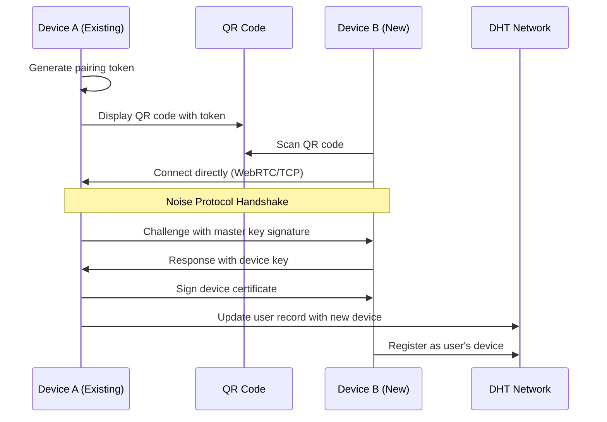

# Peer Discovery & Social Features for CAS/DISOT 🔍

[⬅️ Phase 3 Overview](./README.md) | [🏠 Documentation Home](../../../)

## Overview

This document outlines solutions for peer discovery, device synchronization, and social networking features using libp2p, IPFS, and related technologies.

## Requirements Analysis

### Core Requirements
1. **Multi-Device Synchronization** - Sync data across user's devices
2. **Device Pairing** - Securely link devices with handshake
3. **Data Migration** - Transfer all data between instances
4. **Friend Discovery** - Find and connect with friends across the network

## Proposed Architecture

### 1. Identity & Device Management

#### User Identity Structure
```typescript
interface UserIdentity {
  // Primary identity (permanent)
  masterDID: string;           // did:key:z6Mk...
  masterPublicKey: string;     // Ed25519 public key
  
  // Device identities (one per device)
  devices: {
    deviceId: string;          // Unique device identifier
    deviceDID: string;         // Device-specific DID
    deviceName: string;        // "Alice's Phone"
    addedAt: Date;
    lastSeen: Date;
    capabilities: string[];    // ['storage', 'compute', 'relay']
  }[];
  
  // Social identity
  profile: {
    username: string;          // @alice
    displayName: string;       // Alice Smith
    bio?: string;
    avatar?: CID;              // IPFS CID of avatar
  };
}
```

### 2. Discovery Mechanisms

#### A. DHT-Based Discovery

Using libp2p's Kademlia DHT for global peer discovery:

```typescript
class DHTDiscovery {
  private dht: KadDHT;
  
  // Announce user presence
  async announceUser(identity: UserIdentity) {
    // Create content-addressed record
    const record = {
      key: `/social/user/${identity.profile.username}`,
      value: {
        did: identity.masterDID,
        profile: identity.profile,
        devices: identity.devices.map(d => ({
          id: d.deviceId,
          did: d.deviceDID,
          lastSeen: d.lastSeen
        }))
      }
    };
    
    // Put record in DHT
    await this.dht.put(record.key, record.value);
    
    // Also announce by DID for direct lookup
    await this.dht.put(
      `/social/did/${identity.masterDID}`,
      record.value
    );
  }
  
  // Find user by username
  async findByUsername(username: string): Promise<UserRecord> {
    const key = `/social/user/${username}`;
    return await this.dht.get(key);
  }
  
  // Find user's devices
  async findUserDevices(did: string): Promise<Device[]> {
    const key = `/social/did/${did}`;
    const record = await this.dht.get(key);
    return record.devices;
  }
}
```

#### B. Rendezvous Protocol

For real-time discovery and coordination:

```typescript
class RendezvousDiscovery {
  private rendezvous: Rendezvous;
  
  // Register device for sync
  async registerForSync(userId: string, deviceId: string) {
    const namespace = `/sync/${userId}`;
    await this.rendezvous.register(namespace, {
      deviceId,
      peerId: this.libp2p.peerId,
      addresses: this.libp2p.multiaddrs
    });
  }
  
  // Discover other devices to sync with
  async discoverSyncPeers(userId: string): Promise<Peer[]> {
    const namespace = `/sync/${userId}`;
    return await this.rendezvous.discover(namespace);
  }
  
  // Register for friend discovery
  async registerSocial(username: string) {
    await this.rendezvous.register(`/social/online/${username}`, {
      peerId: this.libp2p.peerId,
      status: 'online'
    });
  }
}
```

#### C. PubSub for Real-time Updates

Using GossipSub for efficient message propagation:

```typescript
class SocialPubSub {
  private pubsub: GossipSub;
  
  // Subscribe to user's sync channel
  async subscribeToSync(userId: string) {
    const topic = `/sync/${userId}`;
    await this.pubsub.subscribe(topic);
    
    this.pubsub.on(topic, (msg) => {
      this.handleSyncMessage(msg);
    });
  }
  
  // Subscribe to friend updates
  async subscribeToFriend(friendDID: string) {
    const topic = `/social/updates/${friendDID}`;
    await this.pubsub.subscribe(topic);
  }
  
  // Broadcast content update
  async broadcastUpdate(update: ContentUpdate) {
    const topic = `/sync/${this.userId}`;
    await this.pubsub.publish(topic, update);
  }
}
```

### 3. Device Pairing & Authentication

#### Secure Pairing Flow



#### Pairing Implementation

```typescript
class DevicePairing {
  // Generate pairing token on existing device
  async initiatePairing(): Promise<PairingToken> {
    const token = {
      userId: this.identity.masterDID,
      temporaryKey: await this.generateEphemeralKey(),
      expires: Date.now() + 5 * 60 * 1000, // 5 minutes
      rendezvousPoint: `/pairing/${randomBytes(16).toString('hex')}`
    };
    
    // Register at rendezvous point
    await this.rendezvous.register(token.rendezvousPoint, {
      peerId: this.libp2p.peerId,
      addresses: this.libp2p.multiaddrs
    });
    
    return token;
  }
  
  // Complete pairing on new device
  async completePairing(token: PairingToken): Promise<void> {
    // Find existing device via rendezvous
    const peers = await this.rendezvous.discover(token.rendezvousPoint);
    const existingDevice = peers[0];
    
    // Establish secure connection
    const conn = await this.libp2p.dial(existingDevice.peerId);
    const stream = await conn.newStream('/pairing/1.0.0');
    
    // Perform Noise handshake with token
    const { sharedSecret } = await this.performNoiseHandshake(
      stream, 
      token.temporaryKey
    );
    
    // Exchange device certificates
    const deviceCert = await this.exchangeCertificates(stream, sharedSecret);
    
    // Store device identity
    await this.storeDeviceIdentity(deviceCert);
  }
}
```

### 4. Data Synchronization

#### OrbitDB for Distributed State

```typescript
class UserDataSync {
  private orbit: OrbitDB;
  private feeds: Map<string, FeedDB>;
  
  // Create user's synchronized databases
  async initializeUserDatabases(identity: UserIdentity) {
    // Profile database (key-value)
    const profileDB = await this.orbit.keyvalue(
      `profile.${identity.masterDID}`,
      {
        accessController: {
          write: identity.devices.map(d => d.deviceDID)
        }
      }
    );
    
    // Content feed (append-only log)
    const contentFeed = await this.orbit.feed(
      `content.${identity.masterDID}`,
      {
        accessController: {
          write: [identity.masterDID]
        }
      }
    );
    
    // Private messages (encrypted documents)
    const messagesDB = await this.orbit.docs(
      `messages.${identity.masterDID}`,
      {
        accessController: {
          write: identity.devices.map(d => d.deviceDID)
        }
      }
    );
    
    return { profileDB, contentFeed, messagesDB };
  }
  
  // Sync with other devices
  async syncWithDevice(deviceId: string) {
    const peer = await this.findDevice(deviceId);
    
    // Replicate databases
    await this.profileDB.load();
    await this.contentFeed.load();
    
    // Subscribe to updates
    this.profileDB.events.on('replicated', () => {
      this.handleProfileUpdate();
    });
  }
}
```

### 5. Friend Discovery & Social Graph

#### Social Graph Management

```typescript
class SocialGraph {
  private friends: Map<string, Friend>;
  private dht: DHTDiscovery;
  
  // Add friend by username
  async addFriend(username: string): Promise<void> {
    // Lookup in DHT
    const userRecord = await this.dht.findByUsername(username);
    
    if (!userRecord) {
      throw new Error('User not found');
    }
    
    // Store friend relationship
    const friend: Friend = {
      did: userRecord.did,
      username: userRecord.profile.username,
      addedAt: new Date(),
      trustLevel: 'friend'
    };
    
    await this.storeFriend(friend);
    
    // Subscribe to their updates
    await this.pubsub.subscribeToFriend(friend.did);
    
    // Share your updates with them
    await this.shareProfileWith(friend.did);
  }
  
  // Discover friends of friends
  async discoverNetwork(depth: number = 2): Promise<SuggestedFriend[]> {
    const discovered = new Map<string, SuggestedFriend>();
    const visited = new Set<string>();
    
    // BFS through social graph
    const queue = [...this.friends.values()];
    let currentDepth = 0;
    
    while (queue.length > 0 && currentDepth < depth) {
      const friend = queue.shift();
      if (visited.has(friend.did)) continue;
      
      visited.add(friend.did);
      
      // Get friend's friends
      const friendsFriends = await this.getFriendsOf(friend.did);
      
      for (const ff of friendsFriends) {
        if (!this.friends.has(ff.did) && !discovered.has(ff.did)) {
          discovered.set(ff.did, {
            ...ff,
            mutualFriends: [friend.username],
            distance: currentDepth + 1
          });
        }
      }
      
      currentDepth++;
    }
    
    return Array.from(discovered.values());
  }
}
```

### 6. Privacy & Security Considerations

#### Access Control

```typescript
interface PrivacySettings {
  // Content visibility
  defaultVisibility: 'public' | 'friends' | 'private';
  
  // Discovery settings
  discoverable: {
    byUsername: boolean;
    byDID: boolean;
    byFriendsOfFriends: boolean;
  };
  
  // Sync settings
  autoSyncWith: 'all-devices' | 'trusted-devices' | 'manual';
  
  // Encryption
  encryptPrivateContent: boolean;
  e2eMessaging: boolean;
}
```

#### Encrypted Communication

```typescript
class SecureMessaging {
  // End-to-end encrypted messages
  async sendPrivateMessage(
    recipientDID: string, 
    content: string
  ): Promise<void> {
    // Get recipient's public key
    const recipientKey = await this.getPublicKey(recipientDID);
    
    // Encrypt message
    const encrypted = await this.encrypt(content, recipientKey);
    
    // Store in shared OrbitDB
    const messageDB = await this.getSharedMessageDB(recipientDID);
    await messageDB.put({
      from: this.identity.masterDID,
      to: recipientDID,
      encrypted,
      timestamp: Date.now()
    });
  }
}
```

## Implementation Roadmap

### Phase 1: Basic Device Sync
- [ ] Implement device pairing with QR codes
- [ ] Set up OrbitDB for profile sync
- [ ] Create sync protocol over libp2p streams

### Phase 2: Social Discovery
- [ ] Implement DHT-based user discovery
- [ ] Add username registration system
- [ ] Create friend request protocol

### Phase 3: Advanced Features
- [ ] Social graph traversal
- [ ] Group synchronization
- [ ] Encrypted messaging
- [ ] Offline message queue

## Benefits of This Architecture

1. **Fully Decentralized** - No central servers required
2. **Privacy Preserving** - Users control their data and visibility
3. **Resilient** - Multiple discovery mechanisms ensure reliability
4. **Scalable** - DHT and pubsub scale to millions of users
5. **Offline Capable** - OrbitDB provides eventual consistency

## Example Use Cases

### Device Sync Flow
```typescript
// On existing device
const pairingToken = await devicePairing.initiatePairing();
const qrCode = generateQR(pairingToken);
displayQRCode(qrCode);

// On new device
const token = await scanQRCode();
await devicePairing.completePairing(token);
await dataSync.syncWithAllDevices();
```

### Friend Discovery Flow
```typescript
// Search for friend
const friend = await socialGraph.findByUsername('@alice');
await socialGraph.addFriend(friend);

// Discover network
const suggestions = await socialGraph.discoverNetwork();
console.log(`Found ${suggestions.length} friends of friends`);
```

---

[⬅️ Phase 3 Overview](./README.md) | [⬆️ Top](#peer-discovery--social-features-for-casdisot-) | [🏠 Documentation Home](../../../)