# 🚀 Deployment Guide

## Overview

This project uses a comprehensive CI/CD pipeline with GitHub Actions for automated testing and deployment to GitHub Pages.

## 🏗️ Environment Strategy

### **Development Environment**
- **Location**: Local development machine
- **Purpose**: Active development and testing
- **Access**: `npm start` (http://localhost:4200)

### **Staging Environment** 
- **Location**: https://o2alexanderfedin.github.io/angular-cas-disot-staging
- **Source**: `develop` branch
- **Deployment**: Automatic on every push to `develop` (after CI passes)
- **Purpose**: Integration testing and review before production

### **Production Environment**
- **Location**: https://o2alexanderfedin.github.io/angular-cas-disot  
- **Source**: `master` branch and tagged releases
- **Deployment**: Automatic on push to `master` or tagged releases (after CI passes)
- **Purpose**: Live application for end users

## 🔄 Deployment Flow

```mermaid
graph TD
    A[Developer Push] --> B{Branch?}
    B -->|develop| C[CI Tests]
    B -->|master| D[CI Tests] 
    B -->|tag v*| E[CI Tests]
    
    C --> F{Tests Pass?}
    D --> G{Tests Pass?}
    E --> H{Tests Pass?}
    
    F -->|✅| I[Deploy to Staging]
    F -->|❌| J[❌ Deployment Blocked]
    
    G -->|✅| K[Deploy to Production]
    G -->|❌| L[❌ Deployment Blocked]
    
    H -->|✅| M[Deploy to Production + Release]
    H -->|❌| N[❌ Deployment Blocked]
    
    I --> O[🎭 Staging Live]
    K --> P[🚀 Production Live]
    M --> Q[🚀 Production Live + GitHub Release]
```



## 📋 CI/CD Pipeline Stages

### **1. Continuous Integration (CI)**
- **Triggers**: Push to `master`/`develop`, Pull Requests
- **Node Versions**: 20.x, 22.x (matrix testing)
- **Steps**:
  - ✅ Checkout code
  - ✅ Install dependencies
  - ✅ Run linting (if configured)
  - ✅ Execute unit tests
  - ✅ Generate coverage reports
  - ✅ Upload coverage to Codecov

### **2. Build Stage**
- **Triggers**: After CI passes on `develop`/`master`/tags
- **Environments**: Staging and Production builds
- **Steps**:
  - ✅ Build optimized production bundles
  - ✅ Configure environment-specific base-href
  - ✅ Create SPA fallback (404.html)
  - ✅ Add build metadata
  - ✅ Upload build artifacts

### **3. Deployment Stage**

#### **Staging Deployment**
- **Trigger**: Push to `develop` branch (after CI passes)
- **Target**: GitHub Pages staging subdirectory
- **URL**: https://o2alexanderfedin.github.io/angular-cas-disot-staging
- **Automatic**: Yes

#### **Production Deployment**  
- **Triggers**: 
  - Push to `master` branch (after CI passes)
  - Tagged releases `v*` (after CI passes)
- **Target**: GitHub Pages main site
- **URL**: https://o2alexanderfedin.github.io/angular-cas-disot
- **Automatic**: Yes
- **Additional**: Creates GitHub deployment records for releases

### **4. Notification Stage**
- **Success**: Reports successful deployments with URLs
- **Failure**: Reports deployment failures for investigation

## 🛠️ Local Development Commands

### **Development**
```bash
npm start                    # Start dev server (localhost:4200)
npm run watch               # Build with file watching
npm test                    # Run tests once
npm run test:watch          # Run tests with watching
npm run test:coverage       # Run tests with coverage report
```

### **Building**
```bash
npm run build               # Development build
npm run build:prod          # Production build
npm run build:staging       # Staging build (with staging base-href)
npm run build:production    # Production build (with production base-href)
```

### **Local Preview**
```bash
npm run preview:staging     # Preview staging build (localhost:4201)
npm run preview:production  # Preview production build (localhost:4202)
```

## 🔐 Security & Permissions

### **GitHub Secrets Used**
- `GITHUB_TOKEN` - Automatic token for GitHub Actions
- `CODECOV_TOKEN` - Optional token for coverage uploads

### **Repository Permissions**
- Actions: Read/Write (for CI/CD)
- Contents: Read/Write (for deployment)
- Pages: Write (for GitHub Pages deployment)
- Metadata: Read (for repository information)

## 🚨 Deployment Rules

### **Staging Deployment Rules**
- ✅ Only deploys from `develop` branch
- ✅ Only deploys if ALL tests pass
- ✅ Automatic deployment (no manual approval)
- ✅ Overwrites previous staging deployment

### **Production Deployment Rules**
- ✅ Only deploys from `master` branch or tagged releases
- ✅ Only deploys if ALL tests pass  
- ✅ Automatic deployment (no manual approval)
- ✅ Creates deployment records for releases
- ✅ Overwrites previous production deployment

## 📊 Monitoring & Rollback

### **Deployment Monitoring**
- GitHub Actions workflow status
- GitHub Pages deployment status
- Codecov coverage reports
- GitHub deployment records

### **Rollback Strategy**
1. **Quick Rollback**: Re-run previous successful deployment
2. **Code Rollback**: Revert commits and push to trigger new deployment
3. **Manual Rollback**: Use GitHub Pages settings to roll back to previous deployment

## 🔧 Troubleshooting

### **Common Issues**

#### **CI Tests Failing**
- Check workflow logs in Actions tab
- Run tests locally: `npm test`
- Fix failing tests before deployment will proceed

#### **Build Failures**
- Check build logs in Actions tab  
- Test build locally: `npm run build:production`
- Verify all dependencies are installed

#### **Deployment Failures**
- Check GitHub Pages settings
- Verify repository permissions
- Check for conflicting deployments

#### **Staging/Production Differences**
- Verify base-href configuration
- Check environment-specific settings
- Test with local preview commands

### **Manual Deployment (Emergency)**
If automated deployment fails, you can deploy manually:

```bash
# For production
npm run build:production
npx gh-pages -d dist/cas-app/browser -b gh-pages

# For staging  
npm run build:staging
npx gh-pages -d dist/cas-app/browser -b gh-pages --dest staging
```

## 📈 Performance & Optimization

### **Build Optimizations**
- ✅ Production builds with optimization
- ✅ Tree shaking for smaller bundles
- ✅ Asset compression
- ✅ SPA routing support with 404.html

### **Deployment Optimizations**
- ✅ Artifact caching between jobs
- ✅ Parallel builds for different environments
- ✅ Conditional deployments to avoid unnecessary builds
- ✅ Build metadata for tracking

## 🔄 GitFlow Integration

The CI/CD pipeline integrates seamlessly with GitFlow:

1. **Feature Development**: Develop on feature branches
2. **Integration**: Merge to `develop` → Auto deploy to staging
3. **Release Preparation**: Create release branch from `develop`
4. **Production Release**: Merge to `master` → Auto deploy to production
5. **Hotfixes**: Hotfix branches → merge to `master` → Auto deploy

## 📞 Support

For deployment issues:
1. Check GitHub Actions logs
2. Review this documentation
3. Test locally with preview commands
4. Create an issue in the repository