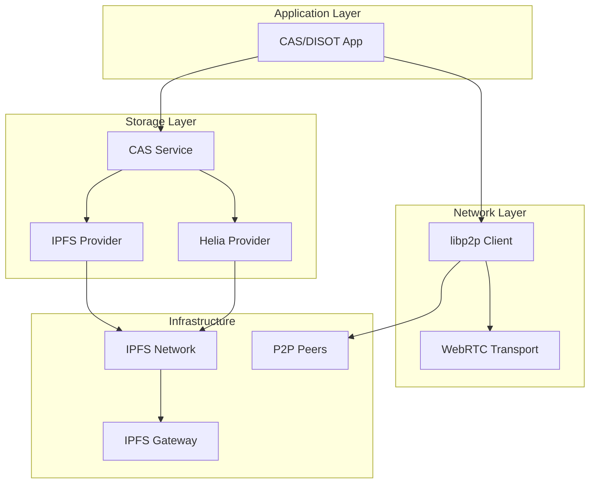

# CAS/DISOT Features Overview 🌟

[🏠 Documentation Home](./)

## Distributed Storage & Networking

The CAS/DISOT system provides comprehensive distributed storage and peer-to-peer networking capabilities through its IPFS and libp2p integrations.

### 🌐 IPFS Integration (Implemented)
Complete distributed storage solution with multiple providers, content migration, and health monitoring.
[→ Full Documentation](./03-developer-guide/features/ipfs-integration.md)

### 🌍 libp2p Integration (Designed)
Peer-to-peer networking with WebRTC support, parallel content discovery, and smart routing.
[→ Full Documentation](./03-developer-guide/features/libp2p-integration.md)

### 🔄 Hybrid Integration
Combined IPFS and libp2p features for optimal content distribution with automatic fallback.
[→ Full Documentation](./03-developer-guide/features/ipfs-libp2p-integration.md)

## Quick Feature Summary

### Storage Features ✅
- **Multiple Providers**: IPFS HTTP, Helia (browser-native), Hybrid
- **Content Migration**: Bulk transfer with progress tracking
- **Upload Queue**: Persistent queue with retry logic
- **Share Links**: IPFS gateway URL generation
- **Health Monitoring**: Real-time node status

### Networking Features 📄
- **P2P Discovery**: Chain of Responsibility pattern
- **Parallel Queries**: Custom race implementation
- **WebRTC Support**: Direct browser connections
- **Smart Routing**: Strategy-based content discovery
- **Private Networks**: Swarm keys for groups

### Integration Benefits 🎯
- **Redundancy**: Multiple fallback layers
- **Performance**: Parallel queries, caching
- **Privacy**: Direct P2P for sensitive content
- **Offline**: Local network operation
- **Scalability**: Global IPFS network

## Implementation Status

| Feature | Status | Phase |
|---------|--------|-------|
| IPFS Storage | ✅ Implemented | Phase 1 |
| Content Migration | ✅ Implemented | Phase 1 |
| Share Links | ✅ Implemented | Phase 1 |
| Health Monitoring | ✅ Implemented | Phase 1 |
| P2P Discovery | 📄 Designed | Phase 3 |
| WebRTC Support | 📄 Designed | Phase 3 |
| Hybrid Protocol | 📄 Designed | Phase 3 |
| Private Networks | 🔮 Planned | Phase 3.2 |

## Architecture

## Getting Started

### Enable IPFS Storage
1. Start local IPFS node: `ipfs daemon`
2. Navigate to Settings in the app
3. Select "IPFS Storage" provider
4. Check health status indicator

### Use Content Migration
1. Go to Migration page
2. Select content to migrate
3. Click "Start Migration"
4. Monitor progress

### Share Content
1. Select any stored content
2. Click "Share" button
3. Copy IPFS gateway URL
4. Share with anyone

## Future Roadmap

### Phase 3.1 (Next)
- [ ] Basic libp2p integration
- [ ] WebRTC peer connections
- [ ] Simple content exchange

### Phase 3.2
- [ ] Parallel peer queries
- [ ] Private networks
- [ ] Advanced routing

### Phase 3.3
- [ ] Performance optimization
- [ ] Economic incentives
- [ ] Analytics

---

For detailed technical documentation, see:
- [Developer Guide](./03-developer-guide/)
- [Architecture](./03-developer-guide/architecture/)
- [API Reference](./04-api-reference/)

[🏠 Documentation Home](./)