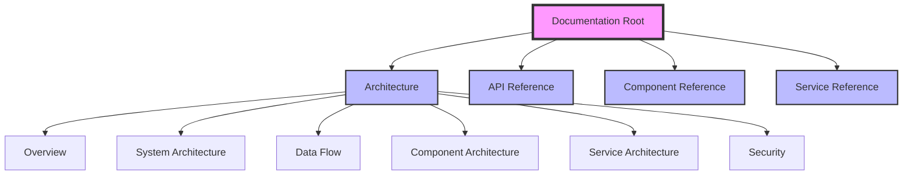

# CAS/DISOT Technical Documentation

## Table of Contents

1. [Architecture Overview](./architecture/overview.md)
2. [System Architecture](./architecture/system-architecture.md)
3. [Data Flow](./architecture/data-flow.md)
4. [Component Architecture](./architecture/component-architecture.md)
5. [Service Architecture](./architecture/service-architecture.md)
6. [Security Architecture](./architecture/security.md)
7. [API Reference](./api/README.md)
8. [Component Reference](./components/README.md)
9. [Service Reference](./services/README.md)
10. [Testing Guide](./testing/testing-guide.md)

## Quick Start

This documentation provides a comprehensive technical overview of the Content Addressable Storage (CAS) and Decentralized Immutable Source of Truth (DISOT) system implemented in Angular.

### Key Concepts

- **CAS (Content Addressable Storage)**: A storage system where content is addressed by its cryptographic hash
- **DISOT (Decentralized Immutable Source of Truth)**: A system for creating verifiable, tamper-proof records using digital signatures
- **Clean Architecture**: Separation of concerns with clear boundaries between layers

### Documentation Structure

---

[Next: Architecture Overview →](./architecture/overview.md)