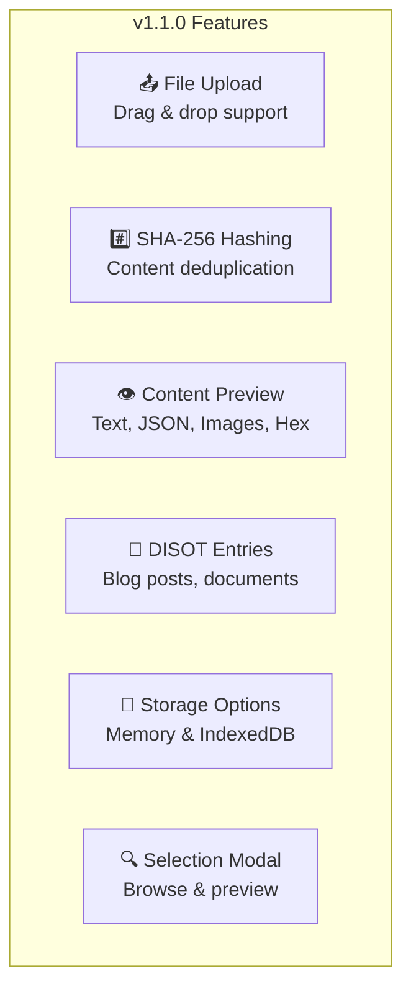
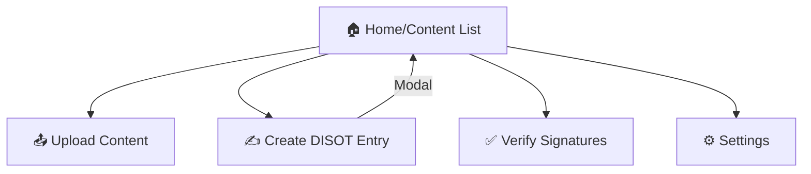

# CAS/DISOT Technical Documentation 📚

## Table of Contents

1. [Architecture Overview](./architecture/overview.md) - 🏗️ High-level system design
2. [System Architecture](./architecture/system-architecture.md) - 🏛️ Detailed architecture patterns
3. [Data Flow](./architecture/data-flow.md) - 🌊 How data moves through the system
4. [Component Architecture](./architecture/component-architecture.md) - 🧩 UI component structure
5. [Service Architecture](./architecture/service-architecture.md) - 🔧 Business logic services
6. [Security Architecture](./architecture/security.md) - 🔐 Security considerations
7. [API Reference](./api/README.md) - 📡 Service interfaces
8. [Component Reference](./components/README.md) - 🎨 Component documentation
9. [Service Reference](./services/README.md) - ⚙️ Service documentation
10. [Testing Guide](./testing/testing-guide.md) - 🧪 Testing strategies

## Quick Start 🚀

This documentation covers the CAS/DISOT application - a browser-based content management system with cryptographic verification.

### What This App Does

- 📤 **Upload Files**: Drag & drop or select files to store
- 🔐 **Content Addressing**: Files stored by SHA-256 hash (deduplication)
- 📝 **DISOT Entries**: Create signed, timestamped records
- ✅ **Verification**: Verify digital signatures on entries
- 💾 **Storage Options**: In-memory or persistent IndexedDB

### Key Features Implemented

### Navigation Structure

---

[Next: Architecture Overview →](./architecture/overview.md)