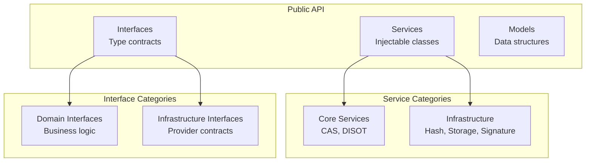
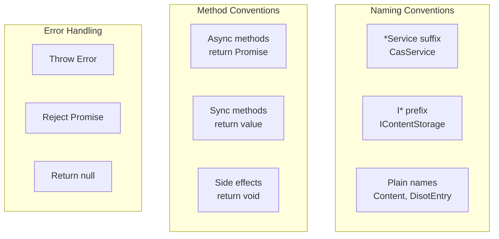
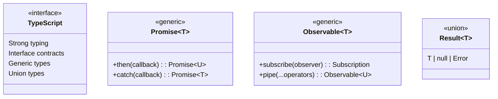

# API Reference

[← Security Architecture](../architecture/security.md) | [Home](../README.md) | [Next: Services API →](./services.md)

## Table of Contents

1. [Services API](./services.md)
   - [CAS Service API](./services.md#cas-service)
   - [DISOT Service API](./services.md#disot-service)
   - [Hash Service API](./services.md#hash-service)
   - [Signature Service API](./services.md#signature-service)
   - [Storage Service API](./services.md#storage-service)

2. [Interfaces API](./interfaces.md)
   - [Content Interfaces](./interfaces.md#content-interfaces)
   - [DISOT Interfaces](./interfaces.md#disot-interfaces)
   - [Crypto Interfaces](./interfaces.md#crypto-interfaces)
   - [Storage Interfaces](./interfaces.md#storage-interfaces)

3. [Models API](./models.md)
   - [Content Models](./models.md#content-models)
   - [DISOT Models](./models.md#disot-models)
   - [Crypto Models](./models.md#crypto-models)

## Overview

This API reference provides detailed documentation for all services, interfaces, and models in the CAS/DISOT application.

### API Structure

### API Conventions

### Type System

---

[← Security Architecture](../architecture/security.md) | [↑ Top](#api-reference) | [Home](../README.md) | [Next: Services API →](./services.md)