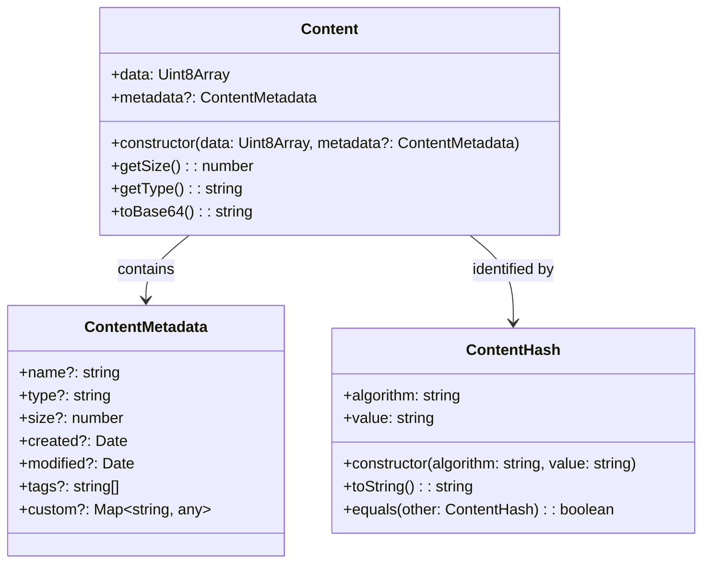
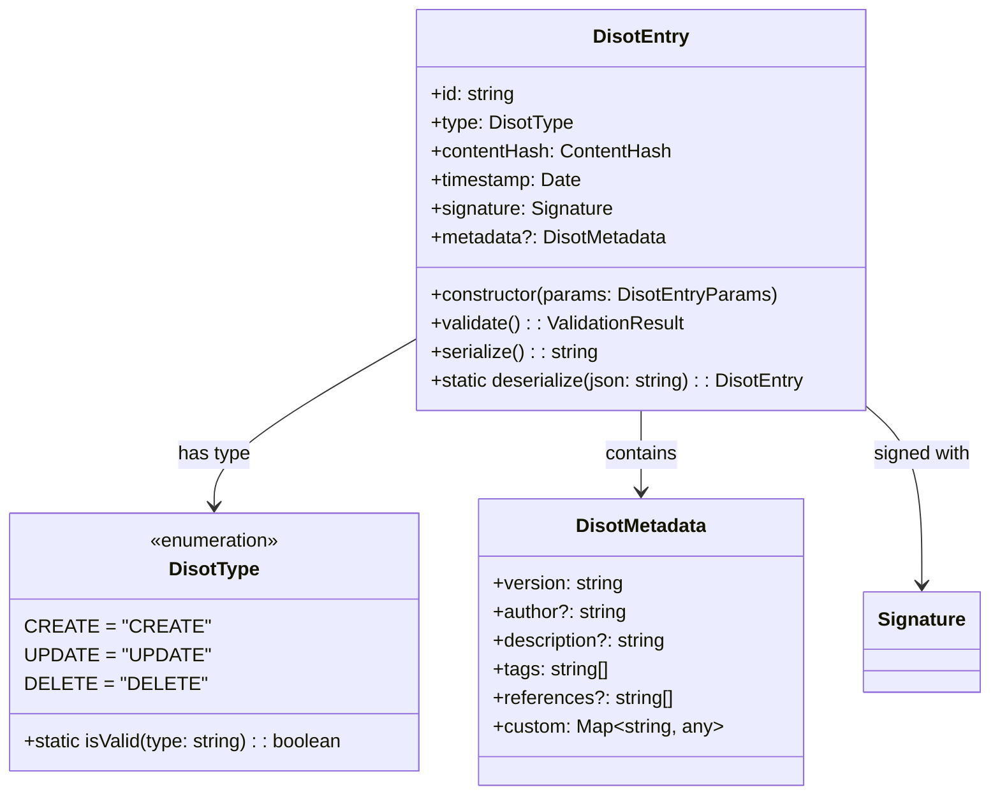
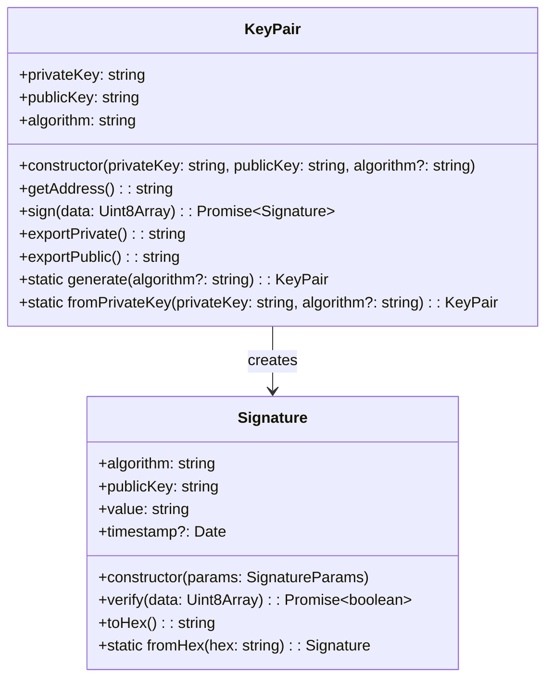
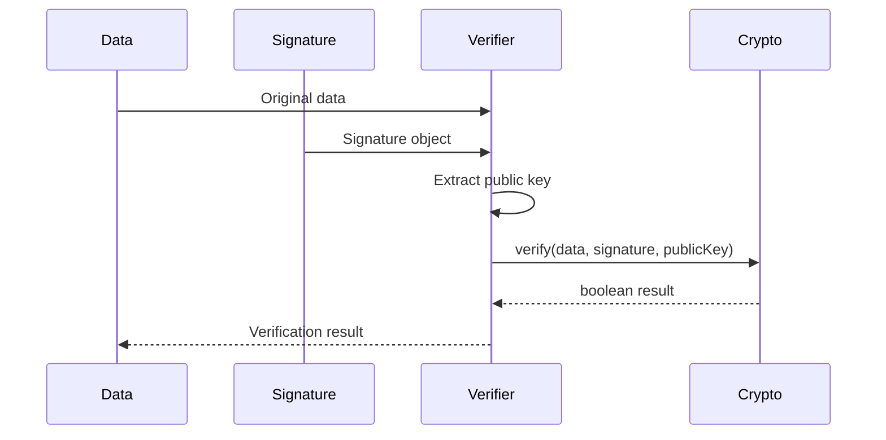
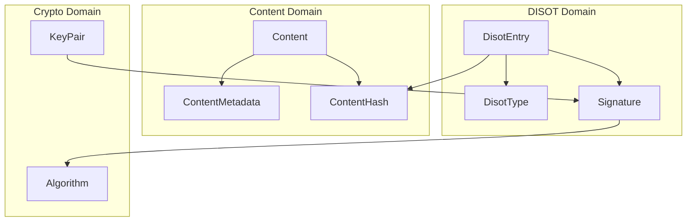

# Models API Reference

[← Interfaces API](./interfaces.md) | [Home](../README.md) | [Component Reference →](../components/README.md)

## Table of Contents

1. [Content Models](#content-models)
2. [DISOT Models](#disot-models)
3. [Crypto Models](#crypto-models)
4. [Usage Examples](#usage-examples)

## Content Models

### Content Model Structure



### Content Factory Methods

```typescript
// Creating content from text
const textContent = Content.fromText('Hello World', {
  name: 'greeting.txt',
  type: 'text/plain'
});

// Creating content from file
const fileContent = Content.fromFile(file);

// Creating content from base64
const base64Content = Content.fromBase64(base64String, metadata);
```

### ContentHash Utilities

```typescript
class ContentHash {
  // Create from hex string
  static fromHex(algorithm: string, hex: string): ContentHash;
  
  // Create from byte array
  static fromBytes(algorithm: string, bytes: Uint8Array): ContentHash;
  
  // Convert to storage path
  toPath(): string {
    // Returns: "sha256/ab/cd/ef/abcdef..."
    return `${this.algorithm}/${this.value.slice(0,2)}/${this.value.slice(2,4)}/${this.value.slice(4,6)}/${this.value}`;
  }
}
```

## DISOT Models

### DisotEntry Model



### DisotEntry Validation

```typescript
interface ValidationResult {
  isValid: boolean;
  errors: ValidationError[];
}

interface ValidationError {
  field: string;
  message: string;
  code: string;
}

// Usage
const entry = new DisotEntry({...});
const validation = entry.validate();
if (!validation.isValid) {
  console.error('Validation errors:', validation.errors);
}
```

### DisotEntry Serialization

```typescript
// Serialize for storage
const serialized = entry.serialize();
// Returns: JSON string with all entry data

// Deserialize from storage
const entry = DisotEntry.deserialize(jsonString);

// Create entry ID from components
const entryId = DisotEntry.createId(contentHash, timestamp, publicKey);
```

## Crypto Models

### KeyPair Model



### Signature Verification Flow



## Usage Examples

### Complete Content Upload Example

```typescript
// 1. Create content from file
const file = event.target.files[0];
const content = await Content.fromFile(file);

// 2. Store content
const casService = inject(CasService);
const contentHash = await casService.store(content);

// 3. Create DISOT entry
const keyPair = KeyPair.generate();
const disotService = inject(DisotService);
const entry = await disotService.createEntry(
  contentHash,
  DisotType.CREATE,
  keyPair.privateKey
);

// 4. Verify the entry
const isValid = await disotService.verifyEntry(entry);
console.log('Entry valid:', isValid);
```

### Content Retrieval Example

```typescript
// 1. Get all content
const contents = await casService.getAllContent();

// 2. Filter by metadata
const images = contents.filter(c => 
  c.content.metadata?.type?.startsWith('image/')
);

// 3. Retrieve specific content
const specific = await casService.retrieve(contentHash);

// 4. Convert to displayable format
const blob = new Blob([specific.data], { 
  type: specific.metadata?.type || 'application/octet-stream' 
});
const url = URL.createObjectURL(blob);
```

### DISOT Entry Management Example

```typescript
// 1. Create a new entry
const entry = await disotService.createEntry(
  contentHash,
  DisotType.CREATE,
  privateKey
);

// 2. Retrieve entry by ID
const retrieved = await disotService.getEntry(entry.id);

// 3. Verify entry signature
const isValid = await disotService.verifyEntry(retrieved);

// 4. Update entry (create new version)
const updateEntry = await disotService.createEntry(
  newContentHash,
  DisotType.UPDATE,
  privateKey,
  { references: [entry.id] }
);
```

### Model Relationships



---

[← Interfaces API](./interfaces.md) | [↑ Top](#models-api-reference) | [Home](../README.md) | [Component Reference →](../components/README.md)