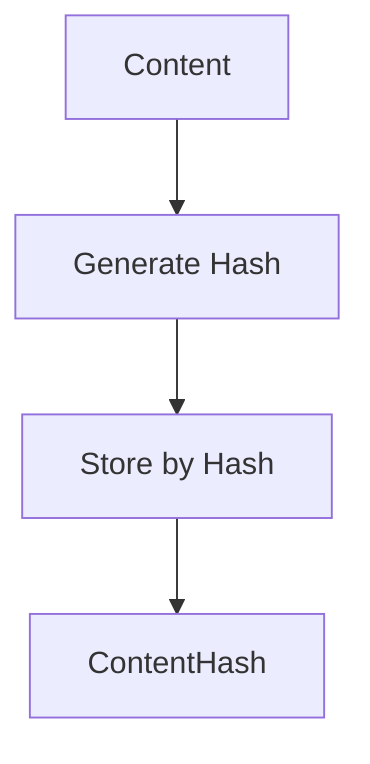
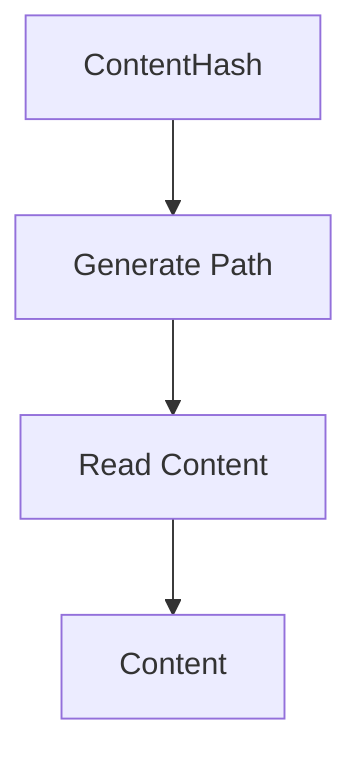
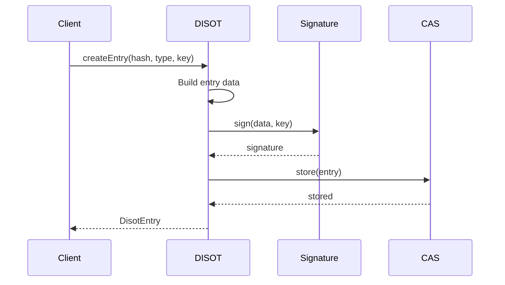
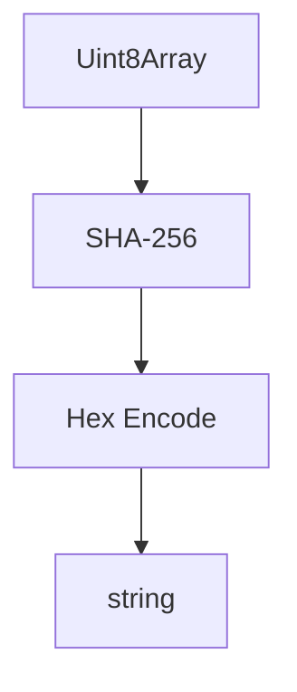
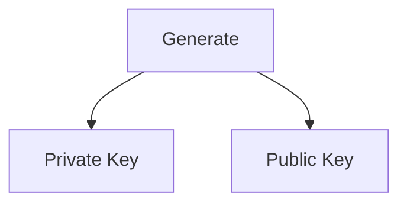
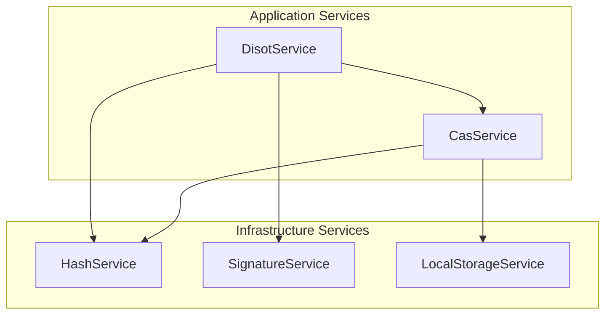

# Services API Reference

[← API Overview](./README.md) | [Home](../README.md) | [Next: Interfaces API →](./interfaces.md)

## Table of Contents

1. [CAS Service](#cas-service)
2. [DISOT Service](#disot-service)
3. [Hash Service](#hash-service)
4. [Signature Service](#signature-service)
5. [Storage Service](#storage-service)

## CAS Service

Content Addressable Storage service for storing and retrieving content by hash.

### Class Definition

```typescript
@Injectable({ providedIn: 'root' })
export class CasService implements IContentStorage
```

### Constructor

```typescript
constructor(
  private hashService: IHashService,
  private storageService: IStorageProvider
)
```

### Methods

#### store

Stores content and returns its hash.



**Signature:**
```typescript
async store(content: Content): Promise<ContentHash>
```

**Parameters:**
- `content: Content` - The content to store

**Returns:**
- `Promise<ContentHash>` - The hash of the stored content

**Example:**
```typescript
const content: Content = {
  data: new TextEncoder().encode('Hello World'),
  metadata: { 
    name: 'greeting.txt',
    type: 'text/plain',
    size: 11
  }
};
const hash = await casService.store(content);
```

#### retrieve

Retrieves content by its hash.



**Signature:**
```typescript
async retrieve(hash: ContentHash): Promise<Content>
```

**Parameters:**
- `hash: ContentHash` - The hash of the content to retrieve

**Returns:**
- `Promise<Content>` - The retrieved content

**Throws:**
- `Error` - If content not found

**Example:**
```typescript
const content = await casService.retrieve(hash);
console.log(new TextDecoder().decode(content.data));
```

#### exists

Checks if content exists for a given hash.

**Signature:**
```typescript
async exists(hash: ContentHash): Promise<boolean>
```

#### getAllContent

Retrieves all stored content with their hashes.

**Signature:**
```typescript
async getAllContent(): Promise<ContentWithHash[]>
```

## DISOT Service

Decentralized Immutable Source of Truth service for managing signed entries.

### Class Definition

```typescript
@Injectable({ providedIn: 'root' })
export class DisotService
```

### Constructor

```typescript
constructor(
  private casService: IContentStorage,
  private signatureService: ISignatureService,
  private hashService: IHashService
)
```

### Methods

#### createEntry

Creates a new DISOT entry with digital signature.



**Signature:**
```typescript
async createEntry(
  contentHash: ContentHash,
  type: DisotType,
  privateKey: string
): Promise<DisotEntry>
```

**Parameters:**
- `contentHash: ContentHash` - Hash of the content
- `type: DisotType` - Type of entry (CREATE, UPDATE, DELETE)
- `privateKey: string` - Private key for signing

**Returns:**
- `Promise<DisotEntry>` - The created entry

#### getEntry

Retrieves a DISOT entry by ID.

**Signature:**
```typescript
async getEntry(entryId: string): Promise<DisotEntry>
```

#### verifyEntry

Verifies the signature of a DISOT entry.

**Signature:**
```typescript
async verifyEntry(entry: DisotEntry): Promise<boolean>
```

**Returns:**
- `Promise<boolean>` - True if signature is valid

## Hash Service

Cryptographic hashing service using Web Crypto API.

### Class Definition

```typescript
@Injectable({ providedIn: 'root' })
export class HashService implements IHashService
```

### Methods

#### hash

Generates SHA-256 hash of data.



**Signature:**
```typescript
async hash(data: Uint8Array): Promise<string>
```

**Parameters:**
- `data: Uint8Array` - Data to hash

**Returns:**
- `Promise<string>` - Hex-encoded hash

**Example:**
```typescript
const data = new TextEncoder().encode('Hello');
const hash = await hashService.hash(data);
// Returns: "185f8db32271fe25f561a6fc938b2e264306ec304eda518007d1764826381969"
```

## Signature Service

Digital signature service (currently mock implementation).

### Class Definition

```typescript
@Injectable({ providedIn: 'root' })
export class SignatureService implements ISignatureService
```

### Methods

#### generateKeyPair

Generates a new key pair.



**Signature:**
```typescript
generateKeyPair(): KeyPair
```

**Returns:**
- `KeyPair` - Object containing privateKey and publicKey

**Note:** Current implementation returns mock keys. Production should use real secp256k1.

#### sign

Signs data with private key.

**Signature:**
```typescript
async sign(data: Uint8Array, privateKey: string): Promise<Signature>
```

**Parameters:**
- `data: Uint8Array` - Data to sign
- `privateKey: string` - Private key

**Returns:**
- `Promise<Signature>` - Digital signature

#### verify

Verifies signature against data.

**Signature:**
```typescript
async verify(data: Uint8Array, signature: Signature): Promise<boolean>
```

## Storage Service

Local storage provider for data persistence.

### Class Definition

```typescript
@Injectable({ providedIn: 'root' })
export class LocalStorageService implements IStorageProvider
```

### Properties

```typescript
private storage: Map<string, Uint8Array>
```

### Methods

#### write

Writes data to storage.

**Signature:**
```typescript
async write(path: string, data: Uint8Array): Promise<void>
```

#### read

Reads data from storage.

**Signature:**
```typescript
async read(path: string): Promise<Uint8Array>
```

**Throws:**
- `Error` - If path not found

#### exists

Checks if path exists.

**Signature:**
```typescript
async exists(path: string): Promise<boolean>
```

#### list

Lists all stored paths.

**Signature:**
```typescript
async list(): Promise<string[]>
```

#### delete

Deletes data at path.

**Signature:**
```typescript
async delete(path: string): Promise<void>
```

### Service Dependency Graph



---

[← API Overview](./README.md) | [↑ Top](#services-api-reference) | [Home](../README.md) | [Next: Interfaces API →](./interfaces.md)