# Component Architecture

[← Data Flow](./data-flow.md) | [Home](../README.md) | [Next: Service Architecture →](./service-architecture.md)

## Table of Contents

1. [Component Overview](#component-overview)
2. [Component Hierarchy](#component-hierarchy)
3. [Component Communication](#component-communication)
4. [Component Lifecycle](#component-lifecycle)
5. [Component Patterns](#component-patterns)

## Component Overview

### Component Categories

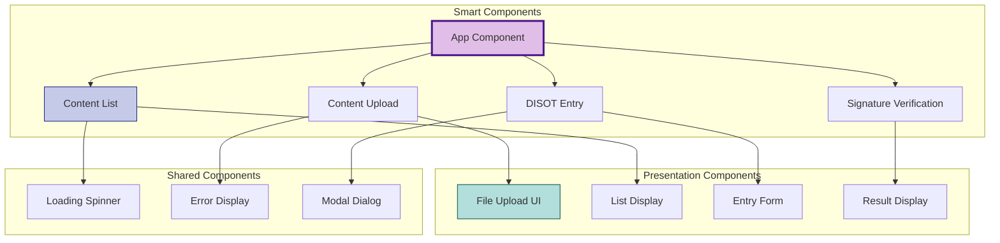

## Component Hierarchy

### Application Component Tree

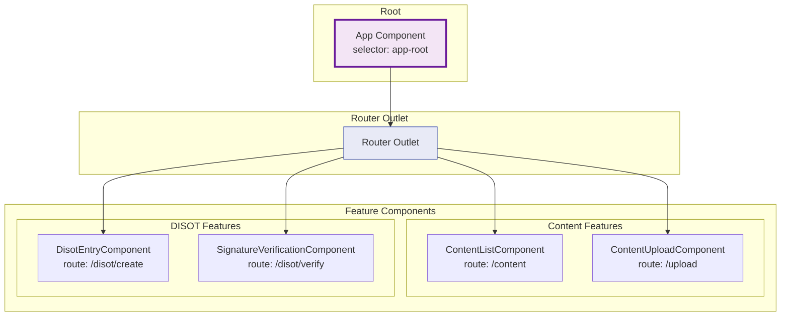

### Component Structure Pattern

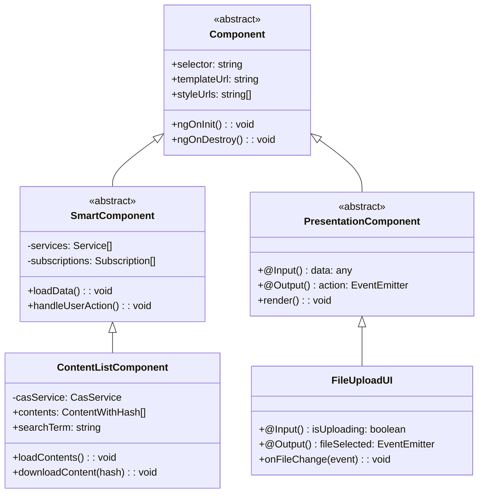

## Component Communication

### Input/Output Flow

```mermaid
graph TD
    subgraph "Parent Component"
        P_DATA[Component Data]
        P_HANDLER[Event Handler]
    end
    
    subgraph "Child Component"
        C_INPUT[@Input Properties]
        C_OUTPUT[@Output Events]
        C_LOGIC[Component Logic]
    end
    
    P_DATA -->|Property Binding| C_INPUT
    C_INPUT --> C_LOGIC
    C_LOGIC --> C_OUTPUT
    C_OUTPUT -->|Event Emission| P_HANDLER
    
    style P_DATA fill:#e3f2fd,stroke:#1565c0
    style C_OUTPUT fill:#f3e5f5,stroke:#6a1b9a
```

### Service-Based Communication

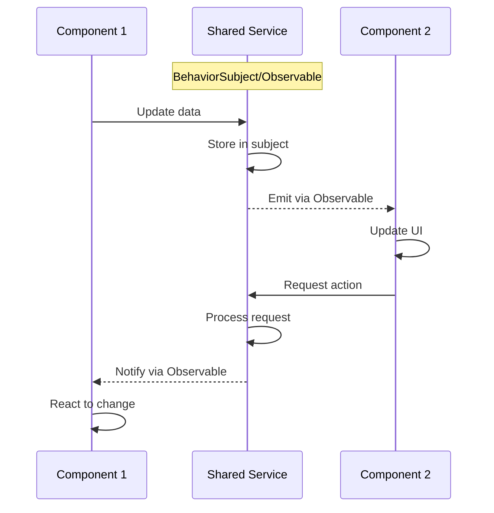

### Router-Based Communication

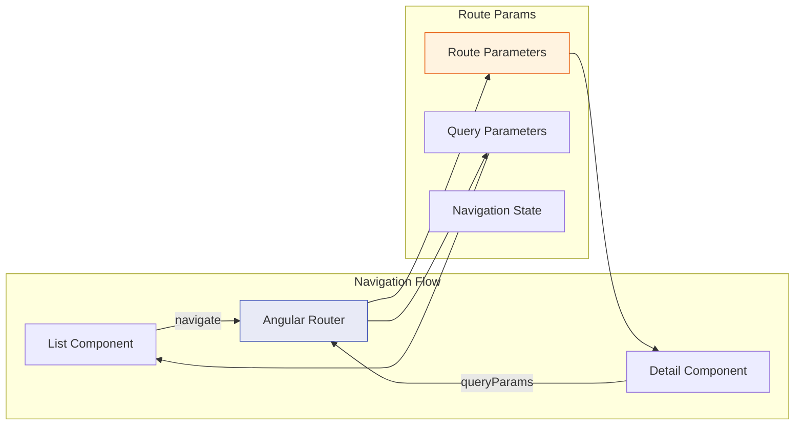

## Component Lifecycle

### Lifecycle Hooks Flow

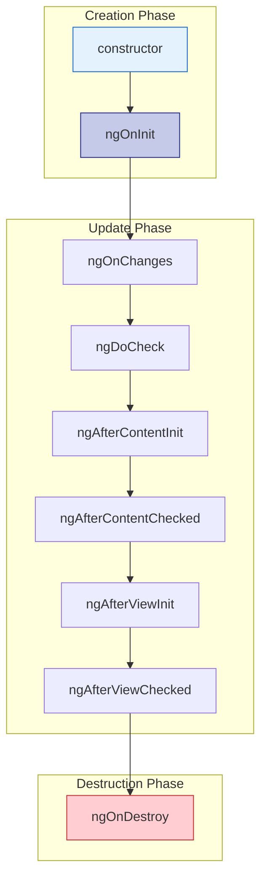

### Component State Management

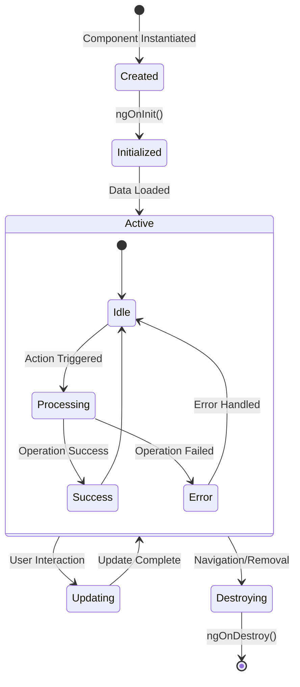

## Component Patterns

### Smart vs Presentation Components

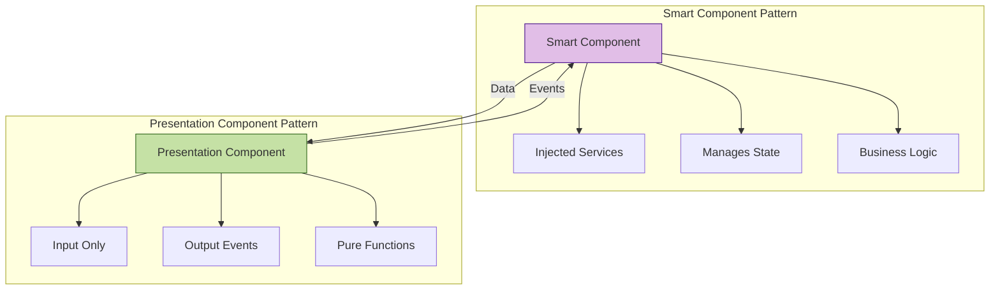

### Component Composition

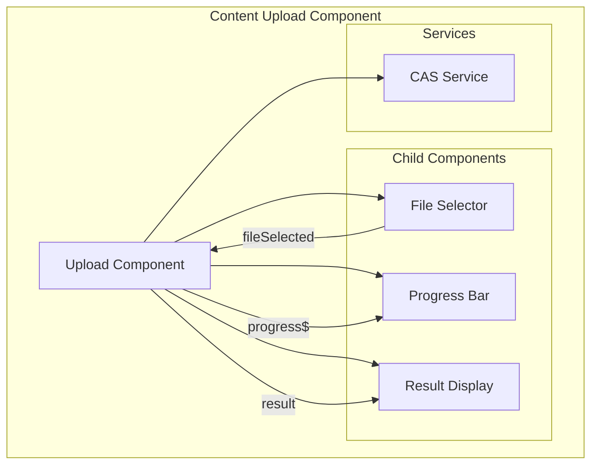

### Error Handling Pattern

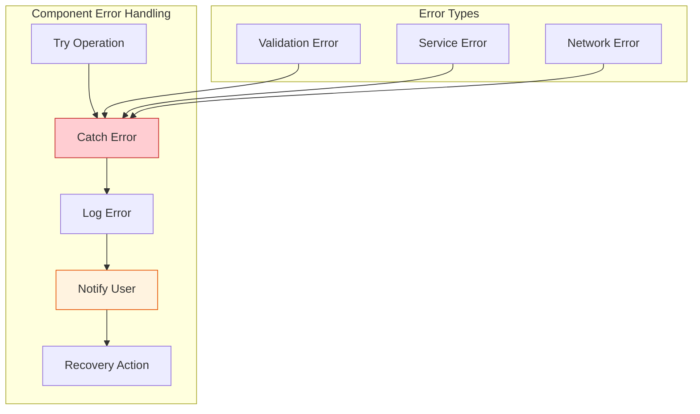

### Reactive Forms Pattern

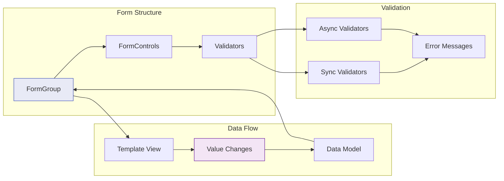

### Component Testing Pattern

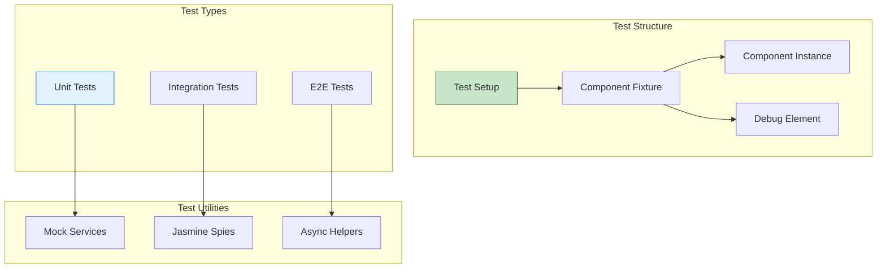

---

[← Data Flow](./data-flow.md) | [↑ Top](#component-architecture) | [Home](../README.md) | [Next: Service Architecture →](./service-architecture.md)