# Data Flow Architecture

[← System Architecture](./system-architecture.md) | [Home](../README.md) | [Next: Component Architecture →](./component-architecture.md)

## Table of Contents

1. [Content Upload Flow](#content-upload-flow)
2. [Content Retrieval Flow](#content-retrieval-flow)
3. [DISOT Entry Creation](#disot-entry-creation)
4. [Signature Verification Flow](#signature-verification-flow)
5. [State Management](#state-management)

## Content Upload Flow

### Upload Sequence Diagram

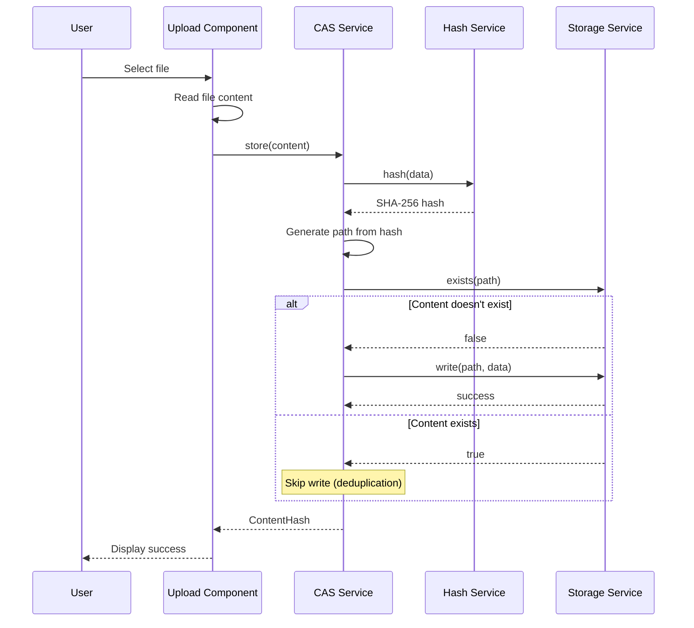

### Upload Data Flow Diagram

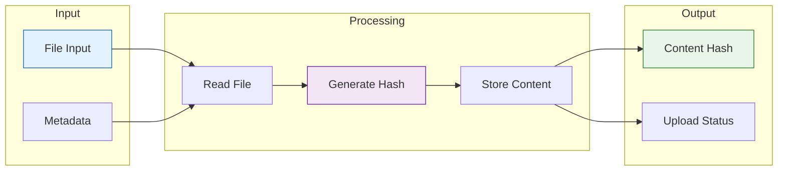

## Content Retrieval Flow

### Retrieval Sequence Diagram

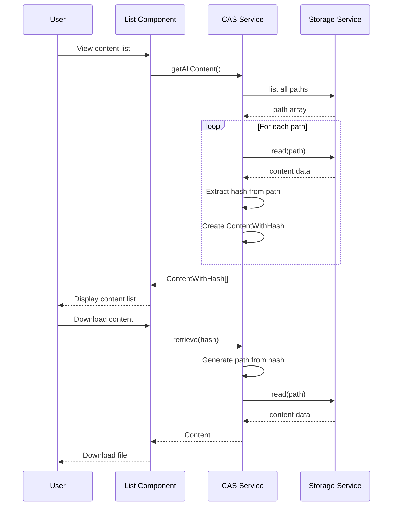

### Content List Data Flow

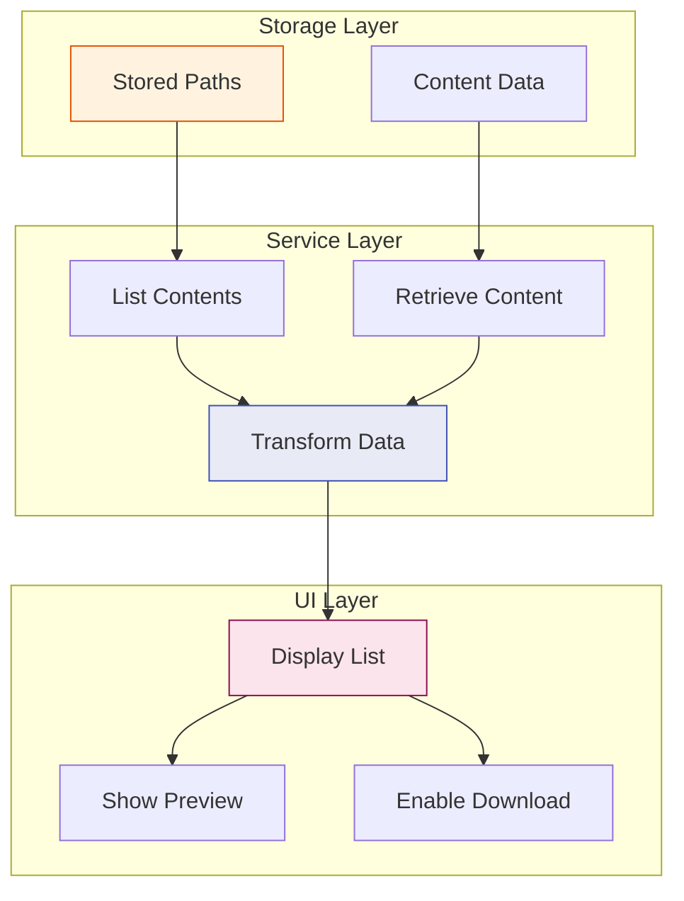

## DISOT Entry Creation

### Entry Creation Flow

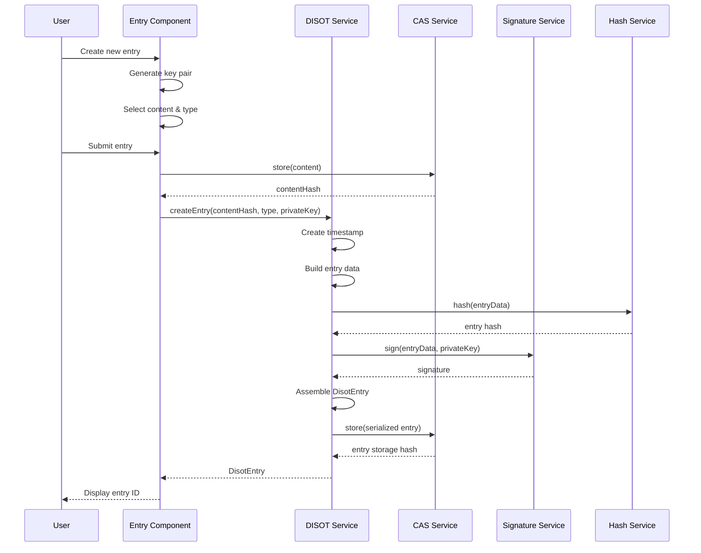

### Entry Data Structure Flow

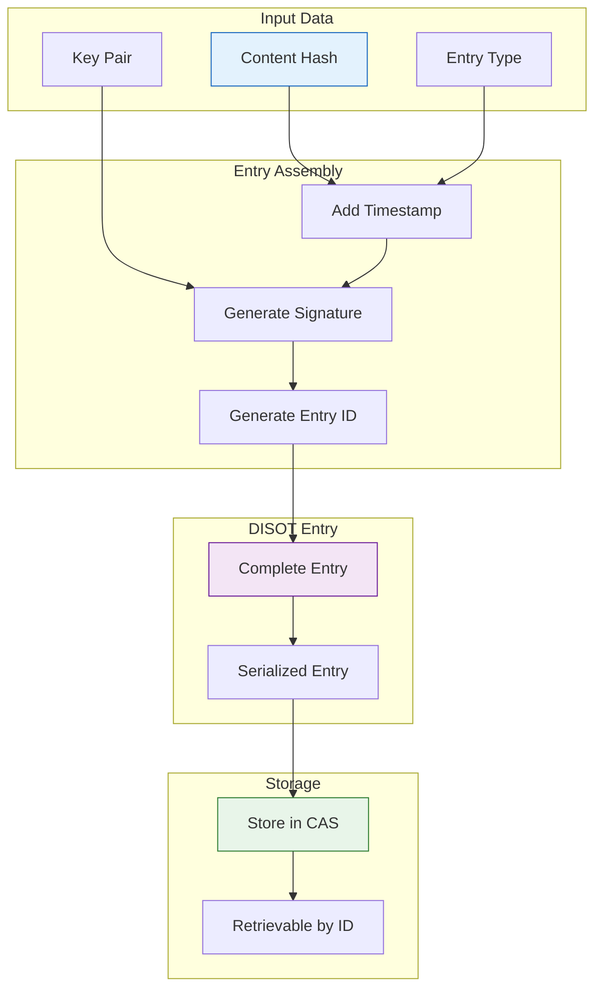

## Signature Verification Flow

### Verification Sequence

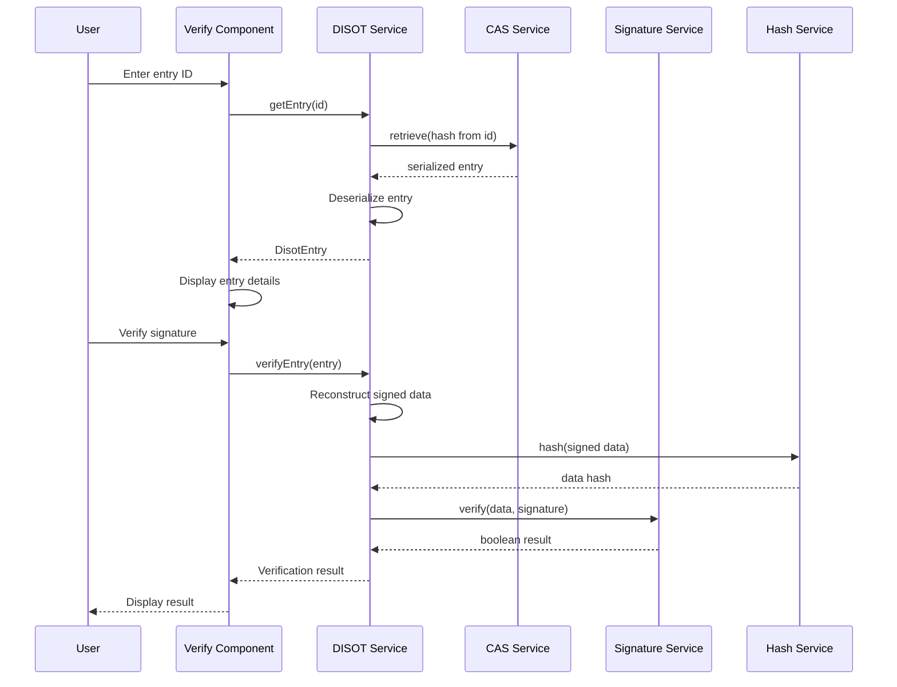

### Verification Data Flow

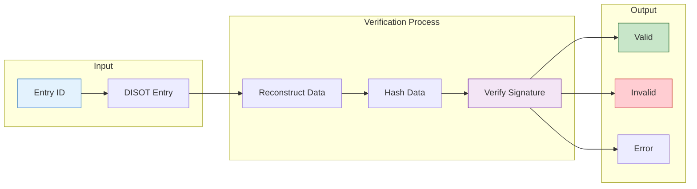

## State Management

### Component State Flow

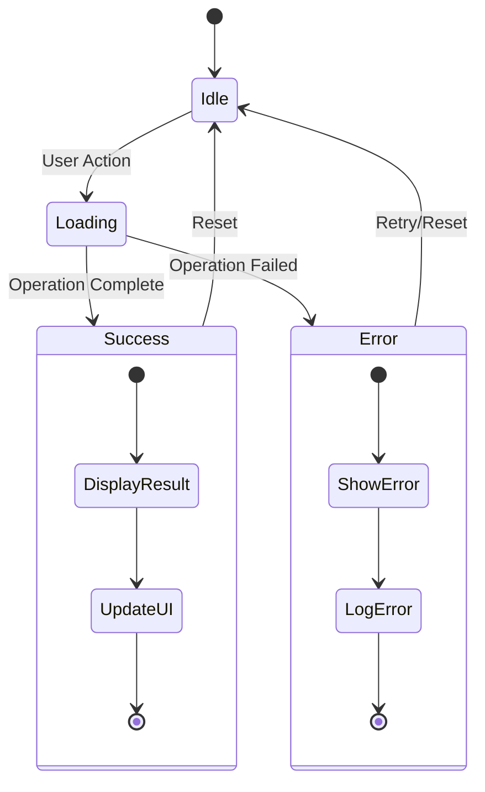

### Data Flow Between Components

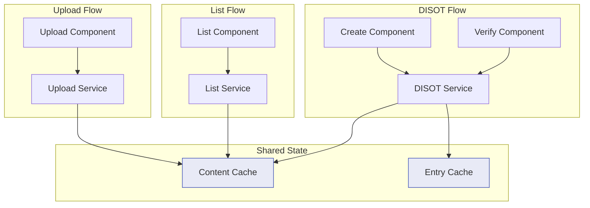

### Error Handling Flow

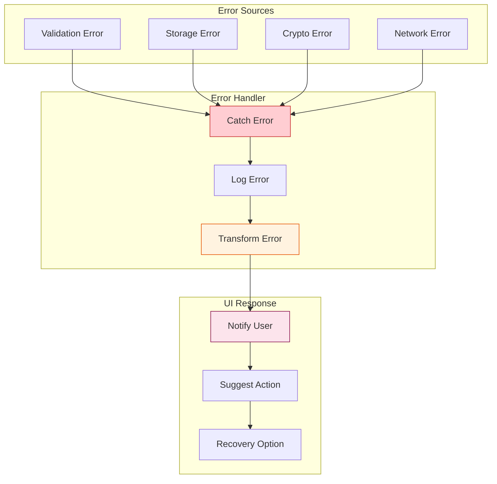

---

[← System Architecture](./system-architecture.md) | [↑ Top](#data-flow-architecture) | [Home](../README.md) | [Next: Component Architecture →](./component-architecture.md)