# Data Flow Architecture 🌊

[← System Architecture](./system-architecture.md) | [Home](../README.md) | [Next: Component Architecture →](./component-architecture.md)

## Table of Contents

1. [Content Upload Flow](#content-upload-flow)
2. [Content Retrieval Flow](#content-retrieval-flow)
3. [DISOT Entry Creation](#disot-entry-creation)
4. [Signature Verification Flow](#signature-verification-flow)
5. [State Management](#state-management)

## Content Upload Flow

### Real Upload Implementation 📤

```mermaid
sequenceDiagram
    participant User
    participant ContentUploadComponent
    participant CasService
    participant HashService
    participant StorageProvider
    
    User->>ContentUploadComponent: Drag & drop file
    ContentUploadComponent->>ContentUploadComponent: FileReader.readAsArrayBuffer()
    ContentUploadComponent->>CasService: store({data: Uint8Array})
    
    CasService->>HashService: hash(data)
    HashService->>HashService: crypto.subtle.digest('SHA-256')
    HashService-->>CasService: "abc123..."
    
    CasService->>CasService: path = `content/${hash}`
    CasService->>StorageProvider: exists(path)
    
    alt New Content
        StorageProvider-->>CasService: false
        CasService->>StorageProvider: write(path, data)
        CasService->>StorageProvider: write(metadata_path, metadata)
        Note over CasService: 🆕 Content stored!
    else Duplicate
        StorageProvider-->>CasService: true
        Note over CasService: ♾️ Deduplication!
    end
    
    CasService-->>ContentUploadComponent: ContentHash
    ContentUploadComponent-->>User: ✅ Upload complete
```



### Drag & Drop Upload Process 🎯

```mermaid
graph TD
    subgraph "User Actions"
        DRAG[🖼️ Drag file over zone]
        DROP[📥 Drop file]
        SELECT[📁 Or click to select]
    end
    
    subgraph "Component Processing"
        PREVENT[Prevent default browser behavior]
        READ[FileReader reads as ArrayBuffer]
        CONVERT[Convert to Uint8Array]
        UPLOAD[Call casService.store()]
    end
    
    subgraph "Results"
        HASH[🆔 SHA-256: abc123...]
        SIZE[📊 Size: 1.5 MB]
        DATE[📅 Date: 2025-07-05]
    end
    
    DRAG --> PREVENT
    DROP --> PREVENT
    SELECT --> READ
    PREVENT --> READ
    READ --> CONVERT
    CONVERT --> UPLOAD
    UPLOAD --> HASH
    UPLOAD --> SIZE
    UPLOAD --> DATE
```

## Content Retrieval Flow

### List & Preview Implementation 📋

```mermaid
sequenceDiagram
    participant User
    participant ContentListComponent 
    participant CasService
    participant StorageProvider
    
    User->>ContentListComponent: Navigate to content list
    ContentListComponent->>ContentListComponent: ngOnInit()
    ContentListComponent->>CasService: getAllContent()
    
    CasService->>StorageProvider: list()
    StorageProvider-->>CasService: ["content/abc123", "content/def456"]
    
    loop For each content path
        CasService->>StorageProvider: read(content_path)
        StorageProvider-->>CasService: Uint8Array data
        CasService->>StorageProvider: read(metadata_path)
        StorageProvider-->>CasService: metadata JSON
        CasService->>CasService: Create ContentWithHash
    end
    
    CasService-->>ContentListComponent: ContentWithHash[]
    
    User->>ContentListComponent: Click preview 👁️
    ContentListComponent->>ContentListComponent: detectContentType()
    ContentListComponent->>ContentListComponent: Show preview modal
    
    User->>ContentListComponent: Click download 📥
    ContentListComponent->>ContentListComponent: Create blob & download link
```



### Content Type Detection 🔍

```mermaid
graph TD
    subgraph "Auto Detection"
        BYTES[Read first bytes]
        PNG[PNG: 89 50 4E 47]
        JPEG[JPEG: FF D8 FF]
        JSON[Try JSON.parse()]
        TEXT[UTF-8 decode]
    end
    
    subgraph "Manual Override"
        SELECT[🎯 User selects type]
        TEXT_OPT[Text]
        JSON_OPT[JSON]
        HEX_OPT[Hex]
        B64_OPT[Base64]
    end
    
    subgraph "Preview Display"
        IMG[🇼️ Image preview]
        CODE[📝 Code highlight]
        HEX_VIEW[🔢 Hex dump]
        B64_VIEW[🔤 Base64 string]
    end
    
    BYTES --> PNG
    BYTES --> JPEG
    BYTES --> JSON
    BYTES --> TEXT
    
    PNG --> IMG
    JPEG --> IMG
    JSON --> CODE
    TEXT --> CODE
    
    SELECT --> TEXT_OPT
    SELECT --> JSON_OPT
    SELECT --> HEX_OPT
    SELECT --> B64_OPT
    
    TEXT_OPT --> CODE
    JSON_OPT --> CODE
    HEX_OPT --> HEX_VIEW
    B64_OPT --> B64_VIEW
```

## DISOT Entry Creation

### Blog Post Entry Flow 📝

```mermaid
sequenceDiagram
    participant User
    participant DisotEntryComponent
    participant CasService
    participant DisotService
    participant SignatureService
    
    User->>DisotEntryComponent: Click "Generate Key Pair" 🔑
    DisotEntryComponent->>SignatureService: generateKeyPair()
    SignatureService-->>DisotEntryComponent: {privateKey, publicKey}
    
    User->>DisotEntryComponent: Select "Blog Post" type
    User->>DisotEntryComponent: Write blog content
    User->>DisotEntryComponent: Click "Create Entry"
    
    DisotEntryComponent->>DisotEntryComponent: Create blog JSON
    DisotEntryComponent->>CasService: store(blogData)
    CasService-->>DisotEntryComponent: blogContentHash
    
    DisotEntryComponent->>DisotService: createEntry(hash, BLOG_POST, privateKey)
    DisotService->>DisotService: timestamp = new Date()
    DisotService->>DisotService: Build entry data
    DisotService->>SignatureService: sign(data, privateKey)
    SignatureService-->>DisotService: signature
    
    DisotService->>DisotService: Store in entries Map
    DisotService-->>DisotEntryComponent: DisotEntry{id, signature, ...}
    
    DisotEntryComponent-->>User: ✅ Entry created!
```



### Content Selection Modal Flow 🔍

```mermaid
graph TD
    subgraph "Modal Trigger"
        BTN[🔘 Select Content button]
        OPEN[showContentModal = true]
    end
    
    subgraph "Modal Display"
        LIST[📋 Show all content]
        SEARCH[🔍 Search by hash]
        PREVIEW[👁️ Preview content]
    end
    
    subgraph "Selection Process"
        SELECT[🎯 User clicks Select]
        EMIT[Emit contentSelected event]
        CLOSE[Close modal]
    end
    
    subgraph "Parent Component"
        RECEIVE[onContentSelected(hash)]
        UPDATE[contentHash = hash]
        DISPLAY[Show selected hash]
    end
    
    BTN --> OPEN
    OPEN --> LIST
    LIST --> SEARCH
    LIST --> PREVIEW
    PREVIEW --> SELECT
    SELECT --> EMIT
    EMIT --> CLOSE
    EMIT --> RECEIVE
    RECEIVE --> UPDATE
    UPDATE --> DISPLAY
```

## Signature Verification Flow

### Entry Verification Process ✅

```mermaid
sequenceDiagram
    participant User
    participant SignatureVerifyComponent
    participant DisotService
    participant SignatureService
    participant HashService
    
    User->>SignatureVerifyComponent: Enter entry ID
    SignatureVerifyComponent->>DisotService: getEntry(id)
    DisotService->>DisotService: Look up in entries Map
    DisotService-->>SignatureVerifyComponent: DisotEntry | undefined
    
    alt Entry Found
        SignatureVerifyComponent->>SignatureVerifyComponent: Display entry details
        User->>SignatureVerifyComponent: Click "Verify Signature"
        
        SignatureVerifyComponent->>DisotService: verifyEntry(entry)
        DisotService->>DisotService: Reconstruct signed data
        DisotService->>HashService: hash(signedData)
        HashService-->>DisotService: dataHash
        
        DisotService->>SignatureService: verify(data, signature)
        SignatureService-->>DisotService: true (mock always returns true)
        
        DisotService-->>SignatureVerifyComponent: ✅ Valid
        SignatureVerifyComponent-->>User: "Signature is valid!"
    else Entry Not Found
        SignatureVerifyComponent-->>User: ❌ "Entry not found"
    end
```



### Previous Entries Display 📜

```mermaid
graph TD
    subgraph "Load Previous Entries"
        INIT[Component ngOnInit]
        LIST[disotService.listEntries()]
        SORT[Sort by timestamp DESC]
    end
    
    subgraph "Display Each Entry"
        ID[🆔 Entry ID]
        TYPE[🏧 Entry Type badge]
        TIME[🕰️ Timestamp]
        HASH[#️⃣ Content hash]
    end
    
    subgraph "Preview Feature"
        PREV_BTN[👁️ Preview button]
        LOAD[Load content from CAS]
        SHOW[Show in modal/accordion]
    end
    
    INIT --> LIST
    LIST --> SORT
    SORT --> ID
    SORT --> TYPE
    SORT --> TIME
    SORT --> HASH
    
    ID --> PREV_BTN
    PREV_BTN --> LOAD
    LOAD --> SHOW
```

## State Management

### Component Loading States 🔄

```mermaid
graph TD
    subgraph "Common Component Pattern"
        IDLE[isLoading = false<br/>errorMessage = '']
        LOADING[isLoading = true<br/>Disable buttons]
        SUCCESS[isLoading = false<br/>Show success UI]
        ERROR[isLoading = false<br/>errorMessage = 'Details']
    end
    
    subgraph "User Actions"
        UPLOAD[📤 Upload file]
        CREATE[✍️ Create entry]
        VERIFY[✅ Verify signature]
    end
    
    subgraph "UI Updates"
        SPINNER[🌀 Show spinner]
        MESSAGE[💬 Show message]
        DISABLE[🚫 Disable inputs]
    end
    
    IDLE --> |User action| LOADING
    LOADING --> |Success| SUCCESS
    LOADING --> |Error| ERROR
    SUCCESS --> |Reset| IDLE
    ERROR --> |Retry| IDLE
    
    UPLOAD --> LOADING
    CREATE --> LOADING
    VERIFY --> LOADING
    
    LOADING --> SPINNER
    LOADING --> DISABLE
    ERROR --> MESSAGE
```



### Service Data Persistence 💾

```mermaid
graph TD
    subgraph "CasService State"
        STORAGE[storageProvider: IStorageProvider]
        FACTORY[Selected via factory]
    end
    
    subgraph "DisotService State"
        ENTRIES[entries: Map<string, DisotEntry>]
        MEMORY[In-memory only ⚠️]
    end
    
    subgraph "Storage Providers"
        MEM[💭 InMemoryStorage<br/>contentMap: Map<>]
        IDB[🗄️ IndexedDbStorage<br/>cas-storage DB]
    end
    
    subgraph "Data Lifetime"
        SESSION[🕒 Session only<br/>(InMemory)]
        PERSIST[💾 Persistent<br/>(IndexedDB)]
    end
    
    STORAGE --> FACTORY
    FACTORY --> MEM
    FACTORY --> IDB
    
    ENTRIES --> MEMORY
    MEMORY --> SESSION
    
    MEM --> SESSION
    IDB --> PERSIST
    
    Note over ENTRIES: ⚠️ TODO: Persist DISOT entries
```

### Error Handling Examples 🚫

```mermaid
graph TD
    subgraph "Common Errors"
        NO_CONTENT[❌ No content selected]
        NO_KEY[❌ No private key]
        NOT_FOUND[❌ Entry not found]
        STORAGE_ERR[❌ Storage failed]
        INIT_ERR[❌ IndexedDB init failed]
    end
    
    subgraph "Error Messages"
        MSG1["Please select content first"]
        MSG2["Please enter or generate a private key"]
        MSG3["Entry not found"]
        MSG4["Failed to store content"]
        MSG5["Failed to initialize IndexedDB"]
    end
    
    subgraph "User Recovery"
        SELECT[🎯 Select content]
        GENERATE[🔑 Generate key]
        RETRY[🔄 Try again]
        SWITCH[🔄 Switch to memory storage]
    end
    
    NO_CONTENT --> MSG1
    NO_KEY --> MSG2
    NOT_FOUND --> MSG3
    STORAGE_ERR --> MSG4
    INIT_ERR --> MSG5
    
    MSG1 --> SELECT
    MSG2 --> GENERATE
    MSG3 --> RETRY
    MSG4 --> RETRY
    MSG5 --> SWITCH
```



---

[← System Architecture](./system-architecture.md) | [↑ Top](#data-flow-architecture) | [Home](../README.md) | [Next: Component Architecture →](./component-architecture.md)