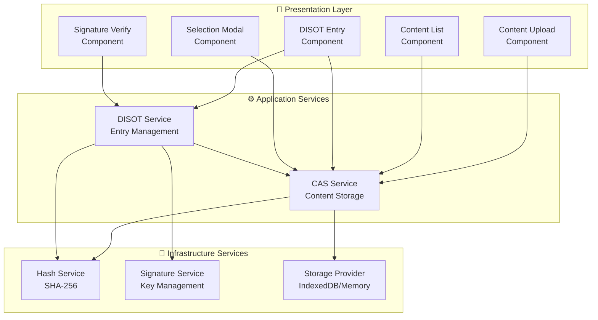
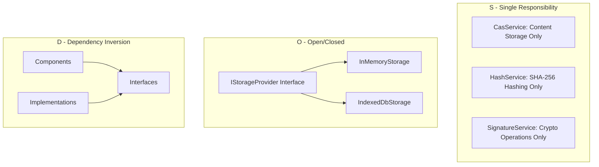
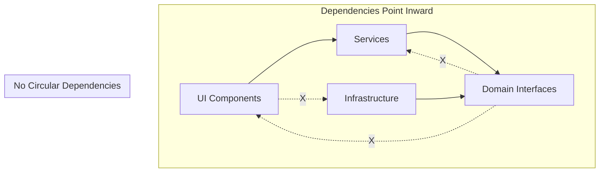
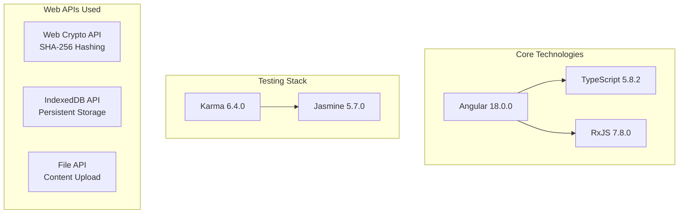
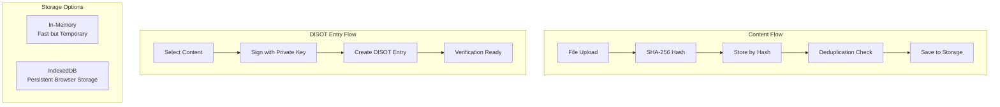
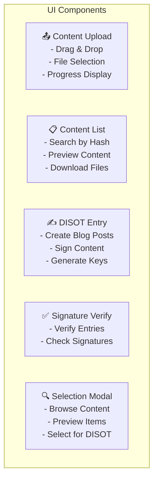

# Architecture Overview 🏗️

[← Home](../README.md) | [Next: System Architecture →](./system-architecture.md)

## Table of Contents

1. [Introduction](#introduction)
2. [High-Level Architecture](#high-level-architecture)
3. [Key Principles](#key-principles)
4. [Technology Stack](#technology-stack)
5. [System Components](#system-components)

## Introduction

The CAS/DISOT system implements content-addressable storage with cryptographic verification capabilities. Built with Angular 18+, it provides secure content management with SHA-256 hashing and digital signatures.

## High-Level Architecture

## Key Principles

### SOLID Principles Applied ✅

### Clean Architecture Implementation 🎯

## Technology Stack 🛠️

## System Components 📦

### CAS/DISOT Data Flow

### Component Responsibilities 📋

---

[← Home](../README.md) | [↑ Top](#architecture-overview) | [Next: System Architecture →](./system-architecture.md)