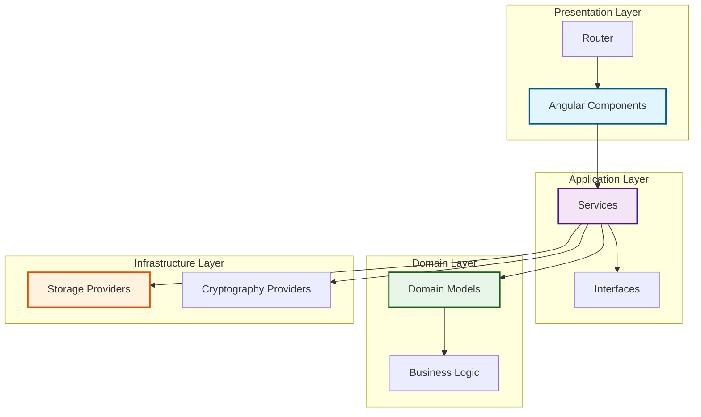
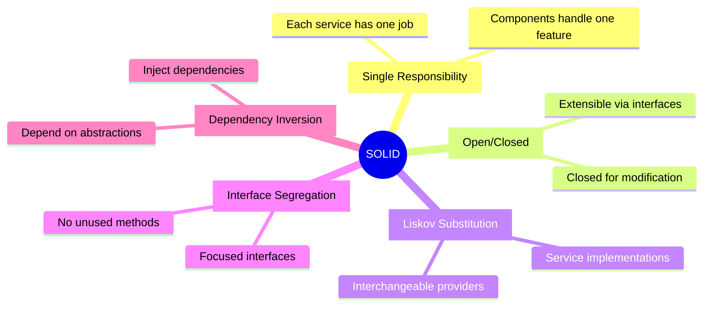
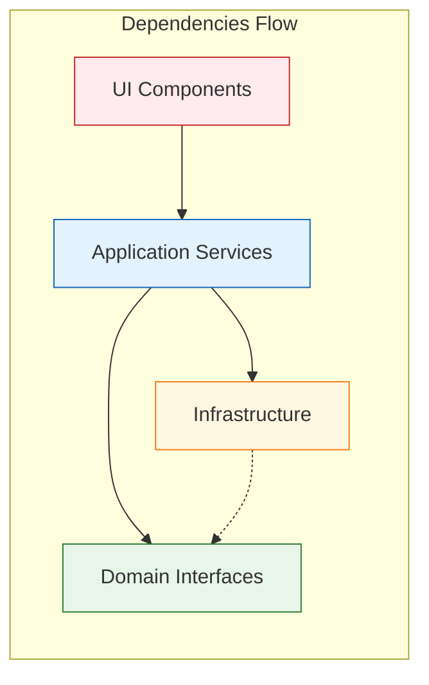
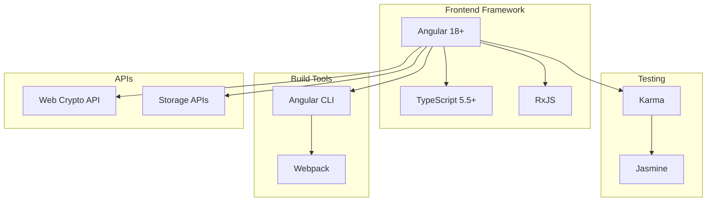
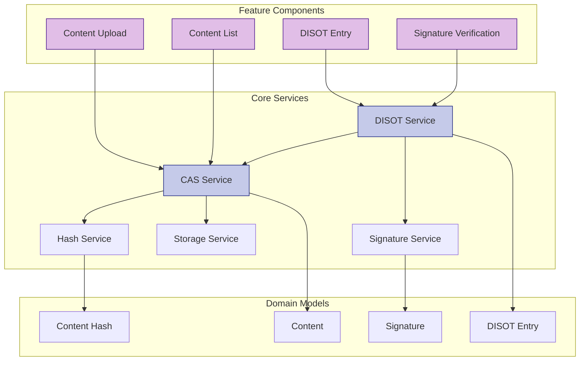
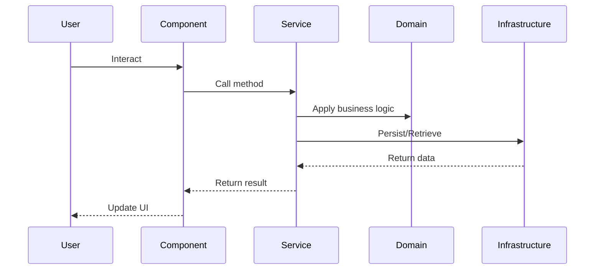

# Architecture Overview

[← Home](../README.md) | [Next: System Architecture →](./system-architecture.md)

## Table of Contents

1. [Introduction](#introduction)
2. [High-Level Architecture](#high-level-architecture)
3. [Key Principles](#key-principles)
4. [Technology Stack](#technology-stack)
5. [System Components](#system-components)

## Introduction

The CAS/DISOT system is built using Angular with a clean architecture approach, emphasizing separation of concerns, testability, and maintainability. The system implements content-addressable storage with cryptographic verification capabilities.

## High-Level Architecture

## Key Principles

### SOLID Principles

### Clean Architecture Layers

## Technology Stack

## System Components

### Core Components Overview

### Component Interaction Flow

---

[← Home](../README.md) | [↑ Top](#architecture-overview) | [Next: System Architecture →](./system-architecture.md)