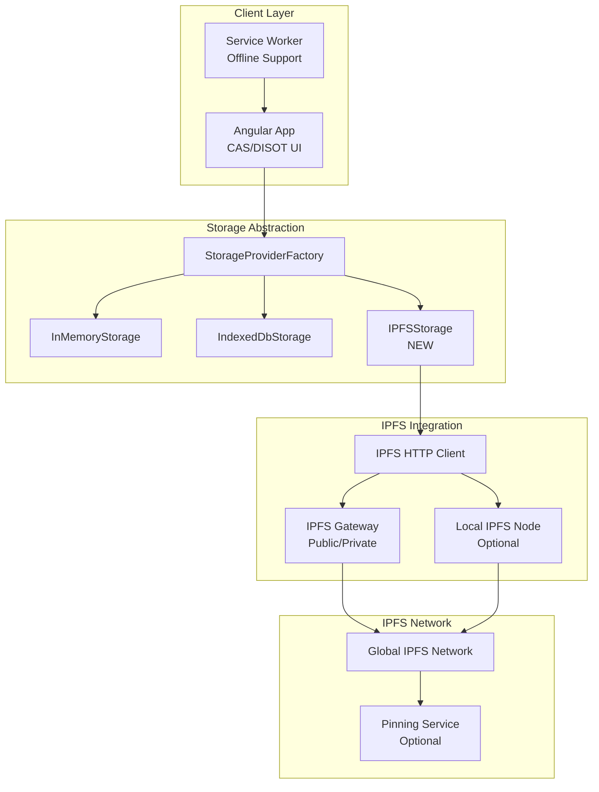
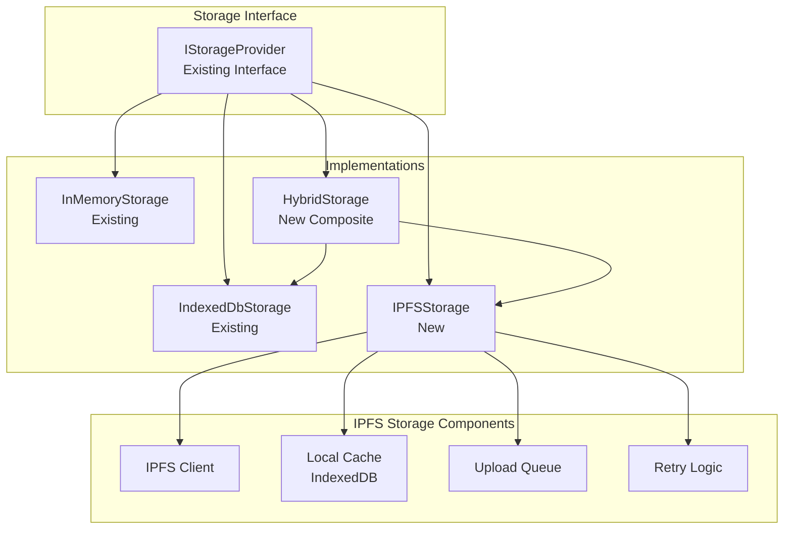
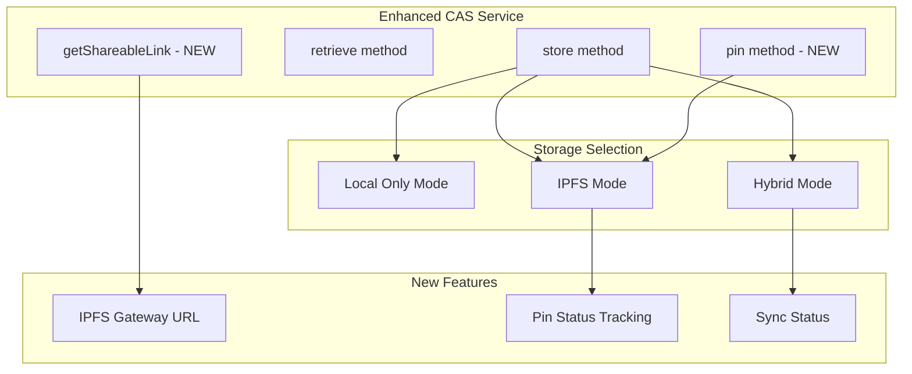
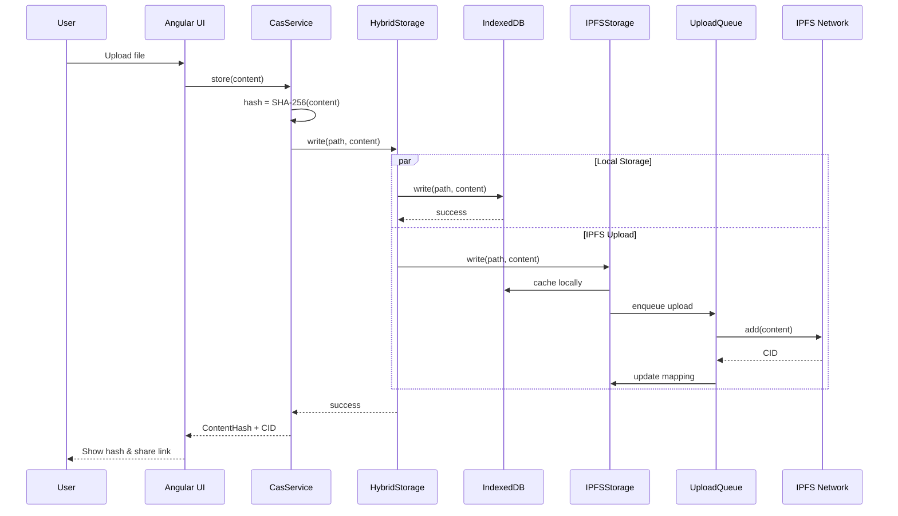
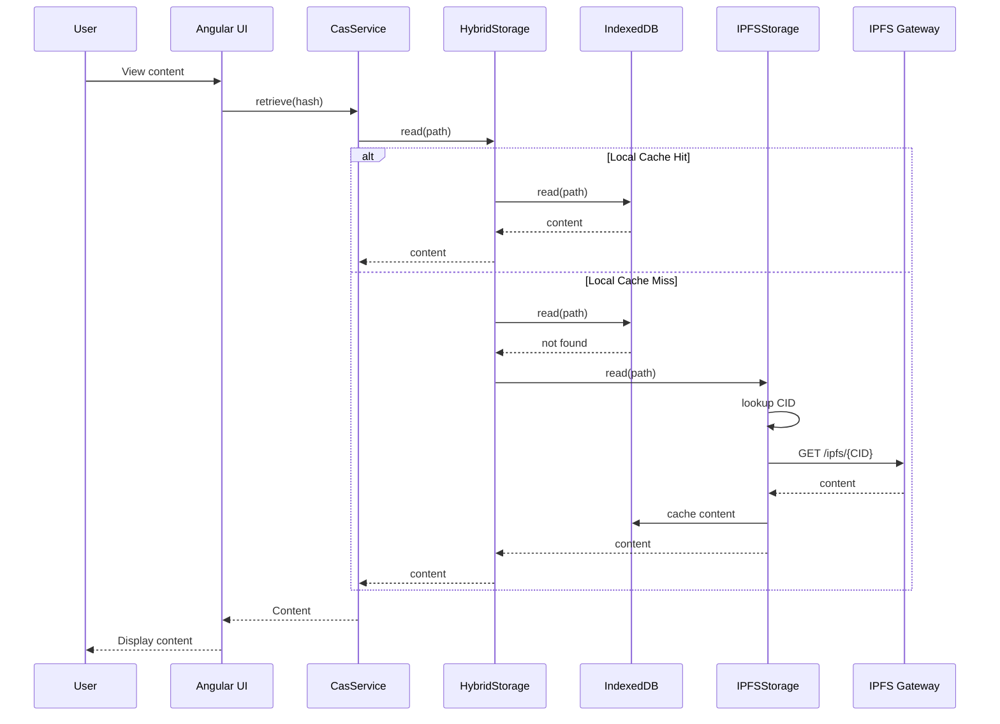
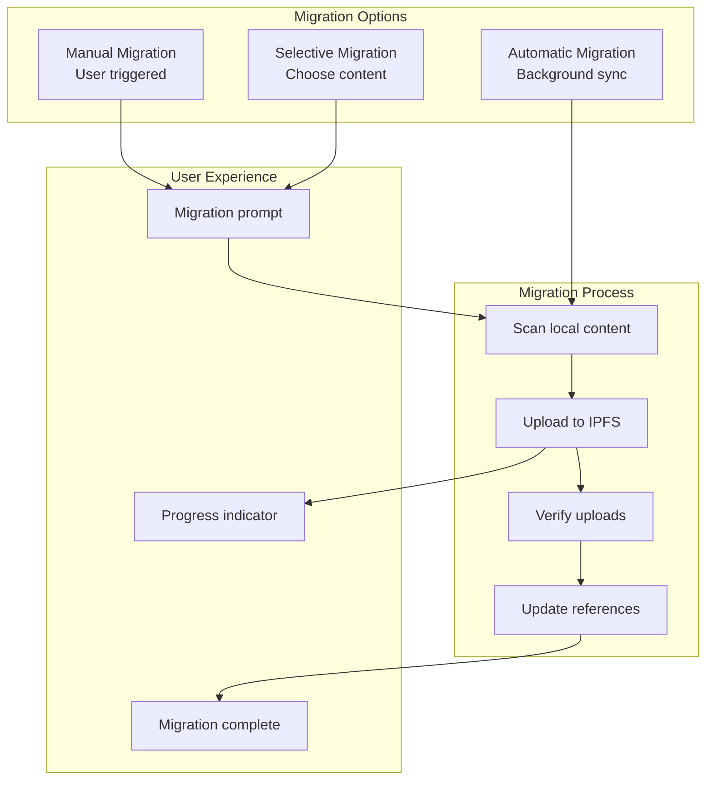
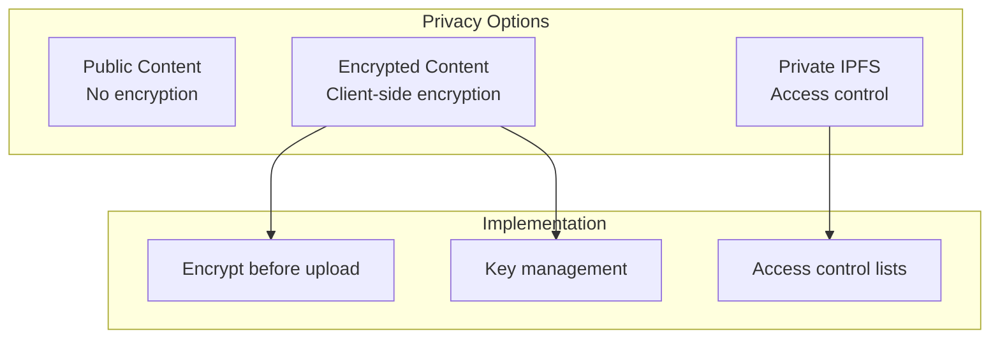
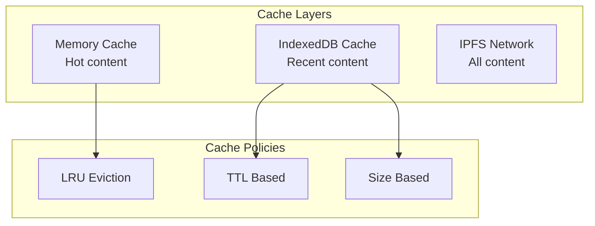
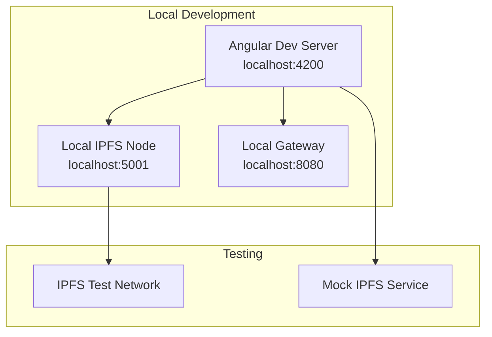
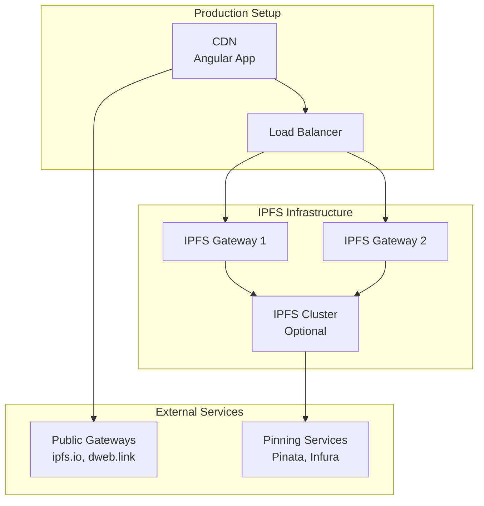

# Phase 1: IPFS Integration Architecture 🌍

[⬅️ System Architecture](./system-architecture.md) | [🏠 Home](../README.md) | [Implementation ➡️](./phase1-implementation-guide.md)

## Table of Contents

1. [Overview](#overview)
2. [Architecture Goals](#architecture-goals)
3. [High-Level Architecture](#high-level-architecture)
4. [Component Design](#component-design)
5. [Data Flow](#data-flow)
6. [Implementation Strategy](#implementation-strategy)
7. [Migration Path](#migration-path)
8. [Security Considerations](#security-considerations)
9. [Performance Optimization](#performance-optimization)
10. [Deployment Architecture](#deployment-architecture)

## Overview

Phase 1 introduces IPFS (InterPlanetary File System) integration to transform the CAS/DISOT application from browser-only storage to a distributed content storage system. This maintains backward compatibility while adding decentralized capabilities.

### Key Benefits
- **Content Persistence**: Content survives beyond browser session
- **Content Distribution**: Automatic replication across IPFS network
- **Deduplication**: Global deduplication via content addressing
- **Availability**: Content accessible from any IPFS gateway
- **Resilience**: No single point of failure

## Architecture Goals

### Primary Goals
1. **Seamless Integration**: IPFS as an additional storage provider
2. **Backward Compatibility**: Existing storage providers continue to work
3. **Progressive Enhancement**: Users can opt-in to IPFS features
4. **Gateway Flexibility**: Support multiple IPFS access methods

### Non-Goals (Phase 1)
- Full P2P browser communication (Phase 3)
- Blockchain integration (Phase 2)
- Removing centralized components entirely

## High-Level Architecture

### System Architecture with IPFS



### Storage Provider Hierarchy



## Component Design

### 1. IPFSStorage Service

```typescript
interface IPFSConfig {
  gateway: string;           // https://ipfs.io or local
  apiEndpoint?: string;      // http://localhost:5001/api/v0
  pinningService?: PinningConfig;
  timeout?: number;
  retryAttempts?: number;
}

@Injectable({
  providedIn: 'root'
})
export class IPFSStorage implements IStorageProvider {
  private ipfsClient: IPFSHTTPClient;
  private localCache: IndexedDbStorage;
  private uploadQueue: UploadQueue;
  
  async write(path: string, data: Uint8Array): Promise<void> {
    // 1. Write to local cache first
    await this.localCache.write(path, data);
    
    // 2. Queue for IPFS upload
    const cid = await this.uploadQueue.enqueue({
      path,
      data,
      retries: 0
    });
    
    // 3. Update path mapping
    await this.updatePathToCID(path, cid);
  }
  
  async read(path: string): Promise<Uint8Array> {
    // 1. Check local cache
    try {
      return await this.localCache.read(path);
    } catch (e) {
      // 2. Fetch from IPFS
      const cid = await this.getPathCID(path);
      const data = await this.ipfsClient.cat(cid);
      
      // 3. Cache locally
      await this.localCache.write(path, data);
      
      return data;
    }
  }
}
```

### 2. IPFS Client Abstraction

```typescript
interface IIPFSClient {
  add(data: Uint8Array): Promise<CID>;
  cat(cid: CID): Promise<Uint8Array>;
  pin(cid: CID): Promise<void>;
  unpin(cid: CID): Promise<void>;
  isOnline(): Promise<boolean>;
}

// HTTP API Implementation
class IPFSHTTPClient implements IIPFSClient {
  constructor(private config: IPFSConfig) {}
  
  async add(data: Uint8Array): Promise<CID> {
    const formData = new FormData();
    formData.append('file', new Blob([data]));
    
    const response = await fetch(`${this.config.apiEndpoint}/add`, {
      method: 'POST',
      body: formData
    });
    
    const result = await response.json();
    return result.Hash;
  }
}

// Gateway-only Implementation  
class IPFSGatewayClient implements IIPFSClient {
  constructor(private gateway: string) {}
  
  async cat(cid: CID): Promise<Uint8Array> {
    const response = await fetch(`${this.gateway}/ipfs/${cid}`);
    return new Uint8Array(await response.arrayBuffer());
  }
  
  async add(data: Uint8Array): Promise<CID> {
    throw new Error('Gateway-only mode: Use local storage');
  }
}
```

### 3. Hybrid Storage Strategy

```typescript
@Injectable({
  providedIn: 'root'
})
export class HybridStorage implements IStorageProvider {
  constructor(
    private primary: IndexedDbStorage,
    private distributed: IPFSStorage
  ) {}
  
  async write(path: string, data: Uint8Array): Promise<void> {
    // Write to both storages
    await Promise.all([
      this.primary.write(path, data),
      this.distributed.write(path, data).catch(err => 
        console.warn('IPFS write failed, using local only', err)
      )
    ]);
  }
  
  async read(path: string): Promise<Uint8Array> {
    try {
      // Try local first
      return await this.primary.read(path);
    } catch (localError) {
      // Fallback to IPFS
      return await this.distributed.read(path);
    }
  }
}
```

### 4. CAS Service Enhancement



## Data Flow

### Content Upload Flow with IPFS



### Content Retrieval Flow



## Implementation Strategy

### Phase 1.1: Foundation (13 points)
1. **IPFS Client Library** (5 points)
   - Create `IPFSHTTPClient` implementation
   - Add configuration service
   - Implement connection testing

2. **Storage Provider** (8 points)
   - Implement `IPFSStorage` service
   - Add to `StorageProviderFactory`
   - Update settings UI

### Phase 1.2: Core Features (21 points)
1. **Upload Queue** (8 points)
   - Background upload service
   - Retry mechanism
   - Progress tracking

2. **Caching Layer** (5 points)
   - CID to path mapping
   - Local cache management
   - Cache eviction policies

3. **UI Updates** (8 points)
   - IPFS status indicator
   - Share links generation
   - Upload progress display

### Phase 1.3: Enhanced Features (13 points)
1. **Pinning Support** (8 points)
   - Pinning service integration
   - Pin management UI
   - Cost tracking (if applicable)

2. **Gateway Selection** (5 points)
   - Multiple gateway support
   - Gateway health checking
   - Automatic failover

### Phase 1.4: Testing & Optimization (8 points)
1. **Testing** (5 points)
   - Unit tests for IPFS components
   - Integration tests
   - E2E tests with local IPFS

2. **Performance** (3 points)
   - Batch uploads
   - Parallel downloads
   - Connection pooling

**Total: 55 story points**

## Migration Path

### User Migration Strategy



### Settings Update

```typescript
interface StorageSettings {
  provider: 'memory' | 'indexeddb' | 'ipfs' | 'hybrid';
  ipfsConfig?: {
    mode: 'gateway' | 'api' | 'auto';
    gateway: string;
    apiEndpoint?: string;
    autoPin: boolean;
    maxCacheSize: number;
  };
  migration?: {
    autoMigrate: boolean;
    batchSize: number;
  };
}
```

## Security Considerations

### 1. Content Privacy


### 2. Gateway Security
- **HTTPS Only**: Enforce secure connections
- **CORS Policy**: Proper CORS configuration
- **Rate Limiting**: Prevent abuse
- **Content Validation**: Verify retrieved content

### 3. Key Security Updates
```typescript
interface SecurityConfig {
  encryption: {
    enabled: boolean;
    algorithm: 'AES-GCM';
    keyDerivation: 'PBKDF2';
  };
  gateway: {
    allowlist: string[];
    requireHTTPS: boolean;
    timeout: number;
  };
  content: {
    maxSize: number;
    allowedTypes: string[];
    scanForMalware: boolean;
  };
}
```

## Performance Optimization

### 1. Caching Strategy


### 2. Optimization Techniques
- **Parallel Uploads**: Upload multiple files concurrently
- **Chunking**: Split large files for better performance
- **Compression**: Compress before uploading
- **CDN Integration**: Use IPFS gateways as CDN

### 3. Performance Metrics
```typescript
interface PerformanceMetrics {
  uploadSpeed: number;
  downloadSpeed: number;
  cacheHitRate: number;
  ipfsLatency: number;
  gatewayHealth: number;
  queueLength: number;
}
```

## Deployment Architecture

### Development Environment


### Production Deployment


### Configuration Examples

**Development Config:**
```typescript
{
  provider: 'hybrid',
  ipfsConfig: {
    mode: 'api',
    gateway: 'http://localhost:8080',
    apiEndpoint: 'http://localhost:5001/api/v0',
    autoPin: true,
    maxCacheSize: 100 * 1024 * 1024 // 100MB
  }
}
```

**Production Config:**
```typescript
{
  provider: 'hybrid',
  ipfsConfig: {
    mode: 'gateway',
    gateway: 'https://ipfs.io',
    autoPin: false,
    maxCacheSize: 50 * 1024 * 1024 // 50MB
  }
}
```

## Success Metrics

### Technical Metrics
- **Upload Success Rate**: >99%
- **Gateway Availability**: >99.9%
- **Average Upload Time**: <5s for 10MB
- **Cache Hit Rate**: >80%

### User Metrics
- **Feature Adoption**: 30% of users enable IPFS
- **Content Persistence**: 100% content availability
- **User Satisfaction**: Improved sharing capabilities

## Next Steps

### Immediate Actions
1. Set up IPFS development environment
2. Create proof-of-concept IPFS storage provider
3. Test with local IPFS node
4. Design migration UI

### Phase 2 Preparation
- Research Ethereum integration options
- Evaluate smart contract requirements
- Plan DISOT entry immutability

---

[⬅️ System Architecture](./system-architecture.md) | [⬆️ Top](#phase-1-ipfs-integration-architecture) | [🏠 Home](../README.md) | [Implementation ➡️](./phase1-implementation-guide.md)