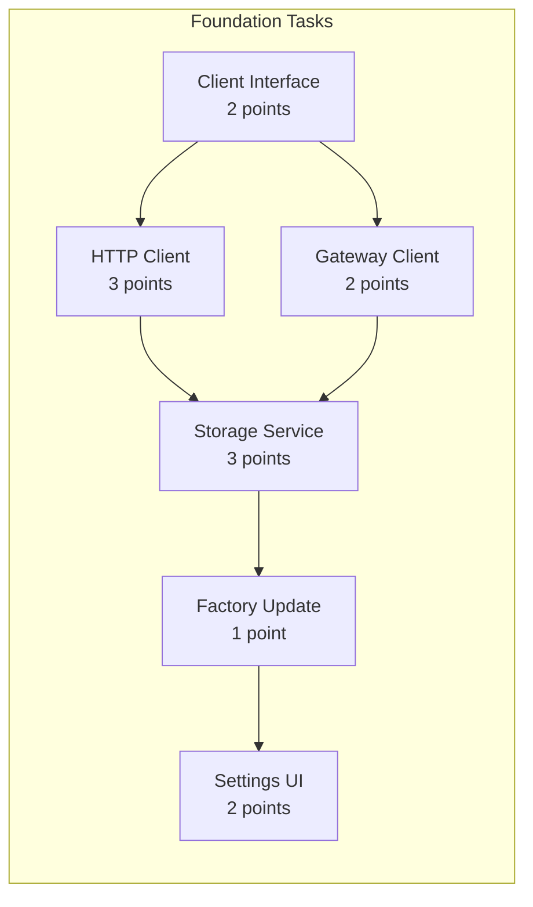
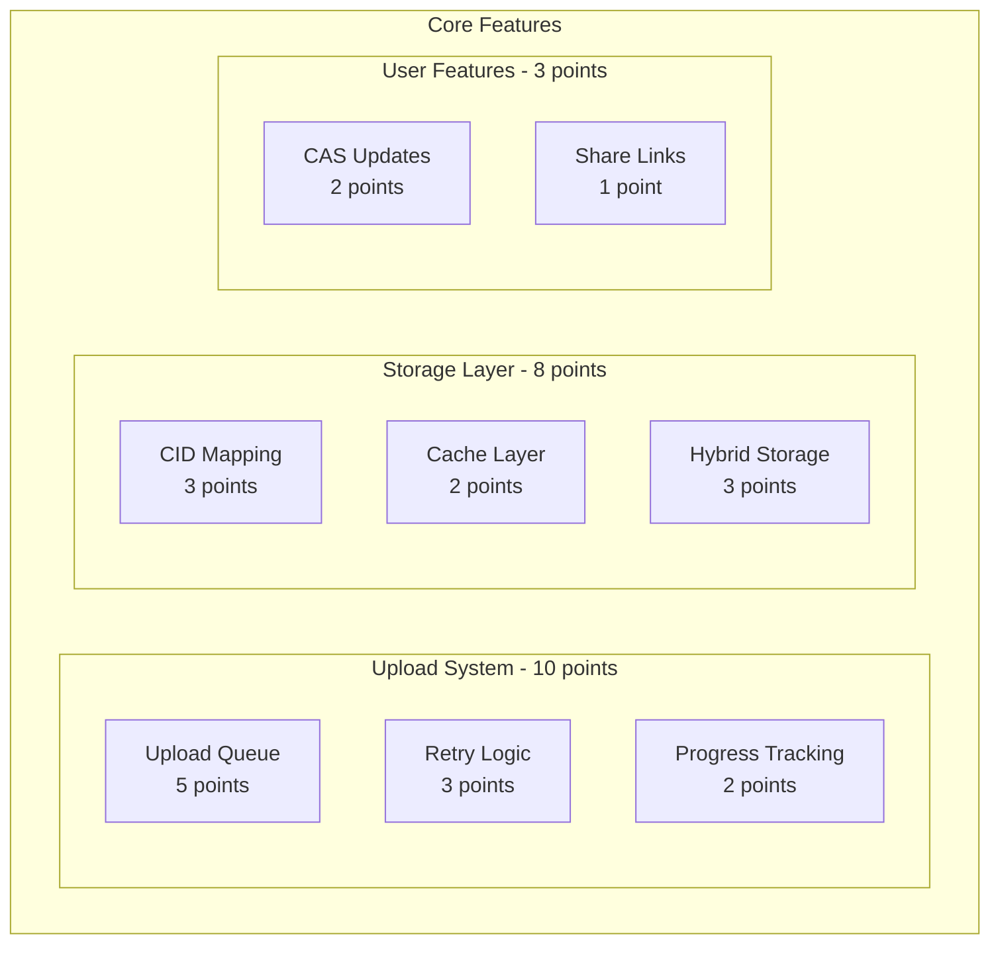
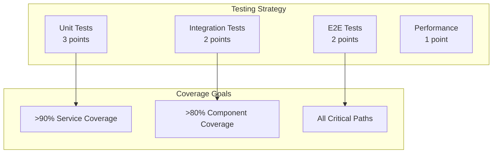

# Phase 1: IPFS Integration Roadmap 🗺️

[⬅️ Implementation Guide](./phase1-implementation-guide.md) | [🏠 Home](../README.md)

## Overview

This roadmap outlines the implementation of IPFS integration for the CAS/DISOT application using story points for estimation. The implementation is designed for AI-assisted development with Claude CLI.

## Total Effort: 55 Story Points

### Story Point Scale
- **1 point**: Trivial changes (config, interfaces)
- **2 points**: Simple implementations
- **3 points**: Standard feature implementation
- **5 points**: Complex features with multiple components
- **8 points**: Major architectural changes

## Implementation Epics

### 🏗️ Epic 1: Foundation (13 points)

**Goal**: Establish IPFS infrastructure and basic integration



**Key Deliverables**:
- Working IPFS client abstractions
- Basic storage provider implementation
- Settings UI with IPFS option

### 🚀 Epic 2: Core Features (21 points)

**Goal**: Implement essential IPFS functionality



**Key Deliverables**:
- Resilient upload queue with retry
- Local caching for performance
- Share link generation

### ✨ Epic 3: Enhanced Features (13 points)

**Goal**: Add advanced IPFS capabilities

| Feature | Points | Priority | Dependencies |
|---------|--------|----------|--------------|
| Pinning Service | 5 | High | Upload Queue |
| Gateway Health | 3 | High | IPFS Client |
| Migration Service | 3 | Medium | CID Mapping |
| Batch Uploads | 2 | Low | Upload Queue |
| Encryption | 3 | Medium | Storage Service |
| Status UI | 2 | High | Gateway Health |
| Migration UI | 3 | Medium | Migration Service |

### 🧪 Epic 4: Testing & Polish (8 points)

**Goal**: Ensure reliability and performance



## Implementation Order

### Critical Path (Must Complete First)
1. **IPFS Client Interface** (2 points) - Foundation for everything
2. **HTTP Client Implementation** (3 points) - Core functionality
3. **Basic Storage Service** (3 points) - Integration point
4. **Upload Queue** (5 points) - Reliability foundation

### Parallel Tracks (Can Be Done Concurrently)

**Track A: Storage Features**
- CID Mapping Service (3 points)
- Cache Layer (2 points)
- Hybrid Storage (3 points)

**Track B: UI Features**
- Settings UI (2 points)
- Status Indicator (2 points)
- Share Links (1 point)

**Track C: Infrastructure**
- Gateway Client (2 points)
- Gateway Health (3 points)
- Retry Logic (3 points)

## Success Criteria

### Functional Requirements
- [ ] Files upload to IPFS successfully
- [ ] Content retrievable via gateway URLs
- [ ] Fallback to local storage on IPFS failure
- [ ] Upload queue persists across sessions
- [ ] Share links work on public gateways

### Performance Requirements
- [ ] Upload starts within 100ms
- [ ] Gateway health check < 1 second
- [ ] Local cache hit rate > 80%
- [ ] Retry backoff prevents API flooding

### Quality Requirements
- [ ] All tests passing
- [ ] No breaking changes to existing features
- [ ] Error messages are user-friendly
- [ ] Documentation updated

## Risk Mitigation

### Technical Risks

| Risk | Impact | Mitigation | Points |
|------|--------|------------|--------|
| IPFS node unavailable | High | Gateway fallback | Already included |
| Large file uploads fail | Medium | Chunking support | +3 points |
| Gateway rate limits | Medium | Multiple gateways | Already included |
| CID mapping corruption | Low | Rebuild from IPFS | +2 points |

### Implementation Risks

| Risk | Impact | Mitigation |
|------|--------|------------|
| Scope creep | High | Strict epic boundaries |
| Integration complexity | Medium | Incremental testing |
| Performance degradation | Medium | Benchmarking suite |

## Definition of Done

### Per Story
- [ ] Code implemented and working
- [ ] Unit tests written and passing
- [ ] Integration tested
- [ ] Code reviewed (self-review for AI)
- [ ] Documentation updated

### Per Epic
- [ ] All stories completed
- [ ] E2E tests passing
- [ ] Performance benchmarked
- [ ] User documentation updated
- [ ] No regression in existing features

### Phase Complete
- [ ] All epics delivered
- [ ] Full test suite passing
- [ ] Documentation complete
- [ ] Performance meets targets
- [ ] Security review passed
- [ ] Migration guide written

## AI Development Guidelines

### For Claude CLI Development

1. **Start Small**: Complete foundation epic first
2. **Test Driven**: Write tests before implementation
3. **Incremental**: Commit after each story
4. **Validation**: Run full test suite frequently
5. **Documentation**: Update docs with code

### Prompt Suggestions

**For Implementation**:
```
Implement the IPFS HTTP client (3 points) following the 
interface in phase1-implementation-guide.md. Include unit 
tests and error handling.
```

**For Testing**:
```
Create integration tests for the upload queue service 
that verify retry logic, persistence, and progress tracking.
```

**For Review**:
```
Review the IPFS storage implementation for security issues,
performance bottlenecks, and adherence to the architecture.
```

## Next Steps

1. **Create feature branch**: `git flow feature start ipfs-integration`
2. **Set up IPFS development environment**
3. **Begin with Epic 1: Foundation**
4. **Track progress in GitHub issues/project board**

---

[⬅️ Implementation Guide](./phase1-implementation-guide.md) | [⬆️ Top](#phase-1-ipfs-integration-roadmap) | [🏠 Home](../README.md)