# Security Architecture

[⬅️ Service Architecture](./service-architecture.md) | [🏠 Home](../README.md) | [API Reference ➡️](../api/README.md)

## Table of Contents

1. [Security Overview](#security-overview)
2. [Cryptographic Architecture](#cryptographic-architecture)
3. [Data Integrity](#data-integrity)
4. [Authentication & Authorization](#authentication--authorization)
5. [Security Best Practices](#security-best-practices)

## Security Overview

### Security Layers

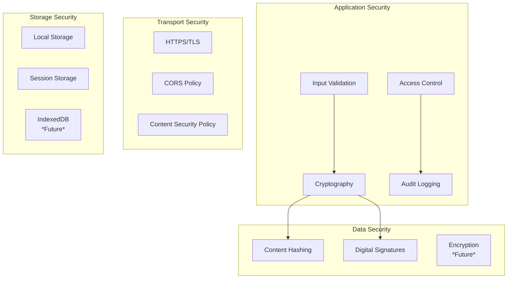

### Threat Model

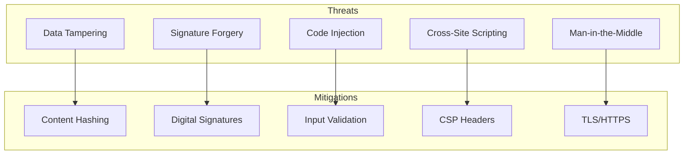

## Cryptographic Architecture

### Cryptographic Components

```mermaid
graph TD
    subgraph "Web Crypto API"
        SUBTLE[SubtleCrypto]
        DIGEST[digest()]
        GENERATE[generateKey()]
        SIGN_API[sign()]
        VERIFY_API[verify()]
    end
    
    subgraph "Hash Service"
        SHA256[SHA-256 Hashing]
        HEX[Hex Encoding]
    end
    
    subgraph "Signature Service"
        KEYPAIR[Key Pair Generation]
        SIGN_DATA[Data Signing]
        VERIFY_SIG[Signature Verification]
    end
    
    SUBTLE --> DIGEST
    SUBTLE --> GENERATE
    SUBTLE --> SIGN_API
    SUBTLE --> VERIFY_API
    
    DIGEST --> SHA256
    SHA256 --> HEX
    
    GENERATE --> KEYPAIR
    SIGN_API --> SIGN_DATA
    VERIFY_API --> VERIFY_SIG
    
    
    
```

### Cryptographic Flow

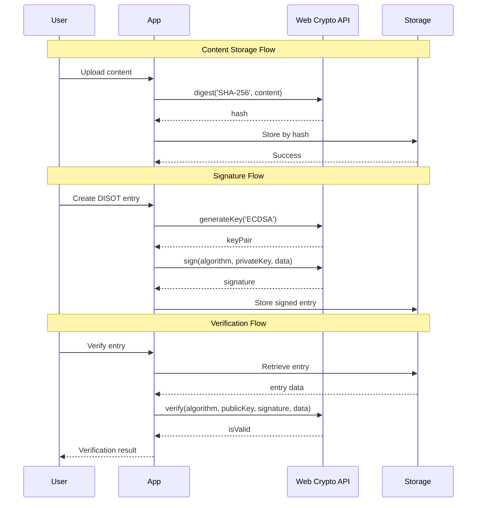

### Key Management

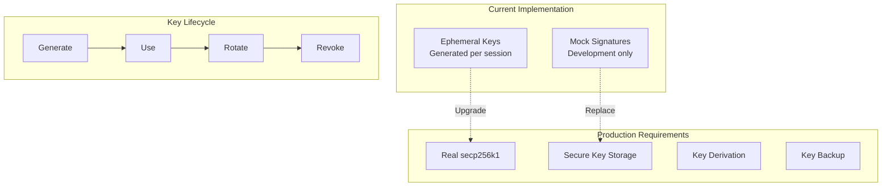

## Data Integrity

### Content Addressing Security

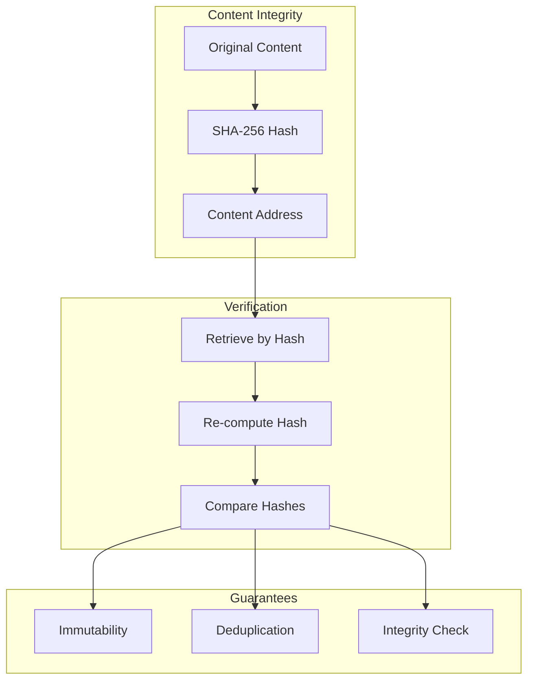

### DISOT Security Model

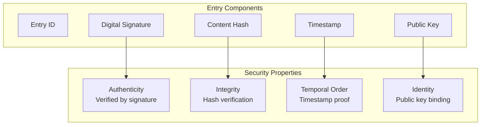

## Authentication & Authorization

### Current Security Model

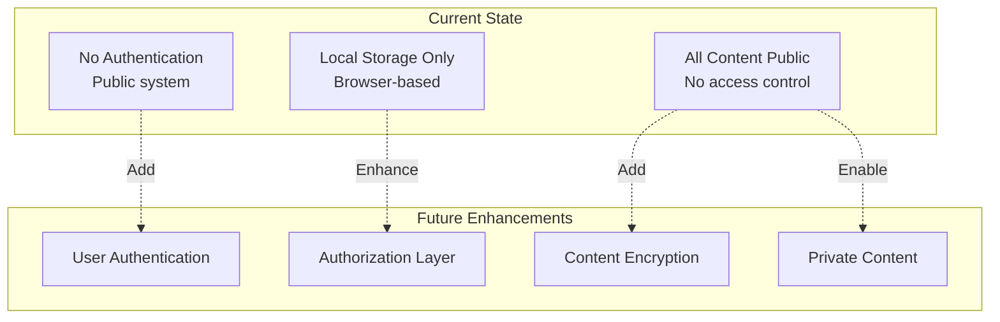

### Future Authentication Flow

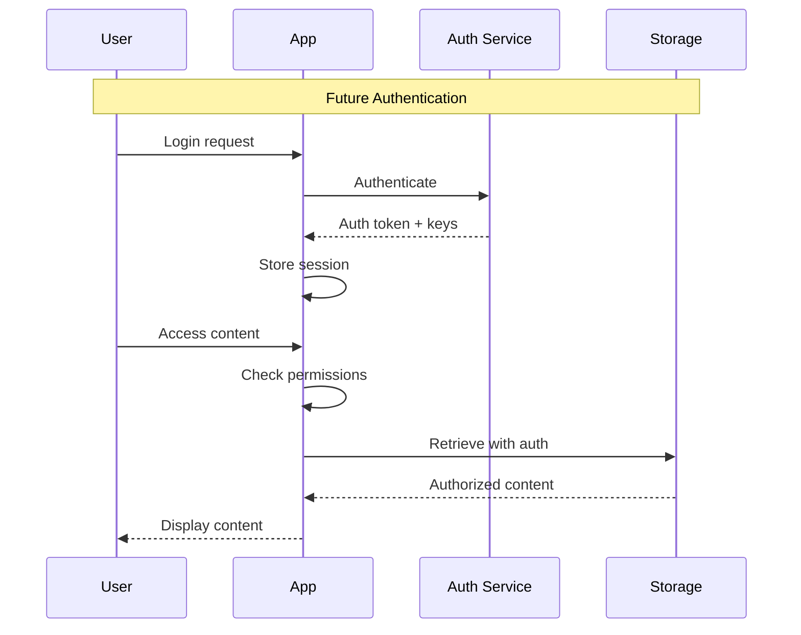

## Security Best Practices

### Input Validation

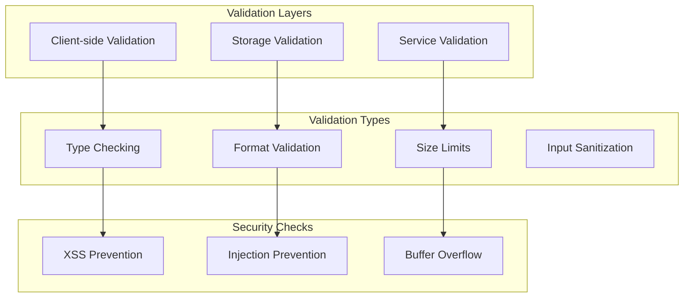

### Secure Coding Patterns

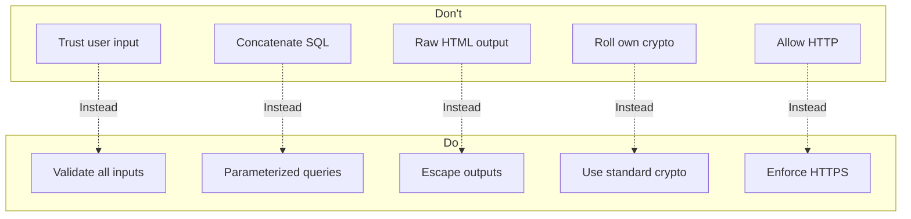

### Security Headers

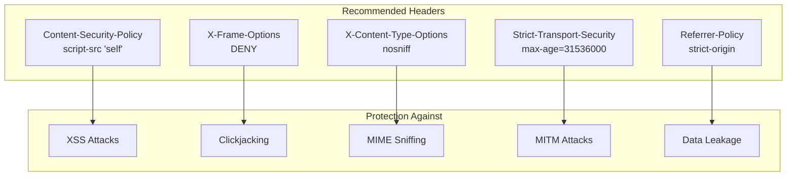

### Security Testing

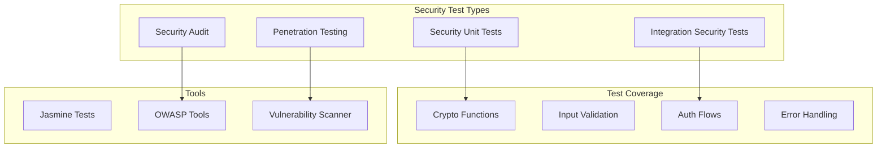

### Deployment Security Checklist

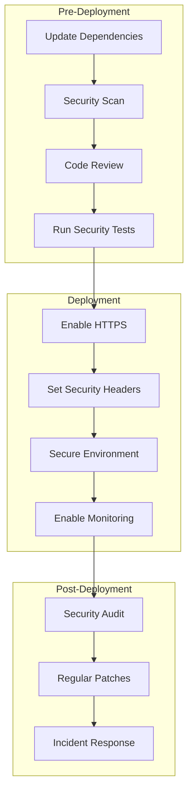

---

[⬅️ Service Architecture](./service-architecture.md) | [⬆️ Top](#security-architecture) | [🏠 Home](../README.md) | [API Reference ➡️](../api/README.md)