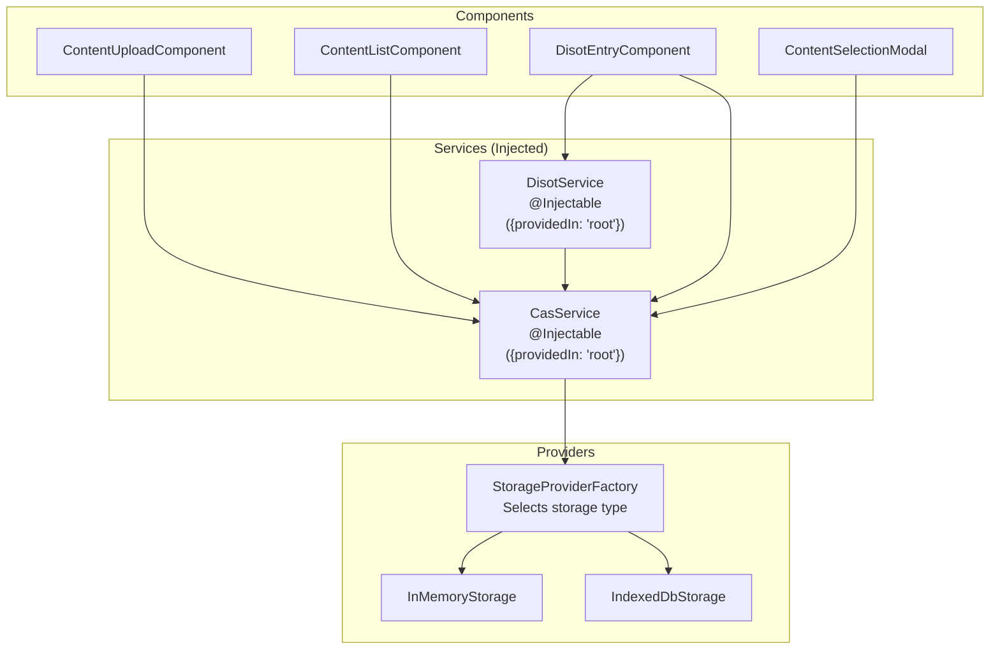
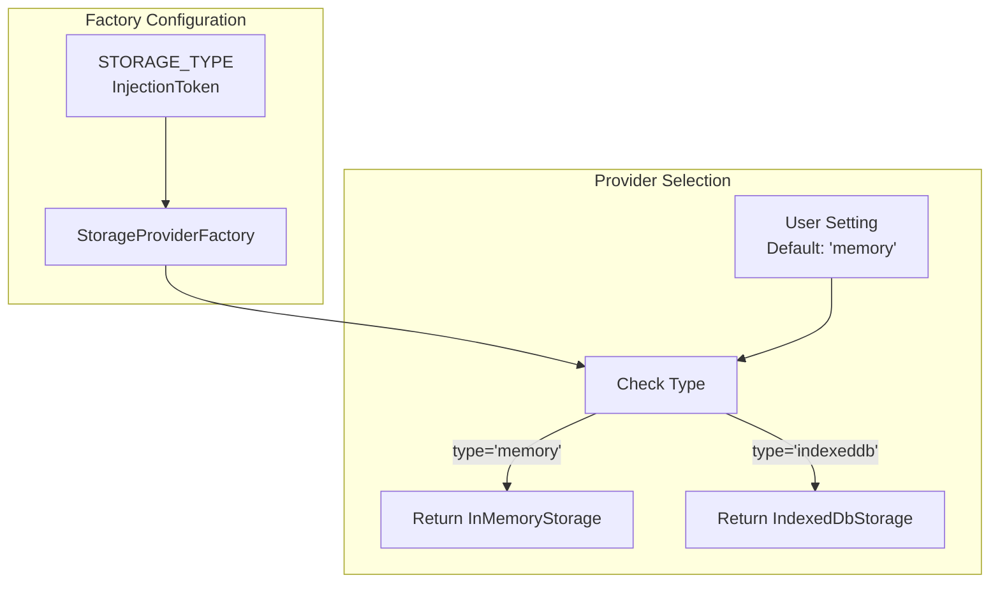
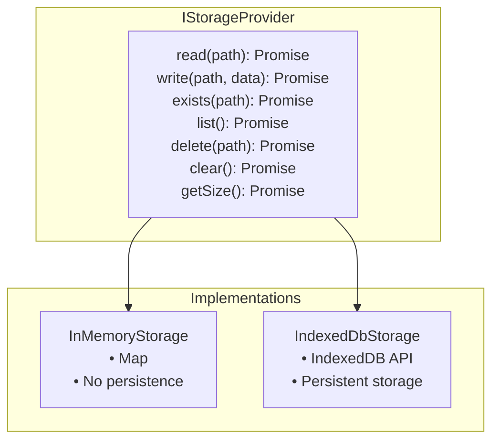
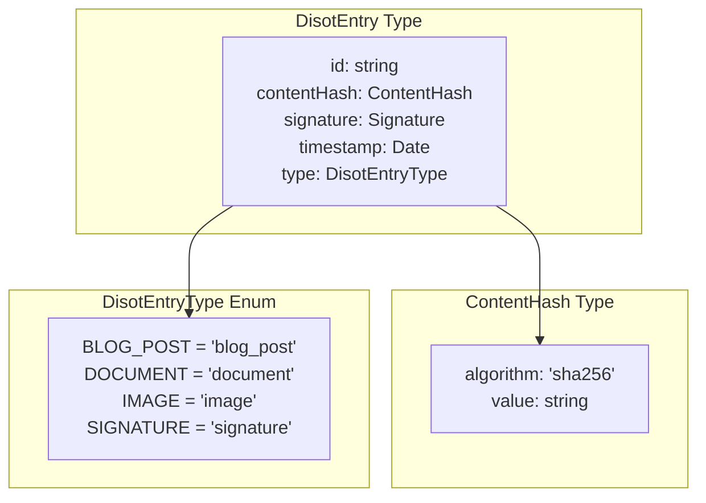
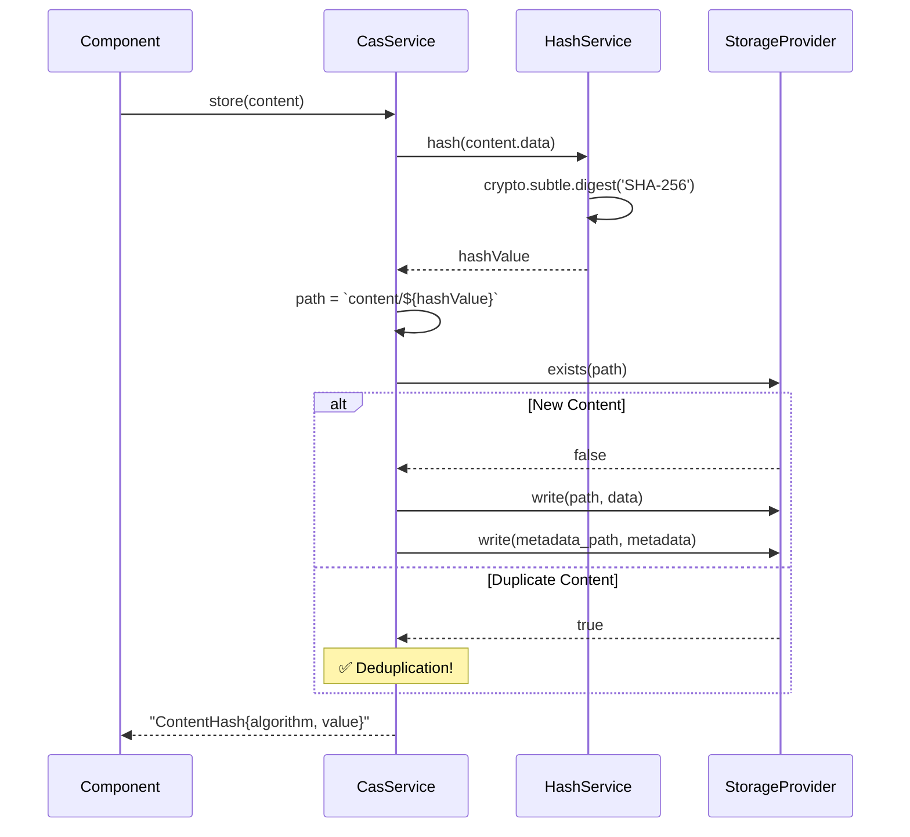
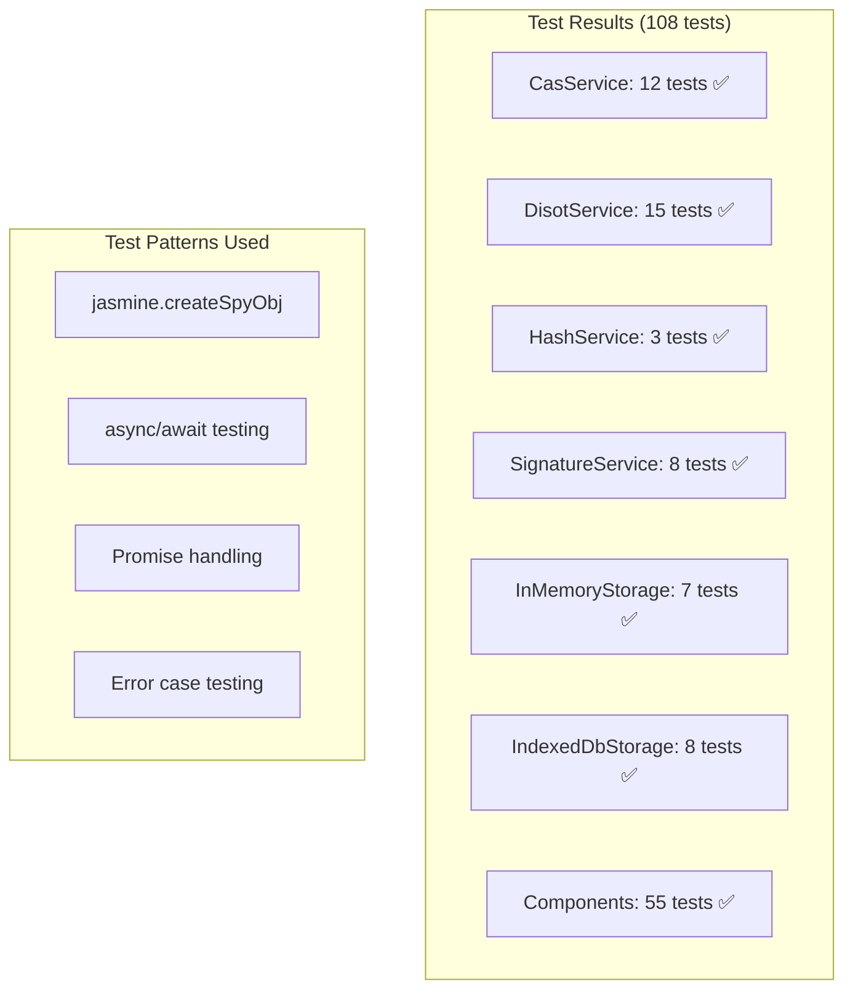
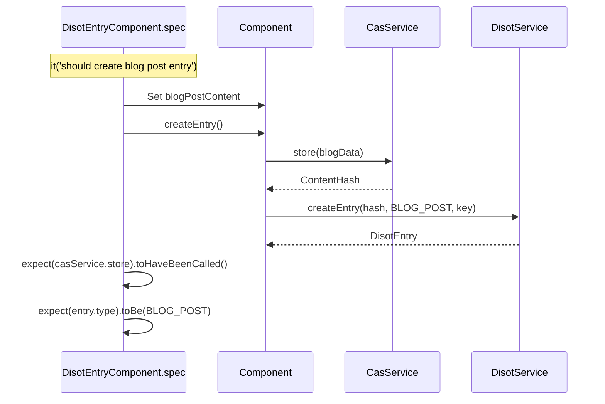
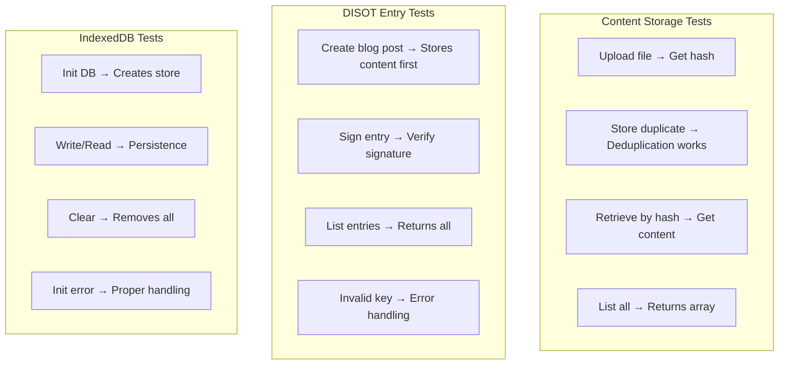
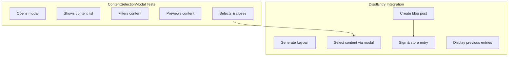

# Service Architecture 🔧

[← Component Architecture](./component-architecture.md) | [Home](../README.md) | [Next: Security Architecture →](./security.md)

## Table of Contents

1. [Service Overview](#service-overview)
2. [Service Dependencies](#service-dependencies)
3. [Service Interfaces](#service-interfaces)
4. [Service Implementation](#service-implementation)
5. [Service Testing](#service-testing)

## Service Overview

### Actual Service Implementation 📐

```mermaid
graph TD
    subgraph "Core Services (Singleton)"
        CAS[CasService<br/>• store()<br/>• retrieve()<br/>• getAllContent()]
        DISOT[DisotService<br/>• createEntry()<br/>• verifyEntry()<br/>• listEntries()]
    end
    
    subgraph "Infrastructure Services"
        HASH[HashService<br/>• hash() via Web Crypto]
        SIG[SignatureService<br/>• generateKeyPair()<br/>• sign() - Mock]
        MEM[InMemoryStorage<br/>• Map-based storage]
        IDB[IndexedDbStorage<br/>• Persistent storage]
    end
    
    CAS --> HASH
    CAS --> |via Factory| MEM
    CAS --> |via Factory| IDB
    DISOT --> CAS
    DISOT --> SIG
    DISOT --> HASH
```

### Service Responsibilities 📋

```mermaid
graph TD
    subgraph "CasService Methods"
        STORE[store(content)<br/>Returns: ContentHash]
        RETRIEVE[retrieve(hash)<br/>Returns: Content]
        LIST[getAllContent()<br/>Returns: ContentWithHash[]]
        META[getMetadata(hash)<br/>Returns: ContentMetadata]
    end
    
    subgraph "DisotService Methods"
        CREATE[createEntry(hash, type, key)<br/>Returns: DisotEntry]
        VERIFY[verifyEntry(entry)<br/>Returns: boolean]
        LISTENT[listEntries()<br/>Returns: DisotEntry[]]
        GET[getEntry(id)<br/>Returns: DisotEntry]
    end
    
    subgraph "Storage Provider Interface"
        READ[read(path)<br/>write(path, data)<br/>exists(path)<br/>list()<br/>delete(path)]        
    end
```

## Service Dependencies

### Actual Dependency Tree 🌳



### Storage Provider Factory Pattern 🏭



## Service Interfaces

### Core Domain Interfaces 🔌



### Content & DISOT Types 📝



## Service Implementation

### CAS Service Store Flow 💾



### DISOT Entry Creation Flow ✍️

```mermaid
graph TD
    subgraph "Blog Post Creation"
        BLOG[User writes blog post]
        STORE_BLOG[Store blog content via CAS]
        GET_HASH[Get content hash]
    end
    
    subgraph "Entry Creation"
        INPUT[contentHash + type + privateKey]
        TIMESTAMP[timestamp = new Date()]
        BUILD[entryData = {hash, timestamp, type}]
        HASH_ENTRY[Hash the entry data]
        SIGN[Sign hash with private key]
        CREATE[Create DisotEntry object]
    end
    
    subgraph "Storage"
        STORE_ENTRY[Store entry in entries map]
        RETURN[Return DisotEntry]
    end
    
    BLOG --> STORE_BLOG
    STORE_BLOG --> GET_HASH
    GET_HASH --> INPUT
    INPUT --> TIMESTAMP
    TIMESTAMP --> BUILD
    BUILD --> HASH_ENTRY
    HASH_ENTRY --> SIGN
    SIGN --> CREATE
    CREATE --> STORE_ENTRY
    STORE_ENTRY --> RETURN
```

### IndexedDB Initialization 🗄️

```mermaid
graph TD
    subgraph "IndexedDB Setup"
        OPEN[indexedDB.open('cas-storage', 1)]
        UPGRADE[onupgradeneeded]
        CREATE[createObjectStore('content')]
        SUCCESS[onsuccess]
        ERROR[onerror]
    end
    
    subgraph "Error Handling"
        INIT_ERR[Store initialization error]
        ENSURE[ensureDb() checks]
        RETRY[Retry if needed]
        THROW_ERR[Throw if persistent]
    end
    
    OPEN --> UPGRADE
    UPGRADE --> CREATE
    CREATE --> SUCCESS
    OPEN --> ERROR
    ERROR --> INIT_ERR
    INIT_ERR --> ENSURE
    ENSURE --> RETRY
    RETRY --> THROW_ERR
```

## Service Testing

### Test Coverage Stats 📊



### Actual Test Example 🧪



### Key Test Scenarios 🎯



### Component Integration Tests 🔄



---

[← Component Architecture](./component-architecture.md) | [↑ Top](#service-architecture) | [Home](../README.md) | [Next: Security Architecture →](./security.md)