# Service Architecture

[← Component Architecture](./component-architecture.md) | [Home](../README.md) | [Next: Security Architecture →](./security.md)

## Table of Contents

1. [Service Overview](#service-overview)
2. [Service Dependencies](#service-dependencies)
3. [Service Interfaces](#service-interfaces)
4. [Service Implementation](#service-implementation)
5. [Service Testing](#service-testing)

## Service Overview

### Service Layer Structure


### Service Responsibilities


## Service Dependencies

### Dependency Graph


### Service Injection Tree


## Service Interfaces

### Interface Definitions

```mermaid
classDiagram
    class IContentStorage {
        <<interface>>
        +store(content: Content): Promise~ContentHash~
        +retrieve(hash: ContentHash): Promise~Content~
        +exists(hash: ContentHash): Promise~boolean~
        +getAllContent(): Promise~ContentWithHash[]~
    }
    
    class IHashService {
        <<interface>>
        +hash(data: Uint8Array): Promise~string~
    }
    
    class ISignatureService {
        <<interface>>
        +generateKeyPair(): KeyPair
        +sign(data: Uint8Array, privateKey: string): Promise~Signature~
        +verify(data: Uint8Array, signature: Signature): Promise~boolean~
    }
    
    class IStorageProvider {
        <<interface>>
        +read(path: string): Promise~Uint8Array~
        +write(path: string, data: Uint8Array): Promise~void~
        +exists(path: string): Promise~boolean~
        +list(): Promise~string[]~
        +delete(path: string): Promise~void~
    }
    
    class IDisotService {
        <<interface>>
        +createEntry(hash: ContentHash, type: string, key: string): Promise~DisotEntry~
        +getEntry(id: string): Promise~DisotEntry~
        +verifyEntry(entry: DisotEntry): Promise~boolean~
    }
```



### Interface Segregation

```mermaid
graph TD
    subgraph "Large Interface (Bad)"
        BIG[IStorageService<br/>read()<br/>write()<br/>delete()<br/>list()<br/>encrypt()<br/>compress()<br/>backup()]
    end
    
    subgraph "Segregated Interfaces (Good)"
        STORAGE[IStorageProvider<br/>read()<br/>write()<br/>exists()]
        LIST[IListProvider<br/>list()<br/>delete()]
        CRYPTO[ICryptoProvider<br/>encrypt()<br/>decrypt()]
        UTIL[IUtilityProvider<br/>compress()<br/>backup()]
    end
    
    BIG -.->|Refactor| STORAGE
    BIG -.->|Refactor| LIST
    BIG -.->|Refactor| CRYPTO
    BIG -.->|Refactor| UTIL
    
    style BIG fill:#ffcdd2,stroke:#c62828
    style STORAGE fill:#c8e6c9,stroke:#1b5e20
```

## Service Implementation

### CAS Service Implementation


### DISOT Service Implementation


### Service Method Patterns


## Service Testing

### Testing Strategy


### Service Test Structure


### Mock Service Pattern


### Test Coverage Matrix

```mermaid
graph TD
    subgraph "CAS Service Tests"
        CAS_STORE[store() - 5 tests]
        CAS_RETRIEVE[retrieve() - 4 tests]
        CAS_LIST[getAllContent() - 3 tests]
    end
    
    subgraph "DISOT Service Tests"
        DISOT_CREATE[createEntry() - 6 tests]
        DISOT_GET[getEntry() - 4 tests]
        DISOT_VERIFY[verifyEntry() - 5 tests]
    end
    
    subgraph "Infrastructure Tests"
        HASH_TEST[HashService - 3 tests]
        SIG_TEST[SignatureService - 8 tests]
        STOR_TEST[StorageService - 5 tests]
    end
    
    style CAS_STORE fill:#c8e6c9,stroke:#1b5e20
    style DISOT_CREATE fill:#c8e6c9,stroke:#1b5e20
    style HASH_TEST fill:#c8e6c9,stroke:#1b5e20
```

### Dependency Injection Testing

```mermaid
graph LR
    subgraph "Production"
        PROD_SVC[Real Service]
        PROD_DEP[Real Dependencies]
    end
    
    subgraph "Testing"
        TEST_SVC[Service Under Test]
        TEST_DEP[Mock Dependencies]
    end
    
    subgraph "TestBed Configuration"
        PROVIDERS[providers: [{<br/>provide: HashService,<br/>useClass: MockHashService<br/>}]]
    end
    
    PROD_SVC --> PROD_DEP
    TEST_SVC --> TEST_DEP
    PROVIDERS --> TEST_DEP
    
    style PROD_SVC fill:#ffcdd2,stroke:#c62828
    style TEST_SVC fill:#c8e6c9,stroke:#1b5e20
```

---

[← Component Architecture](./component-architecture.md) | [↑ Top](#service-architecture) | [Home](../README.md) | [Next: Security Architecture →](./security.md)