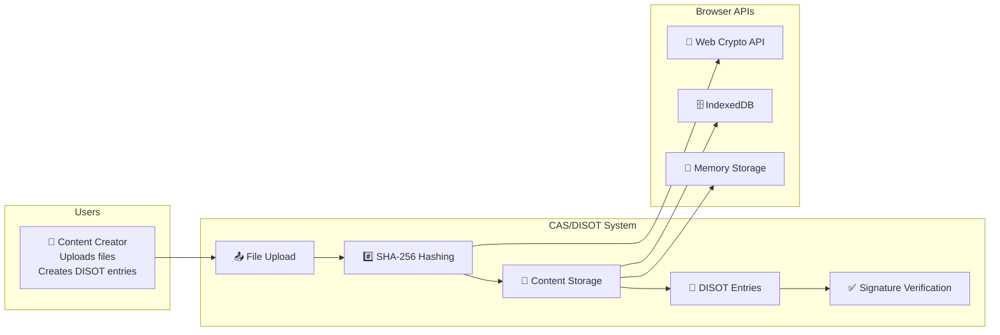
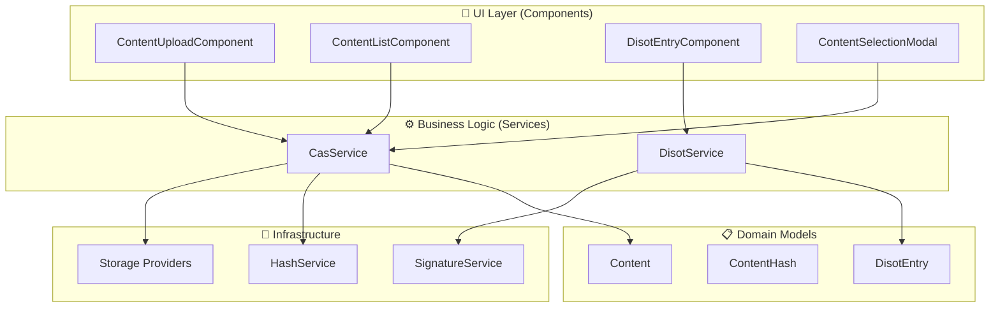
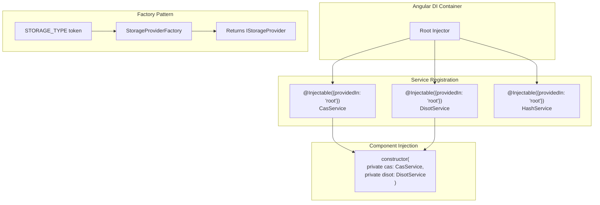
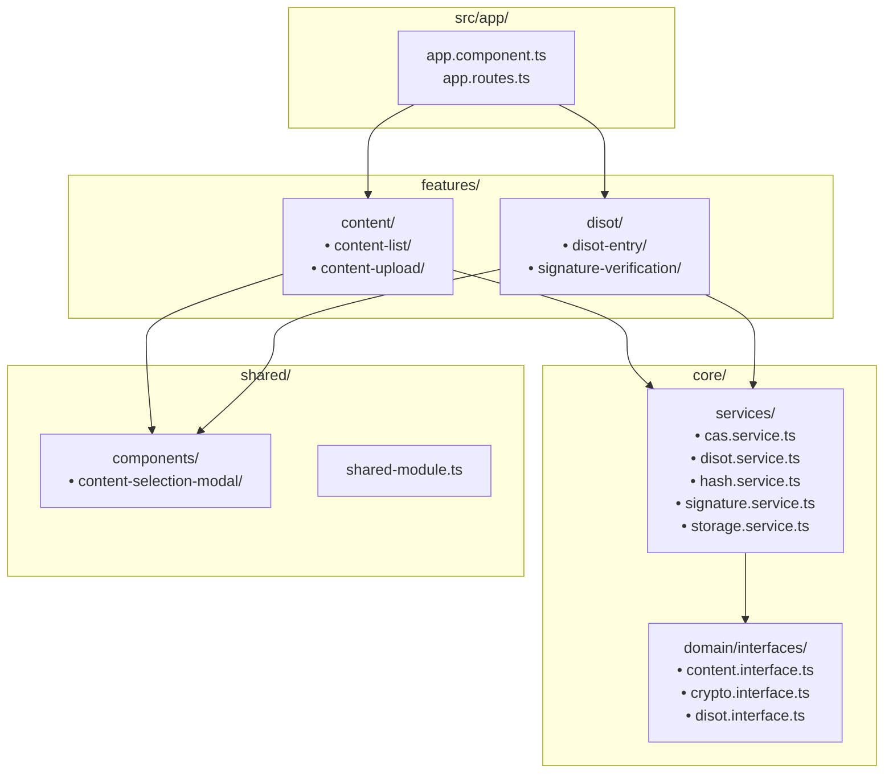
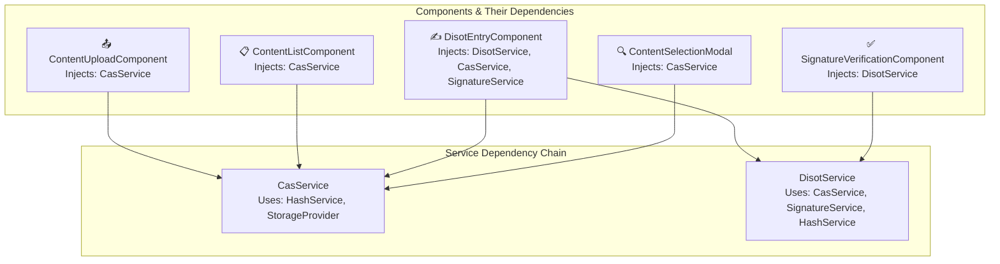
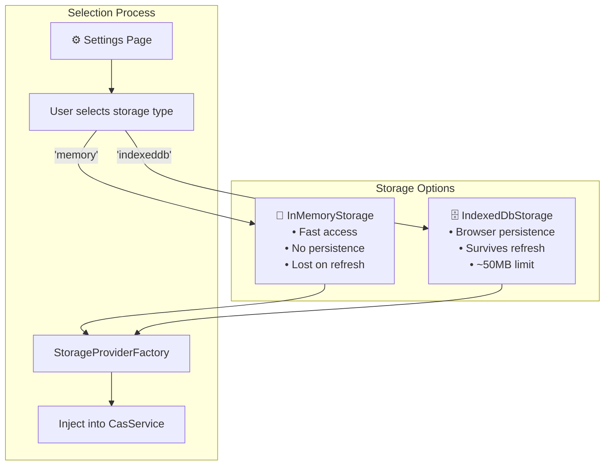
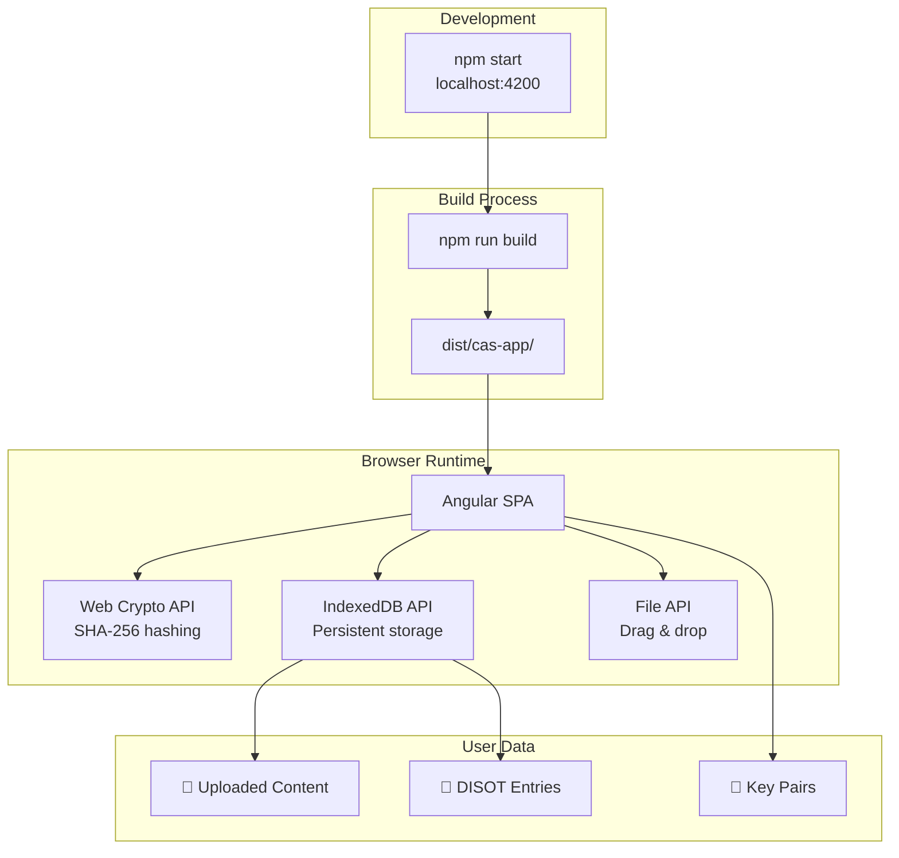
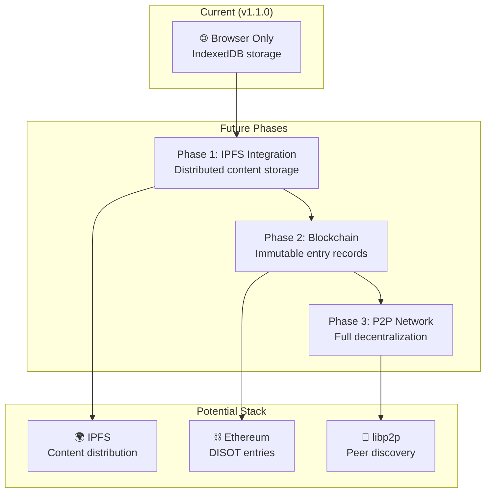

# System Architecture 🏛️

[← Architecture Overview](./overview.md) | [Home](../README.md) | [Next: Data Flow →](./data-flow.md)

## Table of Contents

1. [System Overview](#system-overview)
2. [Architectural Patterns](#architectural-patterns)
3. [Module Structure](#module-structure)
4. [Dependency Graph](#dependency-graph)
5. [Deployment Architecture](#deployment-architecture)

## System Overview

### CAS/DISOT Application Context 🌐



## Architectural Patterns

### Clean Architecture in Practice 🎯



### Dependency Injection Flow 💉



## Module Structure

### Actual Project Structure 📁



### Component Routing Structure 🗺️

```mermaid
graph TD
    subgraph "App Routes"
        HOME[/ → ContentListComponent]
        UPLOAD[/upload → ContentUploadComponent]
        DISOT[/disot → DisotEntryComponent]
        VERIFY[/verify → SignatureVerificationComponent]
        SETTINGS[/settings → SettingsComponent]
    end
    
    subgraph "Navigation Flow"
        NAV[Navigation Bar]
        NAV --> HOME
        NAV --> UPLOAD
        NAV --> DISOT
        NAV --> VERIFY
        NAV --> SETTINGS
    end
    
    subgraph "Modal Navigation"
        DISOT_PAGE[DISOT Entry Page]
        MODAL[Content Selection Modal]
        DISOT_PAGE --> |Open Modal| MODAL
        MODAL --> |Select Content| DISOT_PAGE
    end
```

## Dependency Graph

### Service Dependencies in Action 🔗



### Storage Provider Selection 💾



## Deployment Architecture

### Current Browser-Only Architecture 🌐



### Future Decentralized Architecture 🚀



---

[← Architecture Overview](./overview.md) | [↑ Top](#system-architecture) | [Home](../README.md) | [Next: Data Flow →](./data-flow.md)