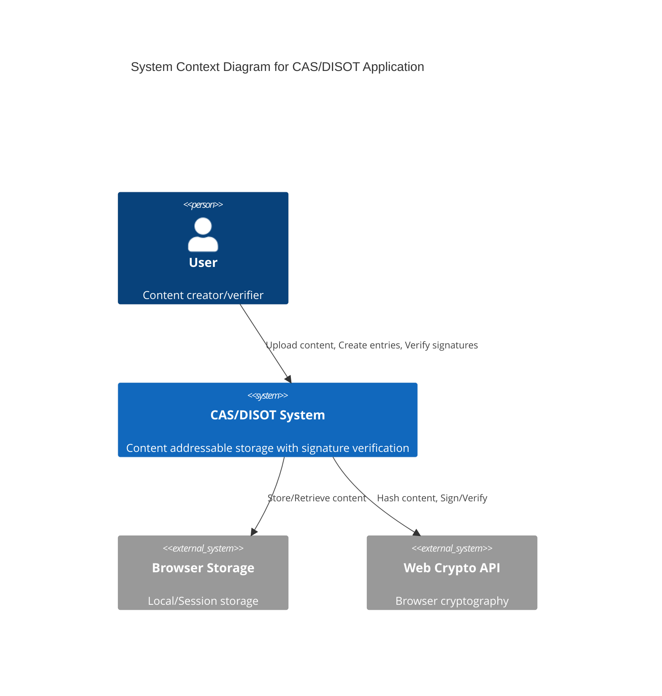
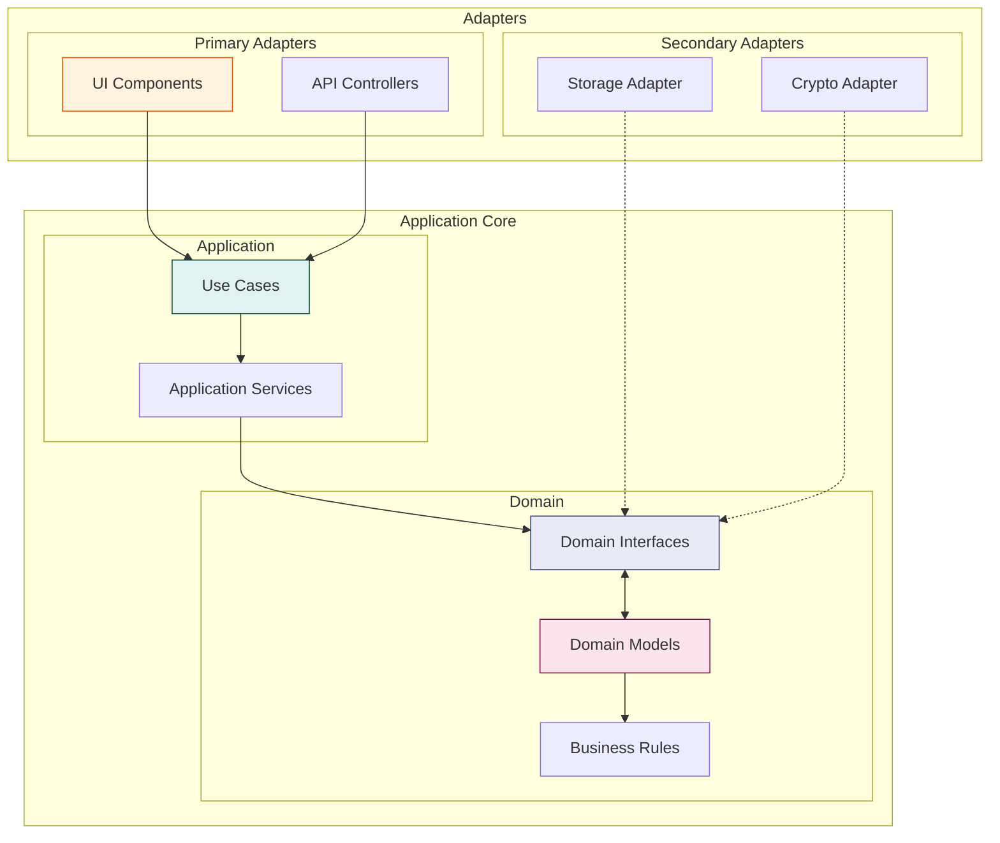
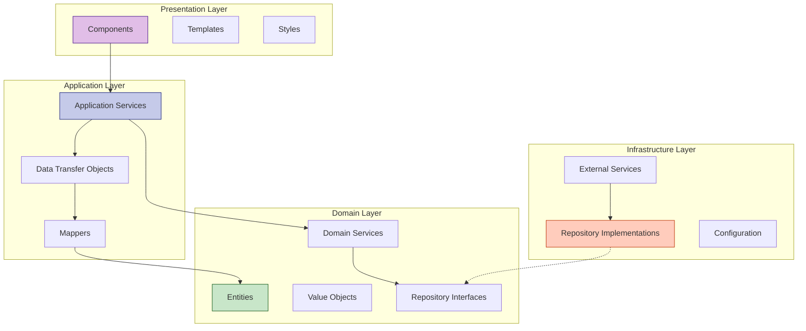
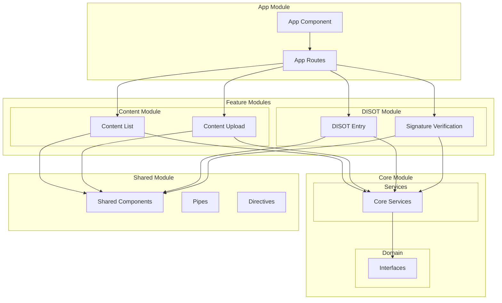
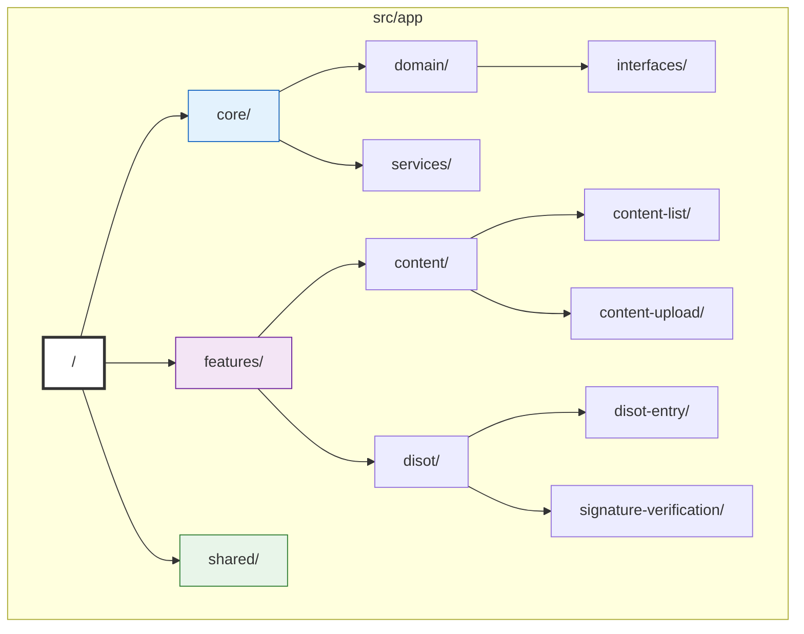
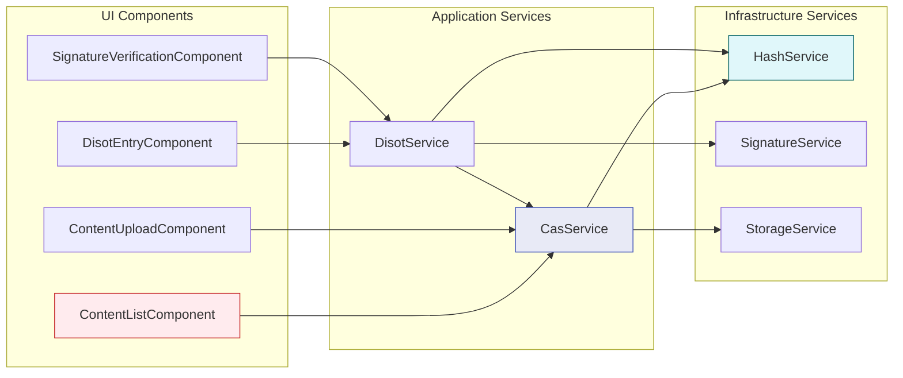
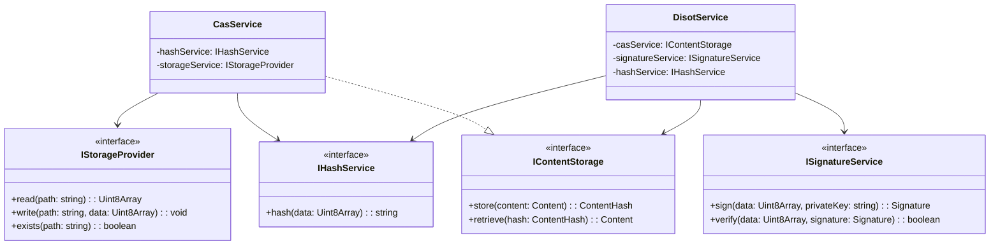
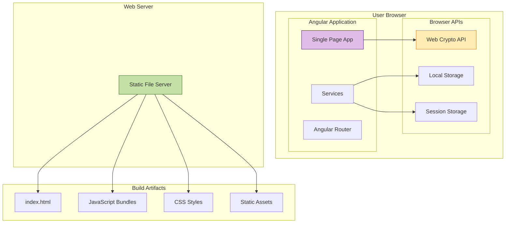
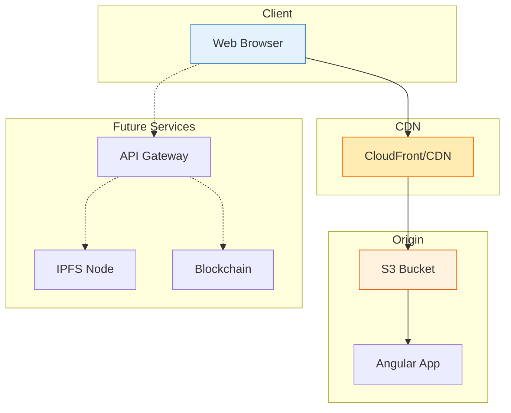

# System Architecture

[← Architecture Overview](./overview.md) | [Home](../README.md) | [Next: Data Flow →](./data-flow.md)

## Table of Contents

1. [System Overview](#system-overview)
2. [Architectural Patterns](#architectural-patterns)
3. [Module Structure](#module-structure)
4. [Dependency Graph](#dependency-graph)
5. [Deployment Architecture](#deployment-architecture)

## System Overview

## Architectural Patterns

### Hexagonal Architecture

### Clean Architecture Layers

## Module Structure

### Angular Module Organization

### File System Structure

## Dependency Graph

### Service Dependencies

### Interface Dependencies

## Deployment Architecture

### Browser-Based Deployment

### Production Architecture

---

[← Architecture Overview](./overview.md) | [↑ Top](#system-architecture) | [Home](../README.md) | [Next: Data Flow →](./data-flow.md)