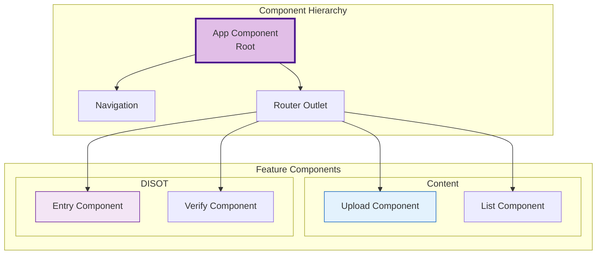
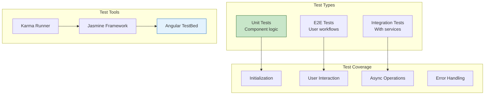

# Component Reference

[← Models API](../api/models.md) | [Home](../README.md) | [Next: Content Components →](./content-components.md)

## Table of Contents

1. [Content Components](./content-components.md)
   - [Content Upload Component](./content-components.md#content-upload-component)
   - [Content List Component](./content-components.md#content-list-component)

2. [DISOT Components](./disot-components.md)
   - [DISOT Entry Component](./disot-components.md#disot-entry-component)
   - [Signature Verification Component](./disot-components.md#signature-verification-component)

3. [Layout Components](./layout-components.md)
   - [App Component](./layout-components.md#app-component)
   - [Navigation Component](./layout-components.md#navigation-component)

## Overview

This reference documents all Angular components in the CAS/DISOT application, including their properties, methods, and usage examples.

### Component Architecture



### Component Categories


### Component Communication Patterns

```mermaid
graph LR
    subgraph "Data Flow"
        PARENT[Parent Component]
        CHILD[Child Component]
        SERVICE[Shared Service]
    end
    
    subgraph "Communication Methods"
        INPUT[@Input]
        OUTPUT[@Output]
        OBSERVABLE[Observable]
    end
    
    PARENT -->|Property Binding| INPUT
    INPUT --> CHILD
    CHILD -->|Event Emitter| OUTPUT
    OUTPUT --> PARENT
    
    PARENT --> SERVICE
    CHILD --> SERVICE
    SERVICE -->|BehaviorSubject| OBSERVABLE
    
    style INPUT fill:#e3f2fd,stroke:#1565c0
    style OUTPUT fill:#f3e5f5,stroke:#6a1b9a
    style OBSERVABLE fill:#e8f5e9,stroke:#2e7d32
```

### Component Testing Strategy



---

[← Models API](../api/models.md) | [↑ Top](#component-reference) | [Home](../README.md) | [Next: Content Components →](./content-components.md)