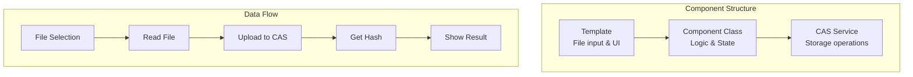
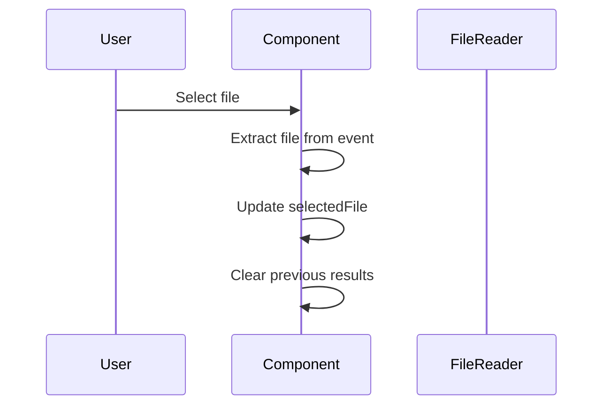
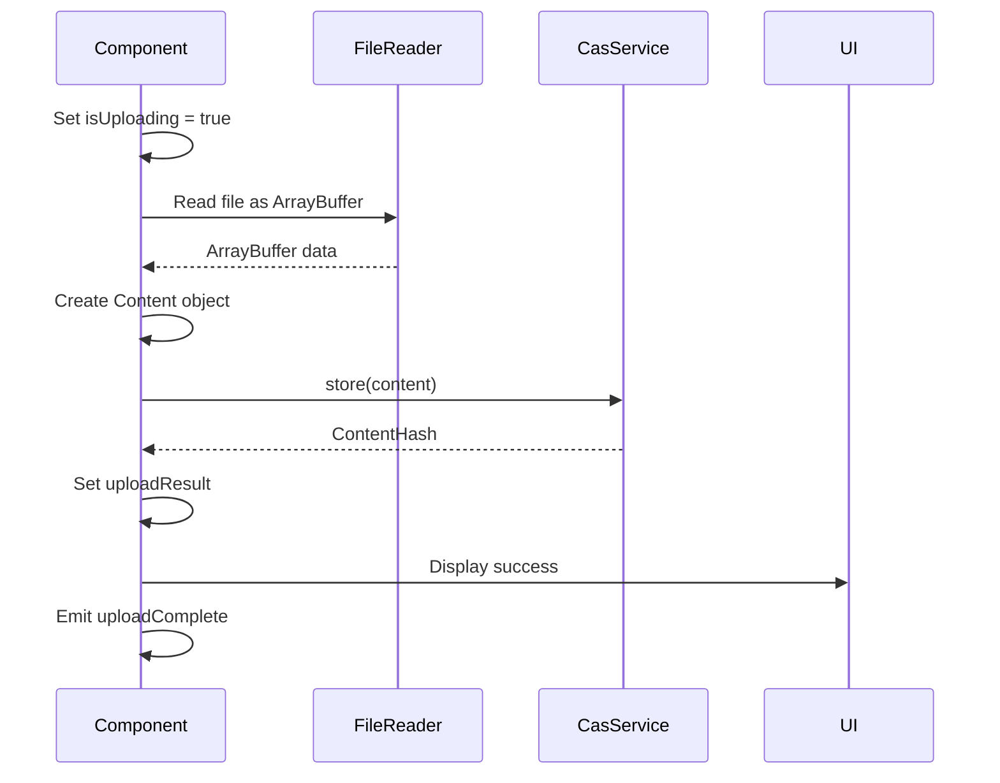
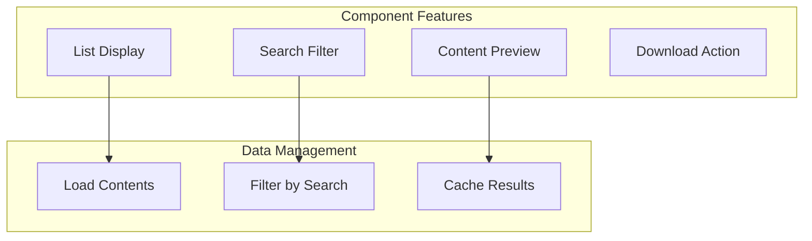
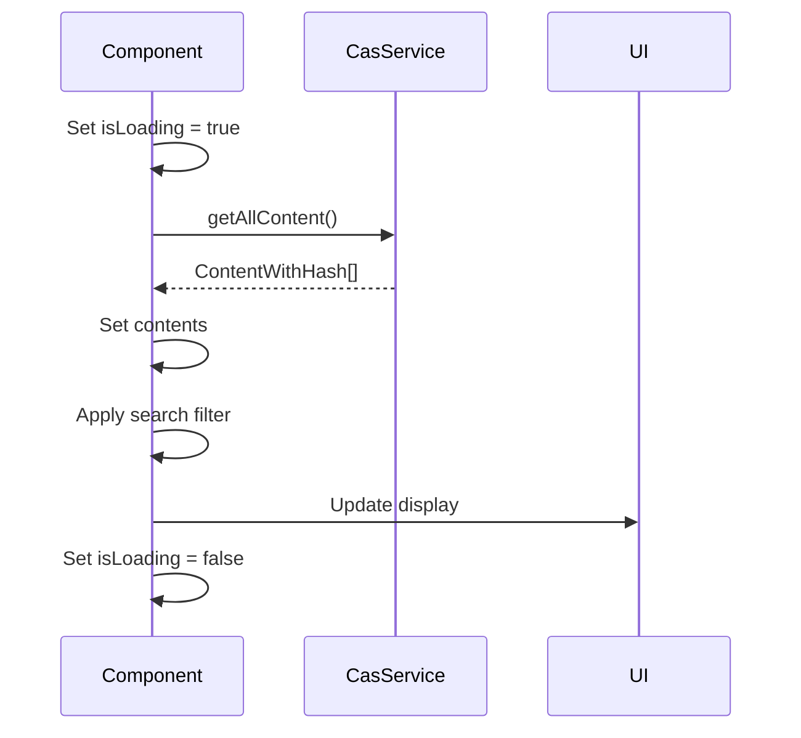
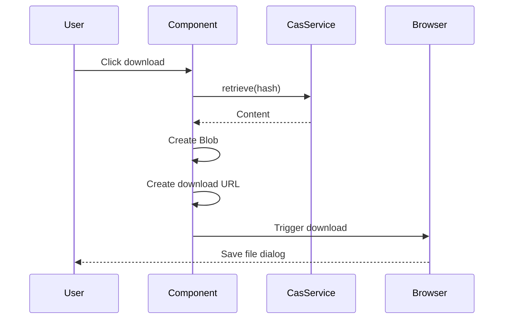
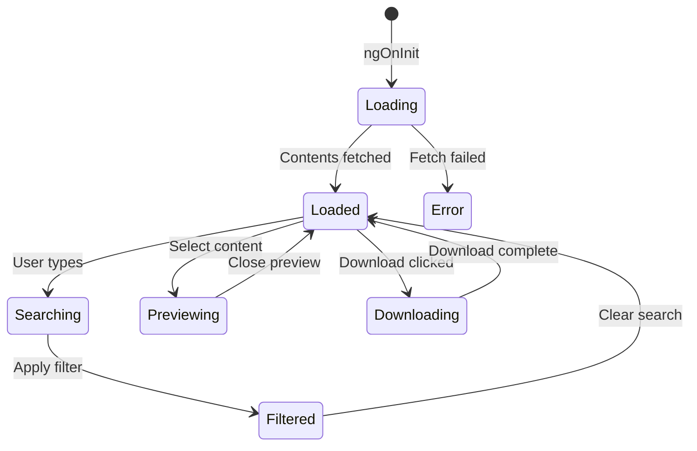

# Content Components

[← Component Overview](./README.md) | [Home](../README.md) | [Next: DISOT Components →](./disot-components.md)

## Table of Contents

1. [Content Upload Component](#content-upload-component)
2. [Content List Component](#content-list-component)

## Content Upload Component

### Overview

The Content Upload Component allows users to upload files to the Content Addressable Storage system.



### Component Definition

```typescript
@Component({
  selector: 'app-content-upload',
  standalone: true,
  imports: [CommonModule, SharedModule],
  templateUrl: './content-upload.component.html',
  styleUrls: ['./content-upload.component.css']
})
export class ContentUploadComponent
```

### Properties

| Property | Type | Description |
|----------|------|-------------|
| `selectedFile` | `File \| null` | Currently selected file |
| `isUploading` | `boolean` | Upload in progress flag |
| `uploadResult` | `ContentHash \| null` | Result of upload |
| `errorMessage` | `string` | Error message if any |
| `@Output() uploadComplete` | `EventEmitter<ContentHash>` | Emits when upload completes |

### Methods

#### onFileSelected

Handles file selection from input.

```typescript
onFileSelected(event: Event): void
```



#### uploadFile

Uploads the selected file to CAS.

```typescript
async uploadFile(): Promise<void>
```



### Template Structure

```html
<div class="content-upload">
  <h2>Upload Content</h2>
  
  <div class="upload-section">
    <input 
      type="file" 
      (change)="onFileSelected($event)"
      [disabled]="isUploading"
    />
    
    <div *ngIf="selectedFile" class="file-info">
      <p>Selected: {{ selectedFile.name }}</p>
      <p>Size: {{ formatFileSize(selectedFile.size) }}</p>
      <p>Type: {{ selectedFile.type || 'Unknown' }}</p>
    </div>
    
    <button 
      (click)="uploadFile()"
      [disabled]="!selectedFile || isUploading"
    >
      {{ isUploading ? 'Uploading...' : 'Upload' }}
    </button>
  </div>
  
  <div *ngIf="uploadResult" class="success-message">
    <h3>Upload Successful!</h3>
    <p>Hash: {{ uploadResult.value }}</p>
  </div>
  
  <div *ngIf="errorMessage" class="error-message">
    {{ errorMessage }}
  </div>
</div>
```

### Usage Example

```typescript
// In parent component template
<app-content-upload 
  (uploadComplete)="onUploadComplete($event)">
</app-content-upload>

// In parent component class
onUploadComplete(hash: ContentHash) {
  console.log('File uploaded with hash:', hash.value);
  // Navigate to content list or show details
}
```

## Content List Component

### Overview

The Content List Component displays all stored content with search, preview, and download capabilities.



### Component Definition

```typescript
@Component({
  selector: 'app-content-list',
  standalone: true,
  imports: [CommonModule, SharedModule, FormsModule],
  templateUrl: './content-list.component.html',
  styleUrls: ['./content-list.component.css']
})
export class ContentListComponent implements OnInit
```

### Properties

| Property | Type | Description |
|----------|------|-------------|
| `contents` | `ContentWithHash[]` | All stored content |
| `filteredContents` | `ContentWithHash[]` | Filtered content list |
| `searchTerm` | `string` | Current search term |
| `selectedContent` | `ContentWithHash \| null` | Selected for preview |
| `isLoading` | `boolean` | Loading state |
| `previewData` | `string \| null` | Preview content |

### Methods

#### ngOnInit

Loads content list on component initialization.

```typescript
ngOnInit(): void {
  this.loadContents();
}
```

#### loadContents

Fetches all content from CAS service.

```typescript
async loadContents(): Promise<void>
```



#### searchContents

Filters content based on search term.

```typescript
searchContents(): void
```

#### downloadContent

Downloads content to user's device.

```typescript
async downloadContent(contentHash: ContentHash): Promise<void>
```



### Template Structure

```html
<div class="content-list">
  <h2>Stored Content</h2>
  
  <div class="search-section">
    <input 
      type="text"
      [(ngModel)]="searchTerm"
      (ngModelChange)="searchContents()"
      placeholder="Search content..."
    />
  </div>
  
  <div *ngIf="isLoading" class="loading">
    Loading content...
  </div>
  
  <div *ngIf="!isLoading && filteredContents.length === 0" class="no-content">
    No content found.
  </div>
  
  <div class="content-grid">
    <div 
      *ngFor="let item of filteredContents" 
      class="content-item"
      (click)="selectContent(item)"
    >
      <h3>{{ getContentName(item) }}</h3>
      <p>Type: {{ getContentType(item) }}</p>
      <p>Size: {{ formatFileSize(getContentSize(item)) }}</p>
      <p class="hash">{{ item.hash.value }}</p>
      
      <div class="actions">
        <button (click)="previewContent(item); $event.stopPropagation()">
          Preview
        </button>
        <button (click)="downloadContent(item.hash); $event.stopPropagation()">
          Download
        </button>
      </div>
    </div>
  </div>
  
  <div *ngIf="selectedContent" class="preview-modal">
    <div class="modal-content">
      <h3>Preview: {{ getContentName(selectedContent) }}</h3>
      <pre *ngIf="previewData">{{ previewData }}</pre>
      <button (click)="closePreview()">Close</button>
    </div>
  </div>
</div>
```

### State Management



### Styling

```css
.content-grid {
  display: grid;
  grid-template-columns: repeat(auto-fill, minmax(300px, 1fr));
  gap: 20px;
}

.content-item {
  border: 1px solid #ddd;
  border-radius: 8px;
  padding: 15px;
  cursor: pointer;
  transition: all 0.3s;
}

.content-item:hover {
  box-shadow: 0 4px 8px rgba(0,0,0,0.1);
  transform: translateY(-2px);
}

.hash {
  font-family: monospace;
  font-size: 12px;
  color: #666;
  overflow: hidden;
  text-overflow: ellipsis;
}
```

### Testing

```typescript
describe('ContentListComponent', () => {
  let component: ContentListComponent;
  let casService: jasmine.SpyObj<CasService>;
  
  beforeEach(() => {
    const spy = jasmine.createSpyObj('CasService', ['getAllContent', 'retrieve']);
    
    TestBed.configureTestingModule({
      imports: [ContentListComponent],
      providers: [{ provide: CasService, useValue: spy }]
    });
    
    casService = TestBed.inject(CasService) as jasmine.SpyObj<CasService>;
  });
  
  it('should load contents on init', async () => {
    const mockContents = [/* mock data */];
    casService.getAllContent.and.returnValue(Promise.resolve(mockContents));
    
    await component.ngOnInit();
    
    expect(component.contents).toEqual(mockContents);
    expect(component.isLoading).toBeFalse();
  });
});
```

---

[← Component Overview](./README.md) | [↑ Top](#content-components) | [Home](../README.md) | [Next: DISOT Components →](./disot-components.md)