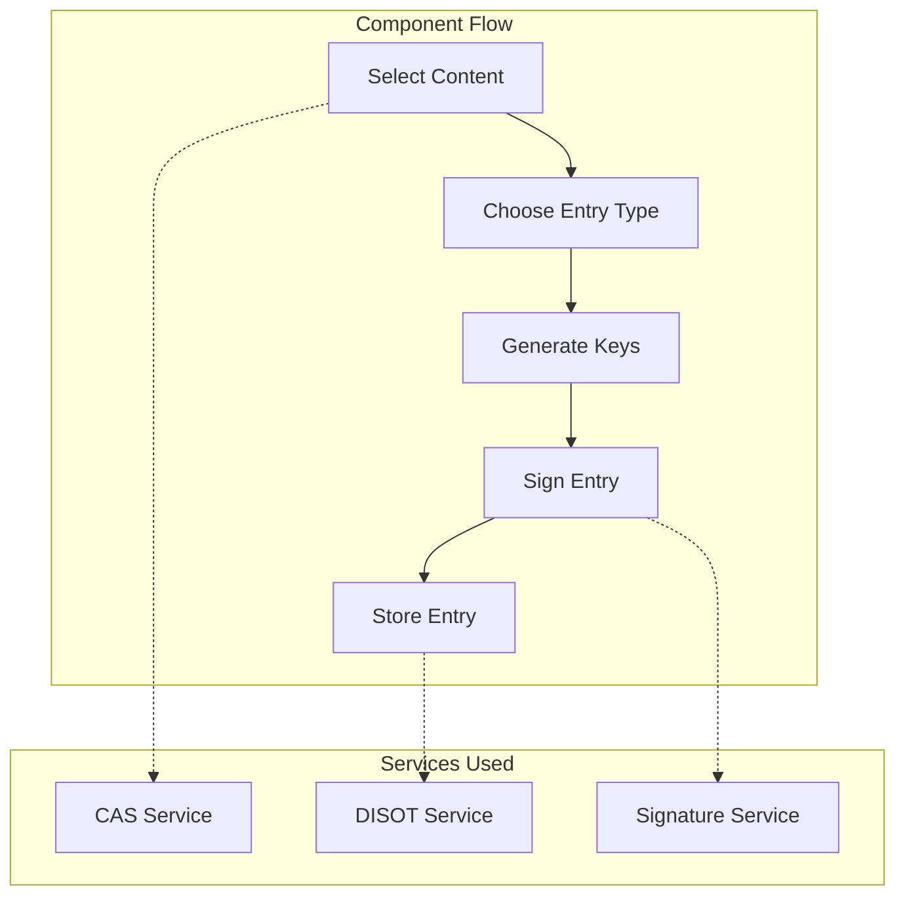
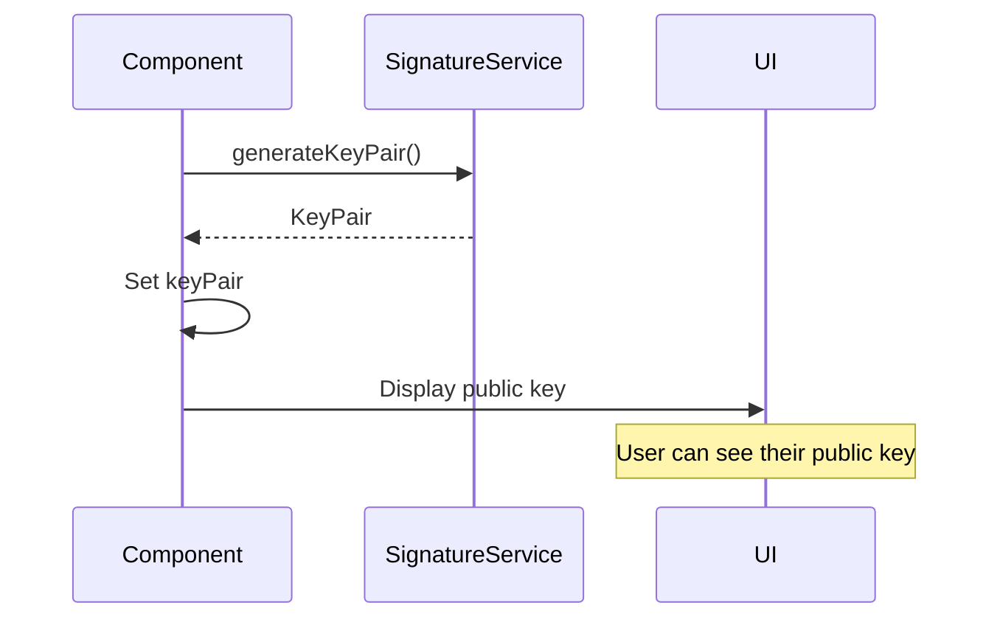
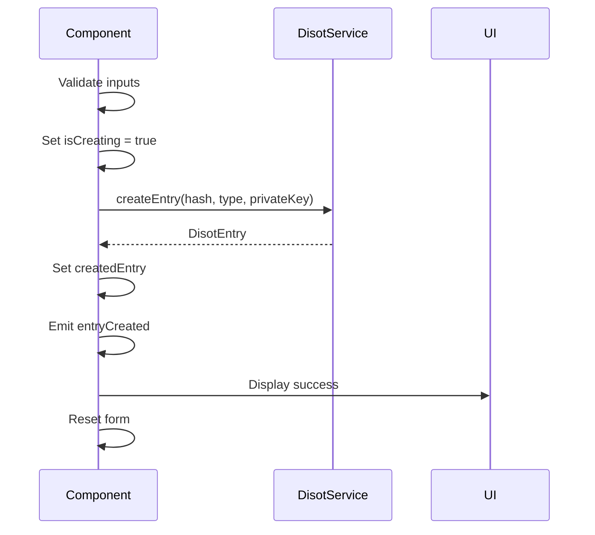
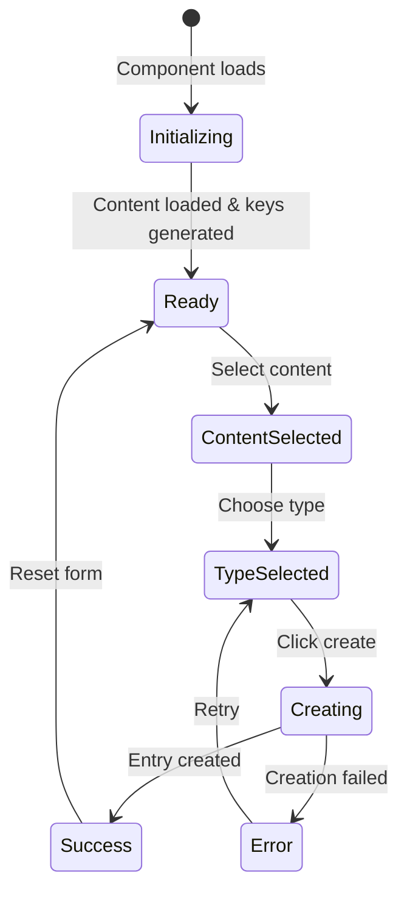
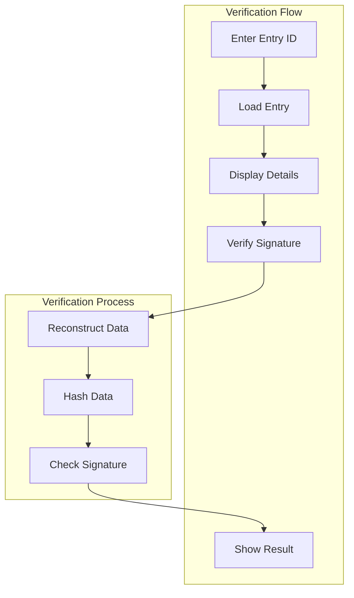
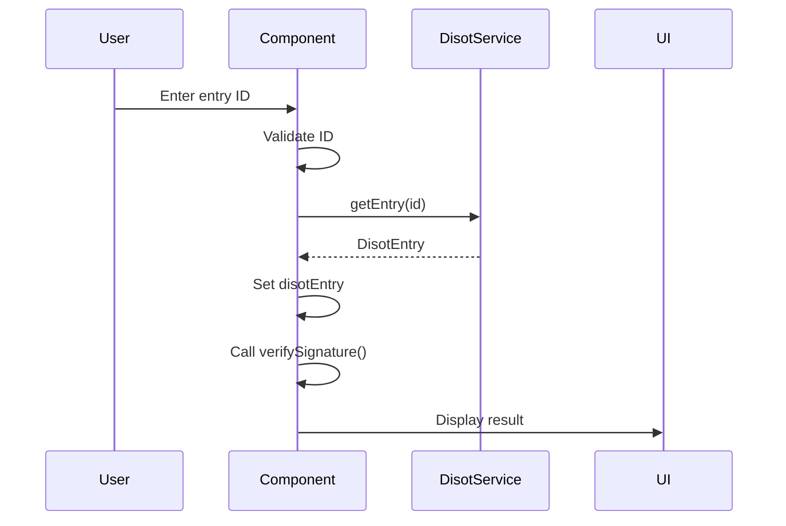
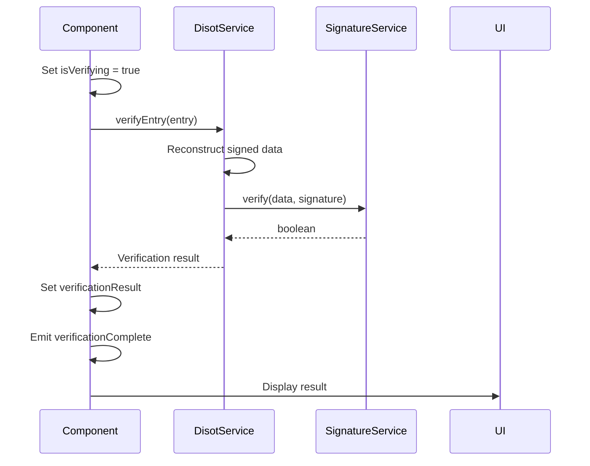
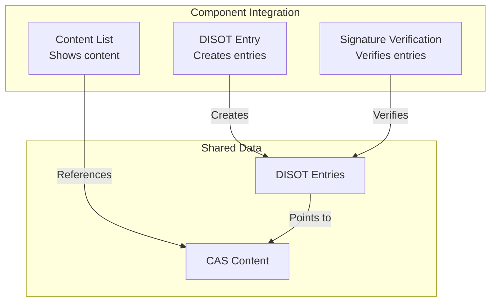

# DISOT Components

[⬅️ Content Components](./content-components.md) | [🏠 Home](../README.md) | [Layout Components ➡️](./layout-components.md)

## Table of Contents

1. [DISOT Entry Component](#disot-entry-component)
2. [Signature Verification Component](#signature-verification-component)

## DISOT Entry Component

### Overview

The DISOT Entry Component allows users to create digitally signed entries that reference content in the CAS system.



### Component Definition

```typescript
@Component({
  selector: 'app-disot-entry',
  standalone: true,
  imports: [CommonModule, SharedModule, FormsModule],
  templateUrl: './disot-entry.component.html',
  styleUrls: ['./disot-entry.component.css']
})
export class DisotEntryComponent implements OnInit
```

### Properties

| Property | Type | Description |
|----------|------|-------------|
| `availableContent` | `ContentWithHash[]` | Available content for selection |
| `selectedContent` | `ContentWithHash \| null` | Selected content |
| `entryType` | `DisotType` | Type of entry (CREATE/UPDATE/DELETE) |
| `keyPair` | `KeyPair \| null` | Generated key pair |
| `createdEntry` | `DisotEntry \| null` | Created entry result |
| `isCreating` | `boolean` | Creation in progress |
| `@Output() entryCreated` | `EventEmitter<DisotEntry>` | Emits when entry created |

### Methods

#### ngOnInit

Initializes component and loads available content.

```typescript
async ngOnInit(): Promise<void> {
  await this.loadAvailableContent();
  this.generateKeyPair();
}
```

#### generateKeyPair

Generates a new cryptographic key pair.

```typescript
generateKeyPair(): void
```



#### createEntry

Creates and signs a new DISOT entry.

```typescript
async createEntry(): Promise<void>
```



### Template Structure

```html
<div class="disot-entry">
  <h2>Create DISOT Entry</h2>
  
  <!-- Step 1: Select Content -->
  <div class="step-section">
    <h3>Step 1: Select Content</h3>
    <select 
      [(ngModel)]="selectedContent"
      [disabled]="isCreating"
    >
      <option [ngValue]="null">-- Select Content --</option>
      <option 
        *ngFor="let content of availableContent" 
        [ngValue]="content"
      >
        {{ getContentName(content) }} ({{ content.hash.value.slice(0, 8) }}...)
      </option>
    </select>
  </div>
  
  <!-- Step 2: Choose Entry Type -->
  <div class="step-section">
    <h3>Step 2: Choose Entry Type</h3>
    <div class="radio-group">
      <label>
        <input 
          type="radio" 
          name="entryType" 
          [value]="'CREATE'"
          [(ngModel)]="entryType"
          [disabled]="isCreating"
        />
        Create - New content entry
      </label>
      <label>
        <input 
          type="radio" 
          name="entryType" 
          [value]="'UPDATE'"
          [(ngModel)]="entryType"
          [disabled]="isCreating"
        />
        Update - Modify existing entry
      </label>
      <label>
        <input 
          type="radio" 
          name="entryType" 
          [value]="'DELETE'"
          [(ngModel)]="entryType"
          [disabled]="isCreating"
        />
        Delete - Mark content as deleted
      </label>
    </div>
  </div>
  
  <!-- Step 3: Key Management -->
  <div class="step-section">
    <h3>Step 3: Digital Signature</h3>
    <div *ngIf="keyPair" class="key-info">
      <p><strong>Public Key:</strong></p>
      <code>{{ keyPair.publicKey }}</code>
      <button 
        (click)="generateKeyPair()"
        [disabled]="isCreating"
      >
        Generate New Keys
      </button>
    </div>
  </div>
  
  <!-- Create Button -->
  <button 
    class="create-button"
    (click)="createEntry()"
    [disabled]="!selectedContent || !keyPair || isCreating"
  >
    {{ isCreating ? 'Creating...' : 'Create Entry' }}
  </button>
  
  <!-- Success Message -->
  <div *ngIf="createdEntry" class="success-section">
    <h3>Entry Created Successfully!</h3>
    <div class="entry-details">
      <p><strong>Entry ID:</strong> {{ createdEntry.id }}</p>
      <p><strong>Type:</strong> {{ createdEntry.type }}</p>
      <p><strong>Timestamp:</strong> {{ createdEntry.timestamp | date:'medium' }}</p>
      <p><strong>Signature:</strong> {{ createdEntry.signature.value.slice(0, 32) }}...</p>
    </div>
    <button (click)="copyEntryId()">Copy Entry ID</button>
  </div>
</div>
```

### State Management



## Signature Verification Component

### Overview

The Signature Verification Component allows users to verify the authenticity of DISOT entries.



### Component Definition

```typescript
@Component({
  selector: 'app-signature-verification',
  standalone: true,
  imports: [CommonModule, SharedModule, FormsModule],
  templateUrl: './signature-verification.component.html',
  styleUrls: ['./signature-verification.component.css']
})
export class SignatureVerificationComponent
```

### Properties

| Property | Type | Description |
|----------|------|-------------|
| `@Input() disotEntry` | `DisotEntry \| null` | Entry to verify (optional input) |
| `verificationResult` | `boolean \| null` | Verification result |
| `isVerifying` | `boolean` | Verification in progress |
| `errorMessage` | `string` | Error message if any |
| `@Output() verificationComplete` | `EventEmitter<VerificationResult>` | Emits verification result |

### Methods

#### verifyById

Loads and verifies entry by ID.

```typescript
async verifyById(entryId: string): Promise<void>
```



#### verifySignature

Verifies the signature of the loaded entry.

```typescript
async verifySignature(): Promise<void>
```



### Template Structure

```html
<div class="signature-verification">
  <h2>Signature Verification</h2>
  
  <!-- Entry ID Input -->
  <div class="lookup-section">
    <h3>Verify by Entry ID</h3>
    <div class="id-input-group">
      <input 
        type="text" 
        #entryIdInput
        placeholder="Enter DISOT entry ID..."
        [disabled]="isVerifying"
      />
      <button 
        (click)="verifyById(entryIdInput.value)"
        [disabled]="isVerifying"
      >
        Load & Verify
      </button>
    </div>
  </div>
  
  <!-- Entry Details -->
  <div *ngIf="disotEntry" class="entry-section">
    <h3>Entry Details</h3>
    <div class="entry-info">
      <div class="info-row">
        <span class="label">Entry ID:</span>
        <code>{{ disotEntry.id }}</code>
      </div>
      <div class="info-row">
        <span class="label">Type:</span>
        <span>{{ formatEntryType(disotEntry.type) }}</span>
      </div>
      <div class="info-row">
        <span class="label">Timestamp:</span>
        <span>{{ disotEntry.timestamp | date:'medium' }}</span>
      </div>
      <div class="info-row">
        <span class="label">Content Hash:</span>
        <code>{{ disotEntry.contentHash.value }}</code>
      </div>
      <div class="info-row">
        <span class="label">Public Key:</span>
        <code>{{ disotEntry.signature.publicKey }}</code>
      </div>
    </div>
    
    <button 
      (click)="verifySignature()"
      [disabled]="isVerifying"
      class="verify-button"
    >
      {{ isVerifying ? 'Verifying...' : 'Verify Signature' }}
    </button>
  </div>
  
  <!-- Verification Result -->
  <div 
    *ngIf="verificationResult !== null" 
    class="verification-result"
    [class.valid]="verificationResult"
    [class.invalid]="!verificationResult"
  >
    <div class="result-icon">
      <span *ngIf="verificationResult">✓</span>
      <span *ngIf="!verificationResult">✗</span>
    </div>
    <div class="result-text">
      <h3>{{ verificationResult ? 'Signature Valid' : 'Signature Invalid' }}</h3>
      <p>{{ getResultMessage() }}</p>
    </div>
  </div>
  
  <!-- Error Display -->
  <div *ngIf="errorMessage" class="error-message">
    {{ errorMessage }}
  </div>
</div>
```

### Styling

```css
.verification-result {
  padding: 20px;
  border-radius: 8px;
  display: flex;
  align-items: center;
  gap: 20px;
  margin-top: 20px;
}

.verification-result.valid {
  background-color: #d4edda;
  color: #155724;
  border: 1px solid #c3e6cb;
}

.verification-result.invalid {
  background-color: #f8d7da;
  color: #721c24;
  border: 1px solid #f5c6cb;
}

.result-icon {
  font-size: 48px;
  font-weight: bold;
}

.entry-info {
  background-color: #f8f9fa;
  padding: 15px;
  border-radius: 4px;
  margin-bottom: 20px;
}

.info-row {
  display: flex;
  margin-bottom: 10px;
  align-items: flex-start;
}

.label {
  font-weight: bold;
  min-width: 120px;
  margin-right: 10px;
}

code {
  background-color: #e9ecef;
  padding: 2px 4px;
  border-radius: 3px;
  font-family: monospace;
  font-size: 12px;
  word-break: break-all;
}
```

### Testing

```typescript
describe('SignatureVerificationComponent', () => {
  let component: SignatureVerificationComponent;
  let disotService: jasmine.SpyObj<DisotService>;
  
  beforeEach(() => {
    const spy = jasmine.createSpyObj('DisotService', ['getEntry', 'verifyEntry']);
    
    TestBed.configureTestingModule({
      imports: [SignatureVerificationComponent],
      providers: [{ provide: DisotService, useValue: spy }]
    });
    
    disotService = TestBed.inject(DisotService) as jasmine.SpyObj<DisotService>;
  });
  
  it('should verify valid signature', async () => {
    const mockEntry = createMockDisotEntry();
    component.disotEntry = mockEntry;
    disotService.verifyEntry.and.returnValue(Promise.resolve(true));
    
    await component.verifySignature();
    
    expect(component.verificationResult).toBeTrue();
    expect(component.isVerifying).toBeFalse();
  });
  
  it('should handle invalid signature', async () => {
    const mockEntry = createMockDisotEntry();
    component.disotEntry = mockEntry;
    disotService.verifyEntry.and.returnValue(Promise.resolve(false));
    
    await component.verifySignature();
    
    expect(component.verificationResult).toBeFalse();
  });
});
```

### Integration with Other Components



---

[⬅️ Content Components](./content-components.md) | [⬆️ Top](#disot-components) | [🏠 Home](../README.md) | [Layout Components ➡️](./layout-components.md)