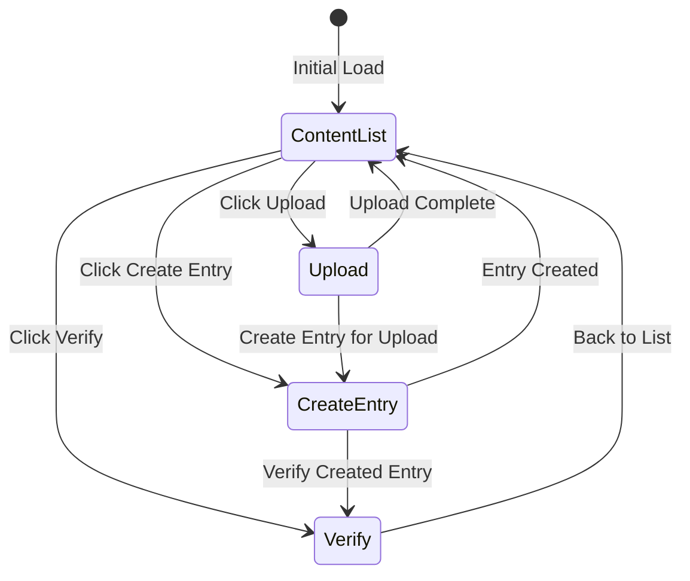
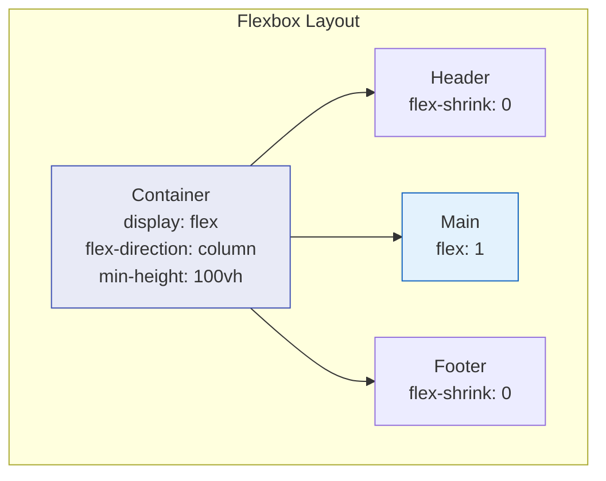
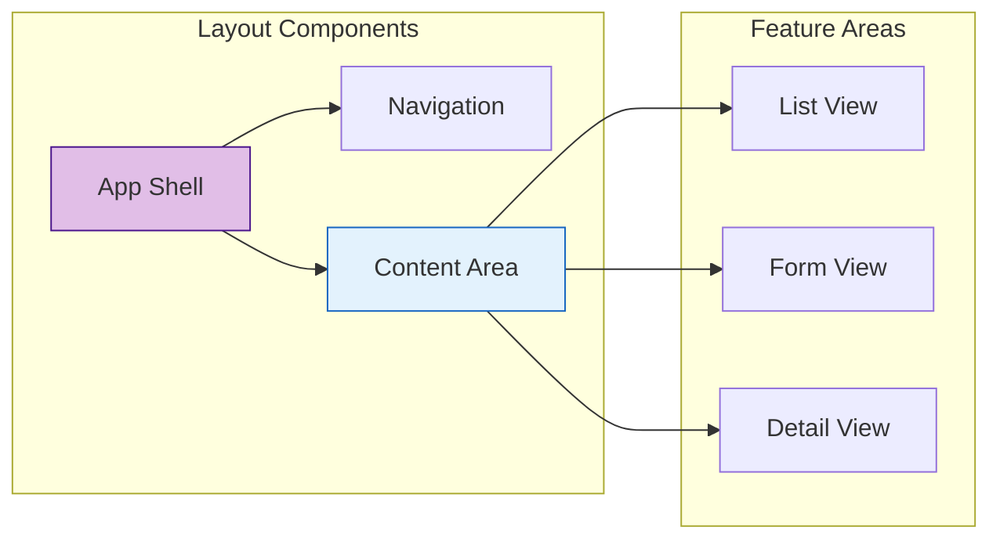
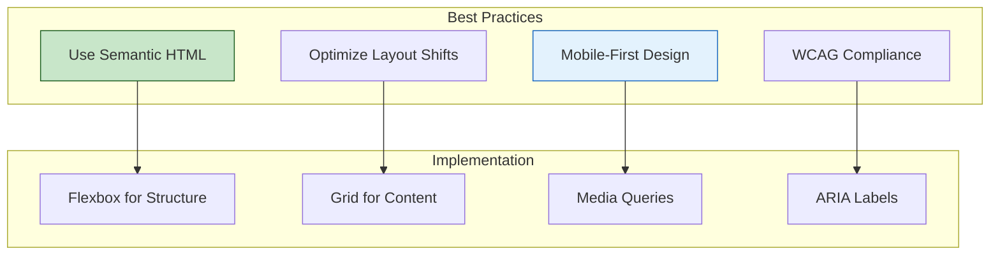

# Layout Components

[← DISOT Components](./disot-components.md) | [Home](../README.md) | [Service Reference →](../services/README.md)

## Table of Contents

1. [App Component](#app-component)
2. [Navigation Component](#navigation-component)
3. [Layout Patterns](#layout-patterns)

## App Component

### Overview

The App Component is the root component that provides the application shell, navigation, and routing.

```mermaid
graph TD
    subgraph "App Component Structure"
        HEADER[Header<br/>Title & Navigation]
        ROUTER[Router Outlet<br/>Dynamic Content]
        FOOTER[Footer<br/>Application Info]
    end
    
    subgraph "Child Routes"
        CONTENT[/content]
        UPLOAD[/upload]
        CREATE[/disot/create]
        VERIFY[/disot/verify]
    end
    
    HEADER --> ROUTER
    ROUTER --> FOOTER
    
    ROUTER --> CONTENT
    ROUTER --> UPLOAD
    ROUTER --> CREATE
    ROUTER --> VERIFY
    
    style HEADER fill:#e1bee7,stroke:#4a148c
    style ROUTER fill:#e3f2fd,stroke:#1565c0
```

### Component Definition

```typescript
@Component({
  selector: 'app-root',
  standalone: true,
  imports: [CommonModule, RouterOutlet, RouterLink],
  template: `...`,
  styles: [`...`]
})
export class App {
  protected title = 'cas-app';
}
```

### Template Structure

```html
<div class="app-container">
  <header class="app-header">
    <h1>CAS - Content Addressable Storage</h1>
    <nav class="main-nav">
      <a routerLink="/content" routerLinkActive="active">
        Content List
      </a>
      <a routerLink="/upload" routerLinkActive="active">
        Upload
      </a>
      <a routerLink="/disot/create" routerLinkActive="active">
        Create Entry
      </a>
      <a routerLink="/disot/verify" routerLinkActive="active">
        Verify
      </a>
    </nav>
  </header>
  
  <main class="main-content">
    <router-outlet></router-outlet>
  </main>
  
  <footer class="app-footer">
    <p>Decentralized Content Management System</p>
  </footer>
</div>
```

### Styling

```css
.app-container {
  min-height: 100vh;
  display: flex;
  flex-direction: column;
}

.app-header {
  background-color: #2c3e50;
  color: white;
  padding: 20px;
  box-shadow: 0 2px 4px rgba(0,0,0,0.1);
}

.main-nav {
  display: flex;
  gap: 20px;
}

.main-nav a {
  color: #ecf0f1;
  text-decoration: none;
  padding: 8px 16px;
  border-radius: 4px;
  transition: background-color 0.3s;
}

.main-nav a:hover {
  background-color: #34495e;
}

.main-nav a.active {
  background-color: #3498db;
}

.main-content {
  flex: 1;
  background-color: #f5f5f5;
  padding: 20px;
}

.app-footer {
  background-color: #2c3e50;
  color: #ecf0f1;
  text-align: center;
  padding: 20px;
}
```

### Routing Configuration

```typescript
export const routes: Routes = [
  { path: '', redirectTo: '/content', pathMatch: 'full' },
  { path: 'content', component: ContentListComponent },
  { path: 'upload', component: ContentUploadComponent },
  { path: 'disot/create', component: DisotEntryComponent },
  { path: 'disot/verify', component: SignatureVerificationComponent }
];
```

```mermaid
graph LR
    subgraph "Route Structure"
        ROOT[/]
        CONTENT[/content]
        UPLOAD[/upload]
        DISOT[/disot]
        CREATE[/disot/create]
        VERIFY[/disot/verify]
    end
    
    ROOT -->|redirect| CONTENT
    ROOT --> UPLOAD
    DISOT --> CREATE
    DISOT --> VERIFY
    
    style ROOT fill:#f3e5f5,stroke:#6a1b9a
    style CONTENT fill:#e3f2fd,stroke:#1565c0
```

## Navigation Component

### Navigation States



### Active Route Indication

The navigation uses Angular's `routerLinkActive` directive to highlight the current route:

```html
<a 
  routerLink="/content" 
  routerLinkActive="active"
  [routerLinkActiveOptions]="{exact: true}"
>
  Content List
</a>
```

### Responsive Navigation

```css
/* Mobile Navigation */
@media (max-width: 768px) {
  .main-nav {
    flex-direction: column;
    gap: 10px;
  }
  
  .main-nav a {
    width: 100%;
    text-align: center;
  }
}

/* Tablet and Desktop */
@media (min-width: 769px) {
  .main-nav {
    flex-direction: row;
    justify-content: flex-start;
  }
}
```

## Layout Patterns

### Flex Layout Structure



### Grid Layout for Content

```css
/* Content Grid Layout */
.content-grid {
  display: grid;
  grid-template-columns: repeat(auto-fill, minmax(300px, 1fr));
  gap: 20px;
  padding: 20px;
}

/* Responsive Grid */
@media (max-width: 600px) {
  .content-grid {
    grid-template-columns: 1fr;
  }
}
```

### Layout Composition



### Theme and Styling

```typescript
// Theme configuration (future enhancement)
interface Theme {
  primary: string;
  secondary: string;
  background: string;
  text: string;
  error: string;
  success: string;
}

const lightTheme: Theme = {
  primary: '#2c3e50',
  secondary: '#3498db',
  background: '#f5f5f5',
  text: '#2c3e50',
  error: '#e74c3c',
  success: '#27ae60'
};
```

### Accessibility Features

```html
<!-- Skip Navigation -->
<a href="#main-content" class="skip-nav">
  Skip to main content
</a>

<!-- Semantic HTML -->
<header role="banner">
  <nav role="navigation" aria-label="Main navigation">
    <!-- Navigation items -->
  </nav>
</header>

<main id="main-content" role="main">
  <router-outlet></router-outlet>
</main>

<footer role="contentinfo">
  <!-- Footer content -->
</footer>
```

### Testing Layout Components

```typescript
describe('App Component', () => {
  let component: App;
  let fixture: ComponentFixture<App>;
  let router: Router;
  
  beforeEach(async () => {
    await TestBed.configureTestingModule({
      imports: [App],
      providers: [provideRouter(routes)]
    }).compileComponents();
    
    fixture = TestBed.createComponent(App);
    component = fixture.componentInstance;
    router = TestBed.inject(Router);
  });
  
  it('should create the app', () => {
    expect(component).toBeTruthy();
  });
  
  it('should render navigation links', () => {
    const compiled = fixture.nativeElement;
    const links = compiled.querySelectorAll('.main-nav a');
    expect(links.length).toBe(4);
  });
  
  it('should navigate to content list by default', async () => {
    await router.navigate(['/']);
    expect(router.url).toBe('/content');
  });
});
```

### Layout Best Practices



---

[← DISOT Components](./disot-components.md) | [↑ Top](#layout-components) | [Home](../README.md) | [Service Reference →](../services/README.md)