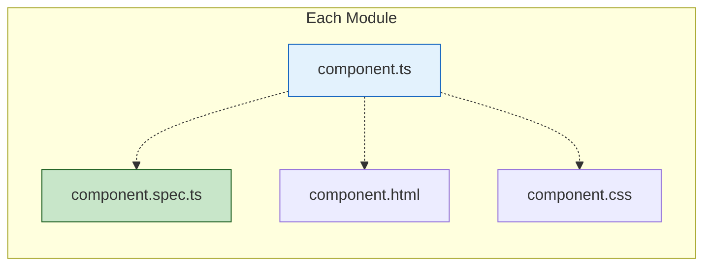
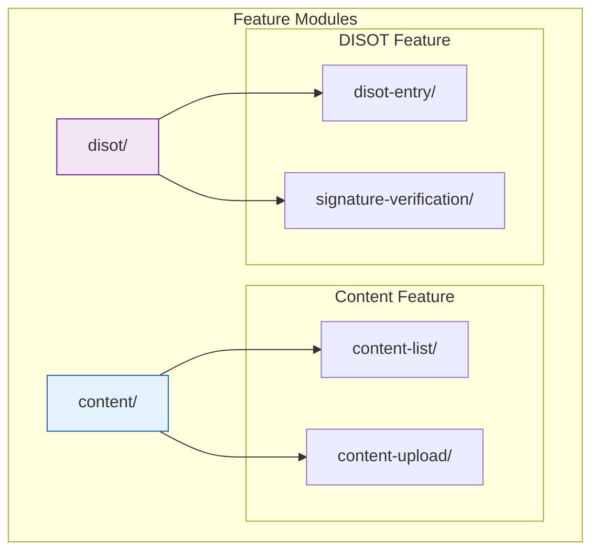

# Project Structure Guide

[← Documentation](../README.md) | [Home](../../README.md)

## Overview

This project follows Angular's recommended project structure with co-located tests and feature-based organization.

## Directory Structure

```
cas-app/
├── src/
│   ├── app/
│   │   ├── core/                      # Core functionality
│   │   │   ├── domain/               # Business logic interfaces
│   │   │   │   └── interfaces/       # Pure interfaces (no implementation)
│   │   │   └── services/             # Application services
│   │   ├── features/                 # Feature modules
│   │   │   ├── content/              # Content management feature
│   │   │   └── disot/                # DISOT feature
│   │   ├── shared/                   # Shared modules
│   │   ├── app.ts                    # Root component
│   │   ├── app.spec.ts               # Root component test
│   │   ├── app.routes.ts             # Application routing
│   │   └── main.ts                   # Application entry point
│   ├── assets/                       # Static assets
│   ├── environments/                 # Environment configs
│   └── index.html                    # Main HTML file
├── docs/                             # Documentation
│   ├── architecture/                 # Architecture docs
│   ├── api/                         # API reference
│   ├── components/                  # Component docs
│   ├── services/                    # Service docs
│   └── testing/                     # Testing guide
├── .angular/                        # Angular cache (gitignored)
├── .claude/                         # Claude memory files
├── node_modules/                    # Dependencies (gitignored)
└── dist/                           # Build output (gitignored)
```

## Key Design Decisions

### 1. Co-located Tests



**Why co-located tests?**
- ✅ Angular official recommendation
- ✅ Industry standard (React, Vue, etc.)
- ✅ Easy to find related files
- ✅ Move/refactor together
- ✅ Clear ownership
- ✅ Simple import paths

**Alternative approaches we considered but rejected:**
- ❌ Separate `/test` directory - Makes refactoring harder
- ❌ `/tests` inside each module - Adds unnecessary nesting
- ❌ Mirrored test structure - Duplicate directory structure

### 2. Feature-based Organization



### 3. Core/Features/Shared Pattern

- **Core**: Singleton services, domain logic
- **Features**: Feature-specific components and services
- **Shared**: Reusable components, pipes, directives

## File Naming Conventions

| Type | Pattern | Example |
|------|---------|---------|
| Component | `name.component.ts` | `content-list.component.ts` |
| Service | `name.service.ts` | `cas.service.ts` |
| Interface | `name.interface.ts` | `content.interface.ts` |
| Test | `name.spec.ts` | `cas.service.spec.ts` |
| Module | `name.module.ts` | `shared.module.ts` |

## Import Order

```typescript
// 1. Angular imports
import { Component, OnInit } from '@angular/core';
import { CommonModule } from '@angular/common';

// 2. Third-party imports
import { Observable } from 'rxjs';

// 3. Local imports - absolute paths
import { CasService } from '@app/core/services/cas.service';
import { Content } from '@app/core/domain/interfaces/content.interface';

// 4. Local imports - relative paths
import { SharedModule } from '../../../shared/shared-module';
```

## Best Practices

### 1. Single Responsibility
Each file should have one clear purpose:
```
✅ content-upload.component.ts    // Only handles upload
❌ content-manager.component.ts   // Does everything
```

### 2. Consistent Structure
All features follow the same pattern:
```
feature/
├── component-name/
│   ├── component-name.component.ts
│   ├── component-name.component.spec.ts
│   ├── component-name.component.html
│   └── component-name.component.css
```

### 3. Lazy Loading Ready
Features are organized for easy lazy loading:
```typescript
const routes: Routes = [
  {
    path: 'content',
    loadChildren: () => import('./features/content/content.module')
      .then(m => m.ContentModule)
  }
];
```

### 4. Barrel Exports
Use index.ts for clean exports:
```typescript
// features/content/index.ts
export * from './content-list/content-list.component';
export * from './content-upload/content-upload.component';
```

## Adding New Features

When adding a new feature:

1. Create feature directory under `features/`
2. Add components with their tests
3. Update routing if needed
4. Document in `/docs`

Example:
```bash
ng generate component features/my-feature/my-component --standalone
```

This automatically creates:
- `my-component.component.ts`
- `my-component.component.spec.ts`
- `my-component.component.html`
- `my-component.component.css`

---

[← Documentation](../README.md) | [↑ Top](#project-structure-guide) | [Home](../../README.md)