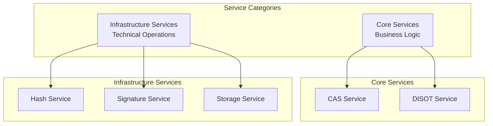
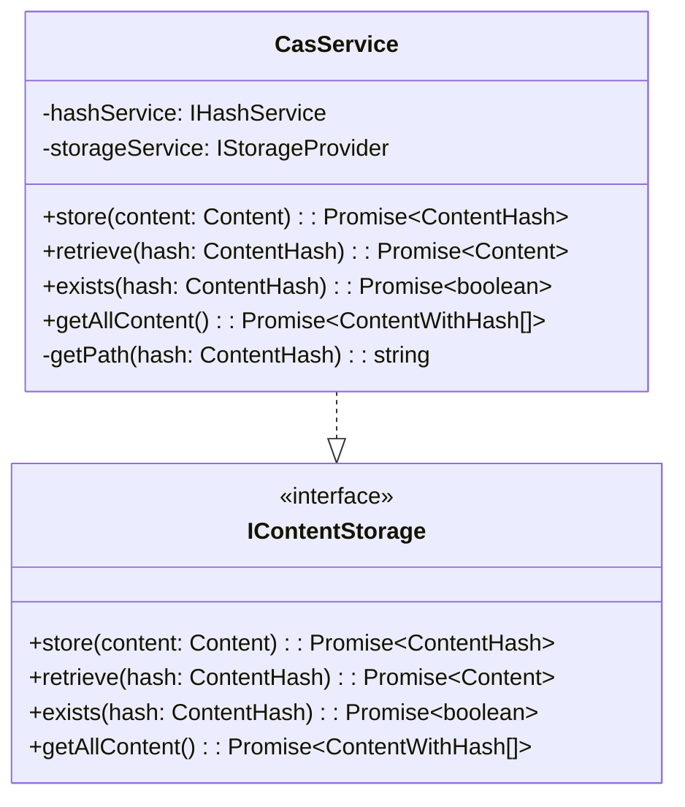
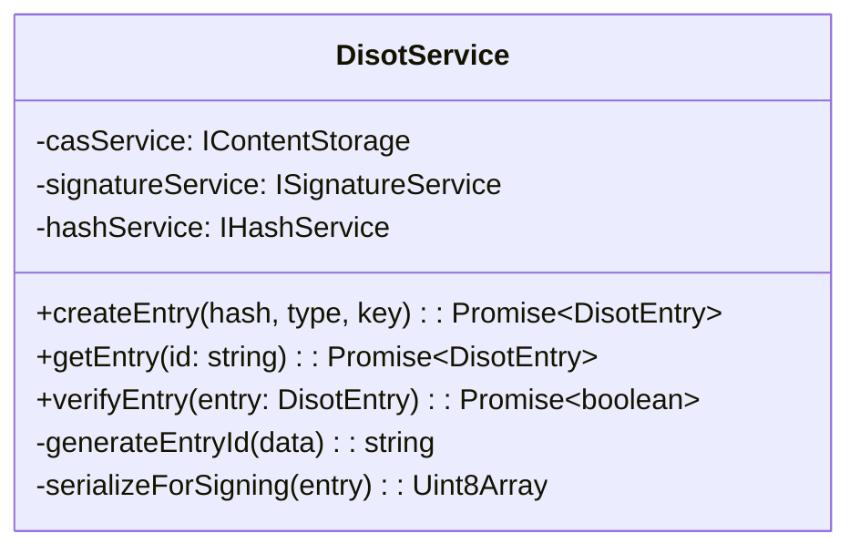
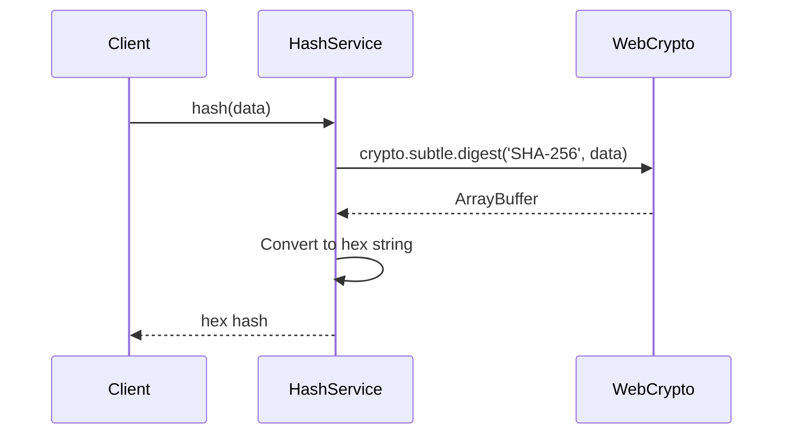
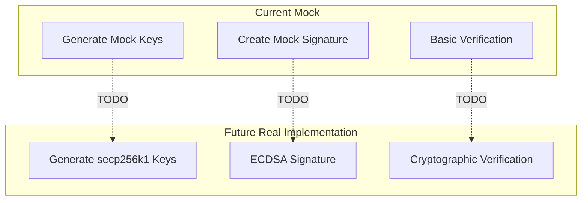
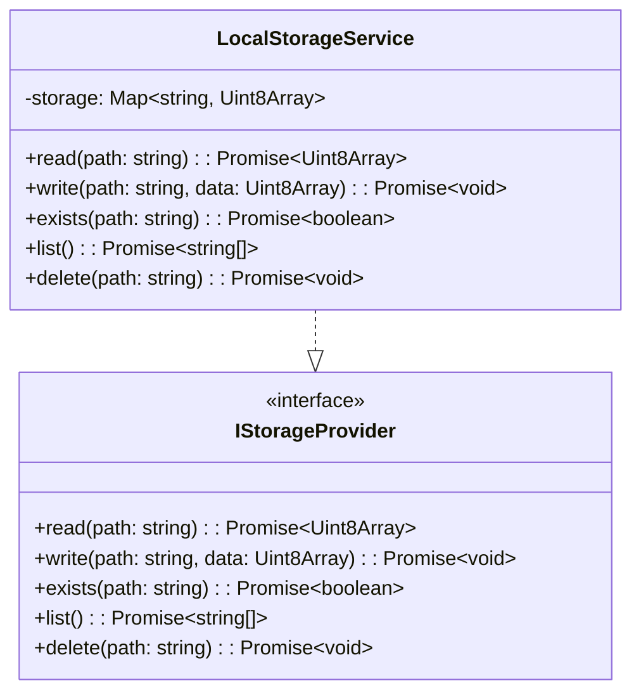
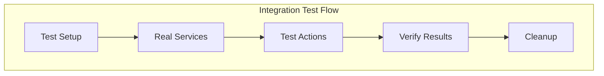
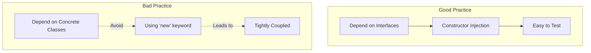
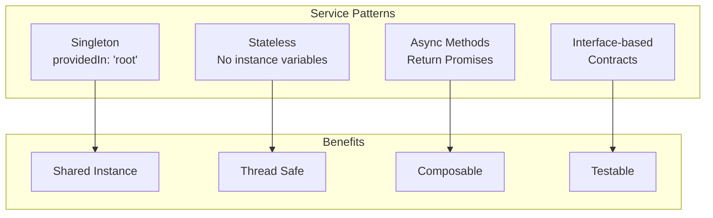

# Service Reference

[← Layout Components](../components/layout-components.md) | [Home](../README.md)

## Table of Contents

1. [Service Overview](#service-overview)
2. [Core Services](#core-services)
3. [Infrastructure Services](#infrastructure-services)
4. [Service Testing Guide](#service-testing-guide)
5. [Service Best Practices](#service-best-practices)

## Service Overview

The service layer implements the business logic and provides a clean API for components to interact with the system.



## Core Services

### CAS Service

Content Addressable Storage service for managing content by hash.



**Key Features:**
- Content deduplication
- Hash-based addressing
- Metadata preservation
- Efficient storage

**Usage Example:**
```typescript
// Store content
const content: Content = {
  data: new TextEncoder().encode('Hello World'),
  metadata: { name: 'greeting.txt', type: 'text/plain' }
};
const hash = await casService.store(content);

// Retrieve content
const retrieved = await casService.retrieve(hash);
console.log(new TextDecoder().decode(retrieved.data)); // "Hello World"
```

### DISOT Service

Manages digitally signed entries with content references.



**Key Features:**
- Entry creation with signatures
- Signature verification
- Timestamp management
- Entry serialization

## Infrastructure Services

### Hash Service

Provides cryptographic hashing using Web Crypto API.



**Implementation:**
```typescript
async hash(data: Uint8Array): Promise<string> {
  const hashBuffer = await crypto.subtle.digest('SHA-256', data);
  const hashArray = Array.from(new Uint8Array(hashBuffer));
  return hashArray.map(b => b.toString(16).padStart(2, '0')).join('');
}
```

### Signature Service

Manages digital signatures (currently mock implementation).



### Storage Service

In-memory storage provider with future persistence support.



## Service Testing Guide

### Unit Testing Services

```typescript
describe('CasService', () => {
  let service: CasService;
  let mockHashService: jasmine.SpyObj<IHashService>;
  let mockStorageService: jasmine.SpyObj<IStorageProvider>;
  
  beforeEach(() => {
    const hashSpy = jasmine.createSpyObj('HashService', ['hash']);
    const storageSpy = jasmine.createSpyObj('StorageService', 
      ['read', 'write', 'exists', 'list']);
    
    TestBed.configureTestingModule({
      providers: [
        CasService,
        { provide: 'IHashService', useValue: hashSpy },
        { provide: 'IStorageProvider', useValue: storageSpy }
      ]
    });
    
    service = TestBed.inject(CasService);
    mockHashService = TestBed.inject('IHashService') as jasmine.SpyObj<IHashService>;
    mockStorageService = TestBed.inject('IStorageProvider') as jasmine.SpyObj<IStorageProvider>;
  });
  
  it('should store content and return hash', async () => {
    const content: Content = {
      data: new Uint8Array([1, 2, 3]),
      metadata: { name: 'test.bin' }
    };
    const expectedHash = 'abc123';
    
    mockHashService.hash.and.returnValue(Promise.resolve(expectedHash));
    mockStorageService.exists.and.returnValue(Promise.resolve(false));
    mockStorageService.write.and.returnValue(Promise.resolve());
    
    const result = await service.store(content);
    
    expect(result.value).toBe(expectedHash);
    expect(mockStorageService.write).toHaveBeenCalled();
  });
});
```

### Integration Testing



## Service Best Practices

### Dependency Injection



### Error Handling

```typescript
// Good: Specific error handling
async retrieve(hash: ContentHash): Promise<Content> {
  try {
    const path = this.getPath(hash);
    const data = await this.storageService.read(path);
    return {
      data,
      metadata: {} // Could enhance to store metadata separately
    };
  } catch (error) {
    if (error instanceof Error && error.message.includes('not found')) {
      throw new ContentNotFoundError(`Content with hash ${hash.value} not found`);
    }
    throw new StorageError(`Failed to retrieve content: ${error}`);
  }
}
```

### Service Patterns



### Performance Considerations

```typescript
// Caching example
export class CasService {
  private cache = new Map<string, Content>();
  
  async retrieve(hash: ContentHash): Promise<Content> {
    const cacheKey = hash.value;
    
    // Check cache first
    if (this.cache.has(cacheKey)) {
      return this.cache.get(cacheKey)!;
    }
    
    // Load from storage
    const content = await this.loadFromStorage(hash);
    
    // Cache for future use
    this.cache.set(cacheKey, content);
    
    return content;
  }
}
```

### Service Documentation

```typescript
/**
 * Content Addressable Storage Service
 * 
 * Provides storage and retrieval of content using cryptographic hashes.
 * Content is deduplicated automatically - storing the same content 
 * multiple times results in a single storage entry.
 * 
 * @example
 * ```typescript
 * const content = { data: new Uint8Array([1,2,3]) };
 * const hash = await casService.store(content);
 * const retrieved = await casService.retrieve(hash);
 * ```
 */
@Injectable({ providedIn: 'root' })
export class CasService implements IContentStorage {
  // Implementation
}
```

---

[← Layout Components](../components/layout-components.md) | [↑ Top](#service-reference) | [Home](../README.md)