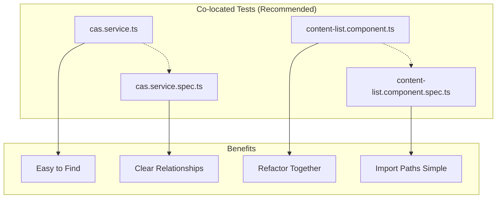

# Testing Guide

[⬅️ Documentation](../README.md) | [🏠 Home](../../README.md)

## Table of Contents

1. [Test Organization](#test-organization)
2. [Testing Standards](#testing-standards)
3. [Running Tests](#running-tests)
4. [Writing Tests](#writing-tests)
5. [Test Coverage](#test-coverage)
6. [Best Practices](#best-practices)

## Test Organization

This project follows **Angular's recommended testing structure** where test files are co-located with their source files.

### Why Co-location?



### Current Test Structure

```
src/
├── app/
│   ├── app.ts
│   ├── app.spec.ts                    ✓ Component test
│   ├── core/
│   │   └── services/
│   │       ├── cas.service.ts
│   │       ├── cas.service.spec.ts    ✓ Service test
│   │       ├── disot.service.ts
│   │       ├── disot.service.spec.ts  ✓ Service test
│   │       ├── hash.service.ts
│   │       ├── hash.service.spec.ts   ✓ Service test
│   │       ├── signature.service.ts
│   │       └── signature.service.spec.ts ✓ Service test
│   └── features/
│       ├── content/
│       │   ├── content-list/
│       │   │   ├── content-list.component.ts
│       │   │   └── content-list.component.spec.ts ✓ Component test
│       │   └── content-upload/
│       │       ├── content-upload.component.ts
│       │       └── content-upload.component.spec.ts ✓ Component test
│       └── disot/
│           ├── disot-entry/
│           │   ├── disot-entry.component.ts
│           │   └── disot-entry.component.spec.ts ✓ Component test
│           └── signature-verification/
│               ├── signature-verification.component.ts
│               └── signature-verification.component.spec.ts ✓ Component test
```

## Testing Standards

### Industry Best Practices We Follow

1. **Co-location of Tests** (Angular, React, Vue standard)
   - Tests live next to the code they test
   - Makes refactoring easier
   - Clear ownership and relationships

2. **Naming Convention**
   - Test files end with `.spec.ts`
   - Matches the file being tested
   - Example: `cas.service.ts` → `cas.service.spec.ts`

3. **Test Structure**
   ```typescript
   describe('ComponentName', () => {
     // Setup
     beforeEach(() => {
       // Test configuration
     });
     
     // Test suites
     describe('method or feature', () => {
       it('should do something specific', () => {
         // Arrange
         // Act
         // Assert
       });
     });
   });
   ```

## Running Tests

### All Tests
```bash
npm test
```

### Watch Mode (Development)
```bash
ng test
```

### Single Run (CI/CD)
```bash
npm test -- --watch=false
```

### Specific Test File
```bash
ng test --include='**/cas.service.spec.ts'
```

### With Coverage
```bash
ng test --code-coverage
```

## Writing Tests

### Component Test Example

```typescript
// content-list.component.spec.ts
import { ComponentFixture, TestBed } from '@angular/core/testing';
import { ContentListComponent } from './content-list.component';
import { CasService } from '../../../core/services/cas.service';

describe('ContentListComponent', () => {
  let component: ContentListComponent;
  let fixture: ComponentFixture<ContentListComponent>;
  let mockCasService: jasmine.SpyObj<CasService>;

  beforeEach(async () => {
    // Create mock service
    mockCasService = jasmine.createSpyObj('CasService', ['getAllContent']);
    
    // Configure testing module
    await TestBed.configureTestingModule({
      imports: [ContentListComponent],
      providers: [
        { provide: CasService, useValue: mockCasService }
      ]
    }).compileComponents();
    
    // Create component
    fixture = TestBed.createComponent(ContentListComponent);
    component = fixture.componentInstance;
  });

  it('should create', () => {
    expect(component).toBeTruthy();
  });

  it('should load contents on init', async () => {
    // Arrange
    const mockContents = [/* test data */];
    mockCasService.getAllContent.and.returnValue(Promise.resolve(mockContents));
    
    // Act
    await component.ngOnInit();
    
    // Assert
    expect(component.contents).toEqual(mockContents);
    expect(mockCasService.getAllContent).toHaveBeenCalled();
  });
});
```

### Service Test Example

```typescript
// cas.service.spec.ts
import { TestBed } from '@angular/core/testing';
import { CasService } from './cas.service';
import { IHashService } from '../domain/interfaces/crypto.interface';
import { IStorageProvider } from '../domain/interfaces/storage.interface';

describe('CasService', () => {
  let service: CasService;
  let mockHashService: jasmine.SpyObj<IHashService>;
  let mockStorageService: jasmine.SpyObj<IStorageProvider>;

  beforeEach(() => {
    // Create mocks
    mockHashService = jasmine.createSpyObj('HashService', ['hash']);
    mockStorageService = jasmine.createSpyObj('StorageService', 
      ['read', 'write', 'exists', 'list']);
    
    // Configure TestBed
    TestBed.configureTestingModule({
      providers: [
        CasService,
        { provide: 'IHashService', useValue: mockHashService },
        { provide: 'IStorageProvider', useValue: mockStorageService }
      ]
    });
    
    // Inject service
    service = TestBed.inject(CasService);
  });

  describe('store', () => {
    it('should store content and return hash', async () => {
      // Arrange
      const content = { data: new Uint8Array([1, 2, 3]) };
      const expectedHash = 'abc123';
      mockHashService.hash.and.returnValue(Promise.resolve(expectedHash));
      mockStorageService.exists.and.returnValue(Promise.resolve(false));
      mockStorageService.write.and.returnValue(Promise.resolve());
      
      // Act
      const result = await service.store(content);
      
      // Assert
      expect(result.value).toBe(expectedHash);
      expect(mockHashService.hash).toHaveBeenCalledWith(content.data);
      expect(mockStorageService.write).toHaveBeenCalled();
    });
  });
});
```

## Test Coverage

### Current Coverage (v1.0.1)
- **Total Tests**: 74
- **Service Tests**: 30
- **Component Tests**: 44
- **All Tests Passing**: ✓

### Coverage Goals
- **Statements**: > 80%
- **Branches**: > 75%
- **Functions**: > 80%
- **Lines**: > 80%

### Viewing Coverage Report
```bash
ng test --code-coverage
open coverage/index.html
```

## Best Practices

### 1. Test Independence
```typescript
// Good: Each test is independent
beforeEach(() => {
  // Fresh setup for each test
  component = new ContentListComponent(service);
});

// Bad: Tests depend on each other
let sharedState;
it('test 1', () => {
  sharedState = 'modified';
});
it('test 2', () => {
  // Depends on test 1
  expect(sharedState).toBe('modified');
});
```

### 2. Descriptive Test Names
```typescript
// Good: Clear what is being tested
it('should return null when content hash is not found', () => {});

// Bad: Vague description
it('should work', () => {});
```

### 3. AAA Pattern
```typescript
it('should calculate total correctly', () => {
  // Arrange
  const items = [{ price: 10 }, { price: 20 }];
  
  // Act
  const total = service.calculateTotal(items);
  
  // Assert
  expect(total).toBe(30);
});
```

### 4. Mock External Dependencies
```typescript
// Good: Mock external services
const mockHttpClient = jasmine.createSpyObj('HttpClient', ['get']);

// Bad: Use real HTTP calls in tests
// This makes tests slow and flaky
```

### 5. Test Edge Cases
```typescript
describe('hash validation', () => {
  it('should handle empty data', () => {});
  it('should handle very large data', () => {});
  it('should handle special characters', () => {});
  it('should handle null input', () => {});
});
```

### 6. Avoid Testing Implementation Details
```typescript
// Good: Test behavior
it('should display error message when upload fails', () => {
  component.uploadFile();
  expect(component.errorMessage).toBeTruthy();
});

// Bad: Test internal implementation
it('should call private method _handleError', () => {
  // Don't test private methods directly
});
```

### 7. Use Test Utilities
```typescript
// Create reusable test utilities
export class TestHelpers {
  static createMockContent(): Content {
    return {
      data: new Uint8Array([1, 2, 3]),
      metadata: { name: 'test.txt' }
    };
  }
  
  static createMockDisotEntry(): DisotEntry {
    return {
      id: 'test-id',
      type: DisotType.CREATE,
      // ... other properties
    };
  }
}
```

## Testing Checklist

Before committing code, ensure:

- [ ] All new code has tests
- [ ] All tests pass (`npm test`)
- [ ] Test coverage hasn't decreased
- [ ] Tests follow naming conventions
- [ ] Tests are independent
- [ ] Edge cases are covered
- [ ] Mocks are used appropriately
- [ ] No console.log statements in tests
- [ ] Tests run quickly (< 10 seconds total)

---

[⬅️ Documentation](../README.md) | [⬆️ Top](#testing-guide) | [🏠 Home](../../README.md)